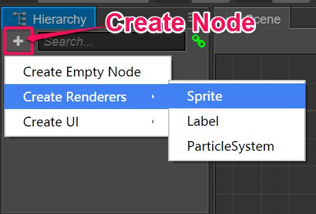
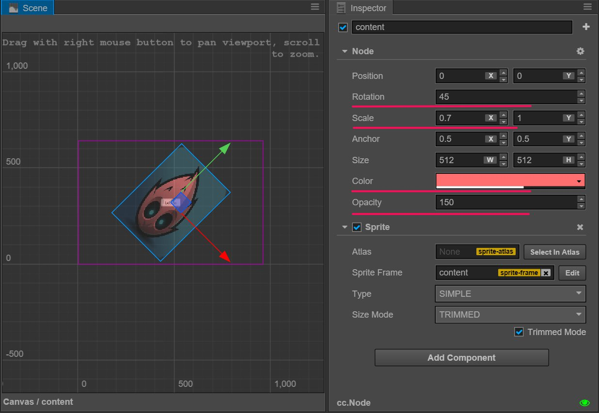

# Node and component

The core workflow of Cocos Creator is focused on component-based development. The component-based framework is also known as the **component-entity system** (or [Entity-Component System](https://en.wikipedia.org/wiki/Entity_component_system)). Simply put, we create gameplay elements with component combination instead of class inheritance.

In Cocos Creator, **Node** is the entity that can contain component. We will attach renderer and gameplay **Components** to node, to make the element has many presentation and gameplay functions. Let`s see how to create a node and add a component in the scene.

## Create Node

To quickly create a node that having a specific purpose, you can use the **Create Node** button on the top left corner of the **Node Tree** panel. We can make a very simple Sprite node as an example. Click the **Create Node** button and then choose `Create Renderer Nodes/Sprite Node`:

Then we can see the newly created Sprite node in the **Scene** panel and **Node Tree** panel. The new node is named `New Sprite`, this is a node with Sprite component attached.

## Component

### Sprite component

Now that we have some nodes in scene, let's see what a component is and what's the connection between component and node. Click on the `New Sprite` node that we just created and you can see **Properties** panel:

The section starting with `Node` in the **Properties** panel is the properties of the node, including transform properties like `Position`, `Rotation`, `Scale` and `Size`, other properties such as `Anchor`, `Color` and `Opacity` are also included. We will introduce each property in detail in the [Scene Editing](scene-editing.md) section.

In the following image, the section starting with `Sprite` is the properties of the **Sprite** component. In 2D games, the **Sprite** component provides most of the image rendering in scene. The most important property of the **Sprite** component is `Sprite Frame` where we can assign an texture file that **Sprite** is going to render in the scene. Let's try to drag a texture asset from the **Assets** panel to the `Sprite Frame` property in the **Properties** panel:

We can see that the default texture turns into the texture we assigned. This is what **Sprite** component does: rendering image textures.

### Node properties affecting sprite component rendering

When a Sprite component is attached to a node, the rendering of the Sprite can be controlled by modifying the node properties. You can modify your node properties as indicated in the following picture. You can see how the Sprite's rotation, scale, color and opacity changes:

We mentioned earlier that the component based development achieves feature extensions by combination. The following picture shows how **Node** and **Sprite** component combine their properties.

## Node Color and Opacity property

The property of **Color** and **Opacity** in the above picture have direct influence on rendering of **Sprite** component. Color and opacity can also influence the display of [Label](../components/label.md) component.

These two properties will multiply with the image of rendering component to determine each pixel's color and opacity. In addition, the **Opacity** property will cascade on a child node and easily achieve the fade in and fade out effect of a set of node contents by altering the `Opacity` of the parent node.

## Add other components

We can add multiple components to one node so that we can extend features to the element. In the example above, we can continue to select the `New Sprite` node, click the **Add component** button at the bottom of the **Properties** panel and select `Add UI component/Button` to add a **Button** component.

Then set the Button component according to the following picture (the actual color attribute can be set freely according to your own taste):

Next, click the **Preview** button on the toolbar  and hover the mouse over the sprite image in the browser window. You can then see the color of the image changes which means the **Button** component on the node has taken effect!

## Brief Summary

In the above example, we first attached Sprite component to the node which led us to the image rendered in scene. Then we can display this image in different ways by altering the node properties like **Scale** and **Color**. Next we can even add a **Button** component to the node so that it could react to mouse event and show different state of the button (normal, hover, down, etc.). This is the component based development workflow in Cocos Creator. We can use this method to combine different functions within a node to achieve a series of complicated goal, such as a character's move and attack controls, auto scrolling of background images, layouts of UI elements, user interactions and so on.

It's worth mentioning that a single node can only contain one renderer component such as **Sprite**, **Label**, **ParticleSystem**.

## Reference reading

- [Understand component-entity system - i_dovelemon's blog](http://blog.csdn.net/i_dovelemon/article/details/25798677)