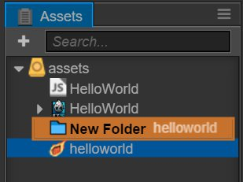

# Assets

**Assets** is used for us to access and manage the working area of project assets. Adding assets into here is normally a necessary step when starting to make a game. You can use the **Hello World** template to create a new project and then see there are some basic asset types within **assets**.

## Introduction to the interface

**Assets** shows the contents of the project assets folder in a tree structure, but note that only the assets put under the `assets` catalogue in the project folder will be shown here. Please read [project structure] for more about the project folder structure (../../getting-started/project-structure.md). Now let's introduce the factors of each interface:

- The **Create** button on the top left corner is used to create a new asset.
- The input box on the top right can be used to search and filter the asset file names that contain some specific text.
- The main part of the panel is the asset list of the asset folder where you can add, delete or alter the assets using the context menu or by dragging.

## Asset list

An asset list can include any folder structure. Folders in **assets** will be shown by the icon. Click the arrow to the left of this icon to expand/collapse the contents of a folder.

Except for the folders, everything else in the list is asset files. Files in the asset list will not show their extended names; instead icons will be used to indicate the type of file or asset. For example, the project created by the **HelloWorld** template includes three core assets:

- **image assets**: currently includes image files like `jpg` and `png`, the icon will show as a thumbnail of the image.
- **script assets**: the JavaScript file compiled by the programmer. It uses `js` as the filename extension. We edit these scripts to add functions and game logic.
- **scene assets**: double click to open the scene file. Only when the scene file has been opened can we continue creating the contents.

For more common asset types and asset workflows, please read the [asset workflow](../../../asset-workflow/index.md) chapter.

### Create assets

Currently, the assets that can be created in **assets** are the following:

- Folder
- Script file
- Scene
- Movie clips

Click the **create** button on the top left corner and the create assets menu including the above asset list will then pop up. Clicking any item on it will create new corresponding assets at the currently selected location.

### Select assets

You can use the following selection of assets in the asset list:

- Click to select a single asset
- Press <kbd>Ctrl</kbd> or <kbd>Cmd</kbd> and click individual assets to select them all together
- Press <kbd>Shift</kbd> and click to select multiple assets

You can move, delete and use other operations on the selected assets.

### Move assets

After selecting the asset (can select multiple assets at once), hold down the mouse and drag to move the asset(s) to another position. Drag the assets onto a folder and you will see the folder that the folder will be highlighted in orange.

Release the mouse to move the assets into the highlighted folder.

### Delete assets

For the selected assets, you can execute the following operation to delete:

- Right click and choose `delete` from the pop up menu
- Press <kbd>Delete</kbd> (Windows) or <kbd>Cmd + Backspace</kbd> (Mac) after selecting the asset.

Since deleting assets is an irreversible operation, there will be a pop up dialog box requesting the user to confirm. Once the user clicks yes, the assets will be deleted permanently and cannot be found in the Recycle Bin (Windows) or Trash Bin (Mac)! Please use it with caution and do version management or a manual backup.

### Other operations

The right click menu of **asset** also includes the following operations:

- `rename`: rename the asset.
- `create`: same function as the **create** button, it will add assets to the currently selected folder. If what is currently selected is an asset file, it will add new assets to the same folder as the currently selected asset.
- `show in Explorer (Windows) or Finder (Mac)`: open the asset folder in the file manager of the operating system.
- `Go to the asset location in Library`: open the imported asset location in `Library` of the project folder. Please read [project structure](../../project-structure.md) for detailed information.
- `Show UUID`: show the currently selected asset's UUID in the **console** window.
- `Refresh`: redo the import operation of the asset.

Also, by double clicking on the asset you can enter the editing status for specific asset types such as scene assets and script assets.

## Filter assets

Enter some text in the search box at the top right of **assets** to filter out filenames of all the assets that include the input text. You can also input filename extensions like `*.png` to list all the assets with this specific extension.

---

Continue on to read about [Scene editor](scene.md).
