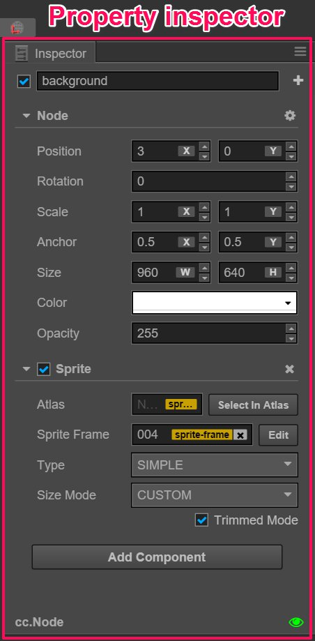

# Properties

**Properties** panel is the working area where we check and edit the current selected nodes and component attributes. Select the node in **Scene editor** or **Node Tree**, attributes of this node and attributes of all the components of this node will display in **Properties** panel for your inquiry and editing.

From top to bottom, the **Properties** panel displays:

- node activating switch and node name
- node attribute
- component attribute

## node name and activating switch

The check box on the top left corner indicates the activating state of node. When the used node is not activated, all the components related to image rendering on the node will be shut down. The whole node including child nodes will be hidden efficiently.

What displays at the right side of the node activating switch is node name, which is in accordance with the node name showed in **Node Tree**.

## Node Properties

Next, **Properties** panel will show properties of node, which are listed under the headline `Node`. By clicking `Node`, one can fold or unfold the attributes of node.

Other than the transforming attributes like Position, Rotation, Scale and Size, node attributes also include Anchor, Color, Opacity. Generally, modifications of node attributes will immediately reflect in the changes in the appearance or position of node in scene editor.

For more details on node attribute, please read [Transform](../../../content-workflow/transform.md) section.

## Component attribute

All the components mounted to a node and their attributes will be listed under node attribute. Just like node attribute, you can switch the fold/unfold status of a component attribute by clicking its name. When there are many components mounted to a node, you can get larger working area by folding the component attributes that are not frequently modified.

Users create a component by script, the attribute of which is declared by the script. Different types of attributes have different widget appearances and editing methods in **Properties** panel. The defining method of attribute will be introduced in detail in [Scripting Properties](../../../scripting/reference/attributes.md).

## Edit an attribute

**Attribute** is a public variable that declared in the component script and can be serialized and stored in the scene and animation data. We can quickly modify the attribute settings by **Properties** panel to realize the goal of adjusting game data and playing method with out programming.

Normally we can divide attributes into **value type** and **reference type** according to the different memory location used by variables.

### Value type attribute

**value type** includes numbers, strings, enumerations and other simple variable types that occupy small RAM space:

- Number: can be input directly by keyboard. Users can also press the upward/downward arrows near the input field to gradually increase/decrease attribut value.
- Vec2: the widget of Vec2 is the combination of two input values. And the input field will mark the corresponding child attribute name of each value with `x` and `y`.
- String: directly use keyboard to input string into textbox. The input widget of string can be divided into two types: single line and multiple lines. Users can press Enter button to wrap in Multiple lines textbox.
- Boolean: It can be edited in the form of check box. The selected state indicates the attribute value is `true`; and the non-selected state indicates the attribute value is `false`.
- Enum: It can be edited in the form of drop-down menu. Click enum menu and choose one option from the popp up menu list, then the modification of enum can be finished.
- Color: click color attribute preview box and **color picker** window will popped out. You can click to choose the color you need in this window, or directly enter specified color in the RGBA color input box below. Click any position outside the **color picker** window will close the window and the color selected in the end will be took as the attribute color.

### Reference type attribute

**Reference type** includes much more complicated objects, such as node, component or asset. Different from the various editing methods of value type, reference type normally has only one editing method--drag the node or the asset into the attribute column.

The attribute of reference type will show `None` after the initialization. Because users can't use script to set up initialized value for attribute of reference type, they can drag corresponding nodes or assets according to the type of attribute to finish the assignment for reference type.

The attribute column that needs to be assigned value by dragging nodes will show green label. There might display `Node` on the label, which means any node can be dragged into it. Also, the label may display component names like `Sprite`,`Animation`, etc., then users need to drag the nodes to which corresponding components are mounted.

The attribute column that needs to be assigned value by dragging assets will show yellow labels. There might display the asset type on the label, such as `sprite-frame`, `prefab`, `font`, etc.. The assignment can be finished as long as you drag the assets of corresponding type from **Assets**.

  Note: that script file is also a type of asset. Therefore the script asset reference attribute used by components shown on the top of the above picture is also represented by a yellow label.

---

Continue on to read about [Console](console.md).
