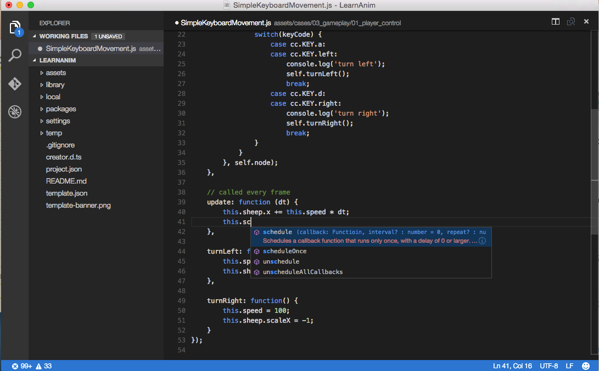

# Coding Environment Setup

In quick start tutorial we showed double clicking script file to edit them in builtin Code Editor. However the builtin Code Editor is only for quick edit and review of scripts and lack of many features we need for daily coding work. So we will introduce the recommended coding environment for Cocos Creator and how to set it up.

## Visual Studio Code

[Visual Studio Code](https://code.visualstudio.com/) （refer to as VS Code）is a cross-platform light weight development environment. It has great support for JavaScript editing and debugging. We have created extensions for VS Code so we have API auto-complete and native debugging support.


### Install VS Code

Go to [home page of VS Code](https://code.visualstudio.com/) and click the download button to get the software package.

Mac user can extract the software to anywhere you like, and double click `Visual Studio Code.app` to launch.

Windows user can run `VSCodeSetup.exe` to install it.

### Install Cocos Creator API Extension

Open your project in Cocos Creator, and choose `Developer/Install VS Code Extension` from main menu.

This will install Cocos Creator API Extension to VS Code's extension library, usually with the path `.vscode/extensions` in your user home folder. You need to install this extension only once unless there's a update with Cocos Creator.

You will see `VS Code extension installed to ...` in **Console** panel.

### Generate API Source In Your Project

For syntax highlight and autocomplete you also need to generate API source to your project folder.

Choose `Developer/Update VS Code API Source` from main menu. It will generate a `creator.d.ts` file to the root of your project (same level as `assets` folder). You'll see `API data generated and copied to ...` when it's complete.

This operation is only required when the API source is updated, or for some reason your project does not have a `creator.d.ts` file in it.

**Notice** Since VS Code 0.10.11, you'll also need a `jsconfig.json` for your project to work. The above command will copy over a predefined `jsconfig.json` file along with `creator.d.ts` to your project. You can customize `jsconfig.json` according to [VS Code JavaScript guide](http://code.visualstudio.com/docs/languages/javascript) to better suit your habit.

### Open Project With VS Code

Let's run VS Code, and choose `File/Open...` from main menu, then select your project's root folder and click `Open`.

Now you can create a new script or edit existing script and enjoy autocomplete and syntax highlight.



**Notice** `creator.d.ts` and `jsconfig.json` file must reside in the folder you open with VS Code to make the whole language and API autocomplete work.

### Setup File Tree and Search Filter

Choose `Code/Preferences/User Settings` from VS Code main menu. The user settings file will be opened for edit. Let's add the following content:

```json
    "search.exclude": {
        "**/node_modules": true,
        "**/bower_components": true,
        "build/": true,
        "temp/": true,
        "library/": true,
        "**/*.anim": true
    },
    "files.exclude": {
        "**/.git": true,
        "**/.DS_Store": true,
        "**/*.meta": true,
        "library/": true,
        "local/": true,
        "temp/": true
    }
```

The above settings exclude folders generated and managed by Cocos Creator from search and file tree.

### Learn More About VS Code

Go to the [documentation page of VS Code](https://code.visualstudio.com/Docs), to learn the editing, customization and extensions for VS Code.


<hr>

If you are a cocos2d-x user, please continue to read:

- [Cocos2d-x User Guide](cocos2d-x-guide.md)
