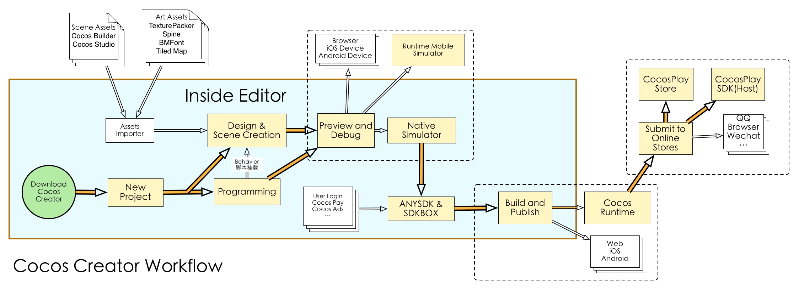

# About Cocos Creator

- **Q**: Is Cocos Creator a game engine?
- **A**: It's a complete game development solution, which includes the JavaScript implementation of Cocos2d-x(no need to learn a new engine), and various kinds of visual interface tools that can help you develop games more quickly.

- **Q**: What kind of editor does Cocos Creator have?
- **A**: It's completely customized for the engine. It's a all-in-one editor that can serve the whole workflow from design, development, preview, debug and all the way to cross-platform publishing.

- **Q**: Can I use Cocos Creator even if I don't know how to programming?
- **A**: Of course! Cocos Creator editor provides two kinds of workflows: one design-oriented and one develop-oriented, and a simple and smooth cooperative method(with an appropriate division of labor).

- **Q**: Which platform can we choose to publish the games developed by Cocos Creator?
- **A**: Currently, Cocos Creator can publish games to Web, Android, iOS, and desktops ( Mac and PC ). The goal is to develop once and publish to all platforms.

## Product Positioning

Cocos Creator is a game development tool focused on content creation, which has features like thorough scripting, componentization and data driven, etc. on the basis of Cocos2d-x.

## Framework Structure

Cocos Creator contains a whole set of functions needed for game development like a game engine, resource management, scene editing, game preview and release, etc. It has assembled all the functions and tool in a unified application program.

It makes data driven and componentization the core game development methods, and seamlessly integrates the mature JavaScript API system of the Cocos engine. It can adapt to the user habits of the Cocos engine developer on one hand, and provide an unprecedented level of content creation and realtime preview&test environment for artworkers and directors on the other.

The editor provides not only strong and complete toolchains, but also a open plugin framework. Developers can use generic front end technologies like Html + JavaScript, etc. to conveniently extend functions of the editor and customize personalized workflows.

What the combination of engine and editor brings is the functional development method of data driven and componentization, and the perfect cooperation (with an appropriate division of labor) of designers and programmers:

- Designers build the visual presentation of game scenes in editor
- Programmers develop functional components that can be mounted to any object in the scene
- Designers are responsible for mounting components to objects that need to perform a particular action and improving each parameter by adjustment
- Programmers develop the data structure and resource management needed for the game
- Designers set up all the data and resources using the graphic interface
- (In this way, from the simple to the complex, all the workflows that you can imagine can be realized)

The development idea that focused on workflows can help developers of different duties quickly find the breakthrough point to maximize their function at work and smoothly cooperate with other group members.

## Workflow introduction

In the development phase, Cocos Creator has already been able to greatly improve efficiency and creativity for users. But the workflows we provided are not limited to a development level. For a successful game, not only the whole set of workflows that form development and adjustment, the assembly of commercialized SDK, multi-platform release, test to going online can't lose a part, but also these workflows need inerations of lots of times.

Cocos Creator integrates the whole set of smartphone web-based games of Cocos Play into editor tools, so there is no need to switch between various softwares. Just open the Cocos Creator editor, various one-click automatic flows can solve all the above problems with the least time and energy. Therefore developers can focus on the development phase, and improve the competitiveness and creativity of products!

## Highlight Features

The highlight features of Cocos Creator include:

- Data properties that can be adjusted in the editor at anytime can be easily declared in the script. The adjustments to parameters can be independently finished by designers.
- A UI system that supports smart canvas adaptation and spares the alignment of coding elements can perfectly adapt to device screens of any resolution.
- Animation system that is specially made for 2D games supports animation trajectory preview and editing of complicated curves.
- Scriptable development supported by a dynamic language makes dynamic adjustment and the remote adjustment of mobile devices amazingly easy.
- By using the Cocos2d-x engine, when enjoying the convenience of scriptable development, you can also release games on various desktop platforms and mobile terminal platforms with one-click, with their superb features on the original level preserved.
- Componentization of script and open plugin system provides developers with methods of customizing workflows at different depths. The editor can be adjusted on a large scale to adapt to the needs of different groups and projects.

## Usage instructions

Cocos Creator is an applicable program that supports cross-platform operation between Windows and Mac, which can be started with one double click. Comparing to traditional Cocos2d-x workflows, it completely spares the requirements of setting up a development environment. After running, developers can immediately start game content creation or functional development.

On the basis of data driven workflows, the creation and editing of the scene has become the core of game development. The design work and functional development can be done synchronously and coorperated seamlessly. Regardless if your teammates are artworkers, directors or programmers, they can all click the Preview button at anytime in the production process to test the lastest form of the game in browsers, mobile device simulators or mobile devices.

Programmers and designers now can realize various kinds of cooperative methods. No matter building the scene before adding functions or creating functional modules to let designers assemble and adjust them, Cocos Creator can always meet the needs of the development group. Features defined in the script can present themselves in the editor with the most suitable visual effects, which provides convenience for content creators.

Content resources outside the scene can be imported in, such as: photo, sound, altas, skeleton animation, etc. Moreover, we are continuously improving the editor's ability of creating resources, which include the currently finished animation editor. Designers can use this tool to make very exquisite and vivid animation resources, and preview the animation in the scene at anytime.

In the end, the finished game can be released on various platforms by using the on-click in the graph tool. From design and development to test and release, Cocos Creator can handle them all for you.

---

Continue on to read about [Installation](install.md).
