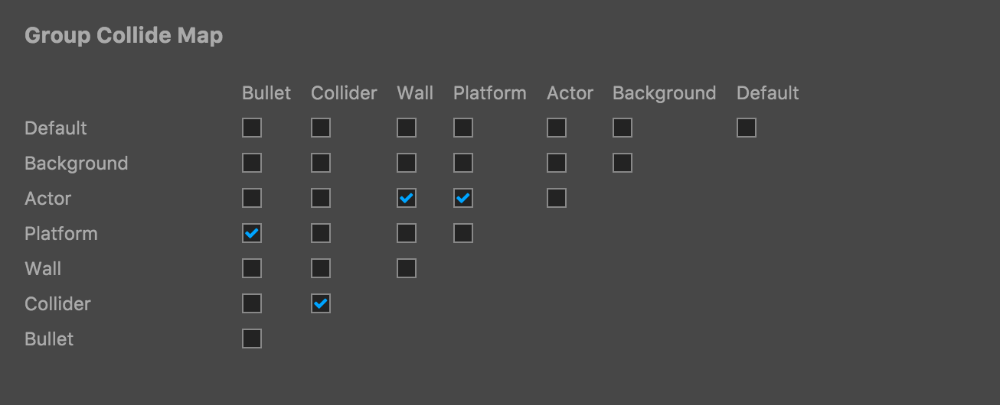

# Collision Group Management

Ideally we want to control which collides with which, to reduce unnecessary collision callbacks (for both performance and gameplay). We can control the collision relationship with **Group Manager** panel.

This panel has two sections:

## Group List

We use node groups to categorize colliders. Set a group for a node will mark all colliders on this node with this specific group.

Let's select main menu's `Project/Project Settings...` and open **Project Settings** panel.

In the **Group Manager** section we can add new groups or rename existing groups:

**Notice:** groups are indexed with integer, so it's not possible to remove groups, or your nodes may fall into the wrong group once you remove the previous group.

## Collision Map

Now that we have some groups to categorize our colliders into. For a platform action game groups such as `player`, `ground`, `enemy`, `bullet` and `item` are very common. Then you'd want to make sure `player` and `enemy` collide with each other, and they both collide with `ground`. Also you don't want `bullet` to collide with `enemy`. So how can we do it?

In the **Collision Map** section we can control whether collision is allowed for each group with any other groups. The collision map looks like this:

Each column and row of this table has all the group listed. If you make modification to the **Group List** this table will be updated accordingly. Each checkbox in the table represent whether the group from the column will collide with the group from the row.

So as the checkboxes stated, we have following groups that can collide with each other:   

Platform - Bullet   
Collider - Collider   
Actor - Wall   
Actor - Platform   

---

Go ahead and read [Collision Scripting](collision-manager.md)