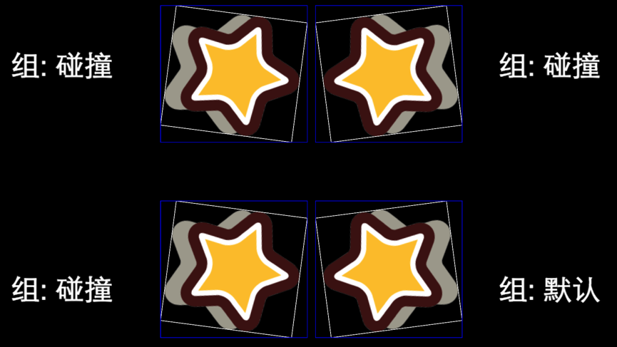

# Collision Manager Scripting

Cocos Creator provides a simple and easy way to use built-in Collision Detection System, it will do collision detect according to the added colliders.   
When a Collider Component is enabled, this Collider Component will be auto added to Collision Detection System, and Collision Manager will search other Collider Components which can generate a Collision Pair with it.   

**Note : The Collider Components in the same node, will not do collision detecsion with each other forever.**   

## Usage of the Collision Manager

### Collision Manager Interface

Get the Collision Manager
```javascript
var manager = cc.director.getCollisionManager();
```


Collision Manager is disabled by default, enable it if you need to use it.
```javascript
manager.enabled = true;
```


Collision Manager Debug Draw is disabled by default, enable it if you need to see the debug info.
```javascript
manager.enabledDebugDraw = true;
```
After enable **Debug Draw**, you can see the Collider area in runtime :    
<a href="collision-manager/draw-debug.png"></a>


If you want to display the bounding box of the Collider Component, please set `enabledDrawBoundingBox` to `true`
```javascript
manager.enabledDrawBoundingBox = true;
```
Result :   
<a href="collision-manager/draw-bounding-box.png"></a>


### Collision Manager Callback

When a collision is detected, Collision Manager will call the callback to notify users. If the script which belong to the same node with the Collider Component implement below functions, Collision will call the functions as the callback.   

```javascript
/**
 * Call when a collision is detected
 * @param  {Collider} other The other Collider Component
 * @param  {Collider} self  Self Collider Component
 */
onCollisionEnter: function (other, self) {
    console.log('on collision enter');

    // Collider Manager will calculate the value in world coordinate system, and put them into the world property
    var world = self.world;

    // Collider Component aabb bounding box
    var aabb = world.aabb;

    // Last calculated Collider Component aabb bounding box
    var preAabb = world.preAabb;

    // world transform
    var t = world.transform;

    // Circle Collider Component world properties
    var r = world.radius;
    var p = world.position;

    // Rect and Polygon Collider Component world properties
    var ps = world.points;
},
```

```javascript
/**
 * Call after enter collision, before end collision, and after every time calculate the collision result.
 * @param  {Collider} other The other Collider Component
 * @param  {Collider} self  Self Collider Component
 */
onCollisionStay: function (other, self) {
    console.log('on collision stay');
},
```
   
```javascript
/**
 * Call after end collision
 * @param  {Collider} other The other Collider Component
 * @param  {Collider} self  Self Collider Component
 */
onCollisionExit: function (other, self) {
    console.log('on collision exit');
}
```


### Hittest

```javascript
cc.eventManager.addListener({
    event: cc.EventListener.TOUCH_ONE_BY_ONE,
    onTouchBegan: (touch, event) => {
        var touchLoc = touch.getLocation();

        // Get the points in world location of the polygon collider component.
        // If it's other type colidder component, can also find the test function in cc.Intersection.
        if (cc.Intersection.pointInPolygon(touchLoc, this.polygonCollider.world.points)) {
            this.title.string = 'Hit';
        }
        else {
            this.title.string = 'Not hit';
        }

        return true;
    },
}, this.node);
```


More examples can visit [github](https://github.com/cocos-creator/example-cases/tree/master/assets/cases/collider) 

