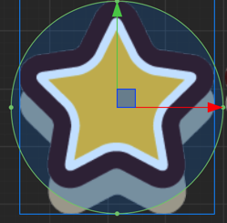
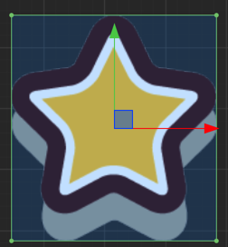

# Edit Collider Component

You can click **editing** checkbox of a collider component to edit collider shape freely.

## Polygon Collider

For editing **Polygon Collider** all vertex points of the collider can be moved freely by dragging. All changes to the vertex points can be seen in **Points** property of Polygon Collider.

If you move the mouse over the line between two points, an 'adding' icon will be added to mouse cursor. Click the mouse to add a new point to the Polygon Collider.

If you move the mouse over a vertex point while hoding **Ctrl** or **Cmd** key, you'll find the point and two lines connecting to it become red. Click the mouse to remove the point from this Polygon Collider.

## Circle Collider

Enable editing for a **Circle Collider** will show the editing gizmo like below:

Move the mouse over the circle edge and drag will modify the radius of Circle Collider.

## Box Collider

Enable editing for a **Box Collider** will show the editing gizmo like below:

Move the mouse over the 4 points of a Box Collider and drag to move the point along either x or y axis.

Drag while holding **Shift** to keep the aspect ratio of the box.

Drag while holding **Alt** to keep the center of the box unchanged.

## Change the Collider Offset

In the editing mode of all kinds of Colliders you can drag the center of the collider to move it off the center of the node. The **Offset** property of the collider will change as well.

---

Go ahead and read [Collision Group Management](collision-group.md)
