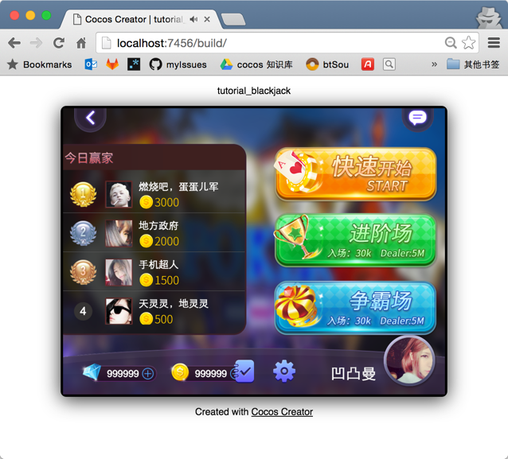

# Release a Game on Web platform

Open main menu's `Project/Build...` and the constructing release window.

Cocos Creator provides page templates for two kinds of Web platforms. From the pop up menu of **release platform**, you can choose `Web Mobile` or `Web Desktop`. The major difference is that in `Web Mobile`, the image will cover the whole browser window by default, while in  `Web Desktop`，you are allowed to designate the resolution of image, which doesn't change when you zoom on the browser window.

## Release a path

You can designate a release path for the game by inputting a path in the **release path** input field or choosing one via the `...` browsing button. The following cross-platform release will create resources or projects in child folders of this release path.

The default release path is in the `build` under the project folder . If you use version control systems like git and svn, you can ignore the `build` folder in version control.

## Construct and preview

The construction of Web platform is very easy. Construction process will **zip** scripts and resources in the game project and resource library, and then drop them into the designated release path. If you need test, the **Debug Mode** is there for you. The sourcemap is preserved with versions thus constructed.

Click the **Build** button, then a progress bar will appear on the top of the panel. When the progress bar reaches 100%, the construction is finished.

Next, you can click the **Play** button to open the constructed game version in the browser for preview and test.

A preview of the Web Desktop mode is shown above. You can see that the resolution of the game image is fixed and the game image doesn't fully cover the browser window.

## Release a game on Web server

If you want to release or share your games on the Internet, click the **Open** button next to **Build path**. After opening the release path, copy everything in the constructed `web-mobile` or `web-desktop` folders, and drop them into your Web server. Then you can see the game later there.

For the construction of Web server, you can search for solutions such as Apache, Nginx, IIS and Express on your own.

---

Continue on to read about [Setup Native Development](setup-native-development.md).
