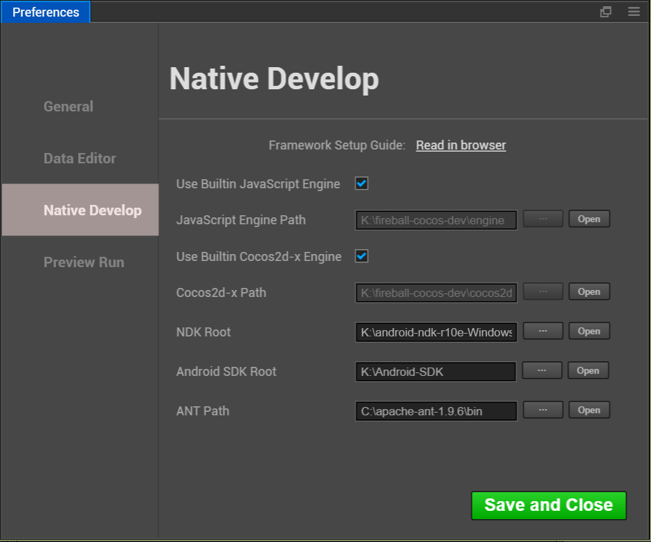

# Setup Native Development Environment

Apart from the built-in game release function of Web version, Cocos Creator uses the JSB technology based on Cocos2d-x engine for the cross-platform release of original applications and Cocos Play smartphone web-based games. Before using Cocos Creator to zip and send games to original platforms, you need to configure the Cocos Framework and related development environment first.

## Download and install Cocos Framework

**Cocos Framework** is the pre-compiled version of Cocos2d-x. Compared to the completed version, it is small, free of compilation and easy to install. The latest version of Cocos2d-x is v3.9. The following are download links for Cocos Framework v3.9:

- [Cocos Framework v3.9 for Windows](http://cocostudio.download.appget.cn/Cocos/CocosStore/CocosFramework-V3.9-Windows.exe)
- [Cocos Framework v3.9 for Mac](http://cocostudio.download.appget.cn/Cocos/CocosStore/CocosFramework-V3.9-Mac.pkg)

After downloading, run the installation package, follow the instructions, and get it done.

You can choose the target path when installing Cocos Framework for Windows. The Mac version will be installed under `/Applications/Cocos/frameworks` by default. Please confirm the installation path of your Cocos Framework, because it will be configured in Cocos Creator later.

## Download SDK and NDK, which are needed for the Android platform release

If you have no plan to release your games on Android, or you have already have a complete Android development environment in your operating system, you can skip this section.

Download Android SDK and NDK in accordance with your operating system via the following links:

- [Android SDK for Windows](http://cocostudio.download.appget.cn/Cocos/CocosStore/Android-SDK-Windows.zip)
- [Android SDK for Mac](http://cocostudio.download.appget.cn/Cocos/CocosStore/android22-sdk-macosx.zip)
- [Android NDK for Windows 32 Bit](http://cocostudio.download.appget.cn/Cocos/CocosStore/android-ndk-r10d-windows-x86.zip)
- [Android NDK for Windows 64 Bit](http://cocostudio.download.appget.cn/Cocos/CocosStore/android-ndk-r10e-Windows.zip)
- [Android NDK for Mac](http://cocostudio.download.appget.cn/Cocos/CocosStore/android-ndk-r10e-macosx.zip)

Please unzip and drop them anywhere you like after downloading, because we need to set up the path of Android SDK and NDK later. Don't forget where you put the unzipped versions of the documents above.

## Install C++ compiling environment

The compiling tool Cocos Console in Cocos Framework needs the following running environment:

- Python 2.7.5+, [download page](https://www.python.org/downloads/). Pay attention! Don't download Python 3.x version.
- In Windows, the installation of Visual Studio 2013 or 2015 Community Edition is needed, [download page](https://www.visualstudio.com/downloads/download-visual-studio-vs)
- In Mac, the installation of Xcode and command line tool is needed, [download page](https://developer.apple.com/xcode/download/)

## Configure path in original release environments

Next, let's go back to Cocos Creator to configure the environmental path of the constructing release original platform. Choose `document/preference` in the main menu, and open the preference window:



We need to configure the following three paths here:

- **NDK**, choose the NDK path that has just been downloaded and unzipped. You can skip this if you don't need to compile on Android platform
- **Android SDK**, choose the Android SDK path that has just been downloaded and unzipped. You can skip this if you don't need to compile the Android platform
- **ANT**, which will be put in the `tools` directory after installing Cocos Framework, which is at the same hierarchy as `frameworks`. The chosen path should include an executable file named `ant`.

Close the window after configuration is completed.

**Note**: The configure will work when build native project. If the configure not works(some Mac may occur this situation), please try to set these settings to **System Environment** manually: COCOS_CONSOLE_ROOT, ANT_ROOT, NDK_ROOT, ANDROID_SDK_ROOT.

## Notes

We have received lots of feedback about original packing in the public beta, and some possible reasons are supplemented here:

1. Check the path

    The path set up in preference settings should be guaranteed to be correct, for example: the path of ant should be set under the bin directory in the ant installation directory, the root directory of which is NDK, while the directory of Android SDK should include documents like build-tools, platforms, etc..

2. Check NDK version

    Please use versions later than NDK r10c, and r10e version is recommended.

3. On Windows platform, JAVA_HOME environmental variables need to be checked

    If using Windows platform, please confirm if JAVA_HOME is included in your environmental variables. By right clicking My Computer, choosing property and opening the advanced tab, you can check and modify environmental variables. For effective running on Windows platform, you might need to restart the computer.

4. Check JAVA environment

    Input the following code into Mac terminal or Windows command line tool for check:

    ```
    java -version
    ```

    If JAVA SE displays, there is no problem. If JRE displays, then you need to install [JAVA SE running environment](http://www.oracle.com/technetwork/java/javase/downloads/index.html).

5. Check if the C++ compiling environment is correctly installed in Visual Studio

    When installing Visual Studio, the C++ compiling component is not ticked off by default. If Visual Studio wasn't installed, you need to install it and choose compiling components concerning C++.

6. Package name issue

    Check the package name in the constructing release panel. Package names that include blank space, `-`, etc. are all illegal.

In the end, if zipping still fails, you can try to create a standard Cocos2d-x project and compile it. If the Cocos2d-x project is compilable and Cocos Creator couldn't be zipped, please send the bug to us by [forum](http://www.cocoachina.com/bbs/thread.php?fid-71.html).

---

Continue on to read about [Publising -> Native](publish-native.md).
