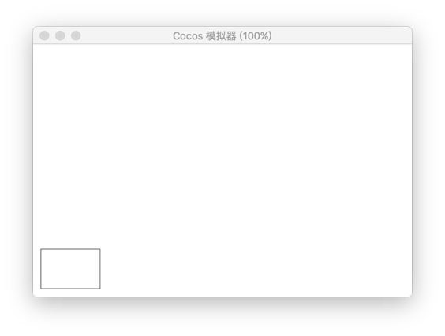

# Rect

Use `rect()` method to create a rectangle.

| Parameter | Description
| -------------- | ----------- |
| x | The x coordinate of the lower left point of the rectangle.
| y | The y coordinate of the center of the lower left point of the rectangle.
| width | the width of rectangle.
| height | the height of rectangle.

## Example

```javascript
var ctx = node.getComponent(cc.Graphics);
ctx.rect(20,20,150,100);
ctx.stroke();
```

<a href="graphics/rect.png"></a>

```javascript
var ctx = node.getComponent(cc.Graphics);

// 红色矩形
ctx.lineWidth = 6;
ctx.strokeColor = cc.Color.RED;
ctx.rect(5,5,290,140);
ctx.stroke();

// 绿色矩形
ctx.lineWidth=4;
ctx.strokeColor = cc.Color.GREEN;
ctx.rect(30,30,50,50);
ctx.stroke();

// 蓝色矩形
ctx.lineWidth = 10;
ctx.strokeColor = cc.Color.BLUE;
ctx.rect(50,50,150,80);
ctx.stroke();
```

<a href="graphics/rect2.png"></a>

<hr>

Return to [Graphics component](index.md).
