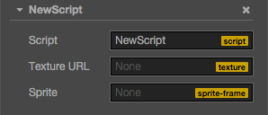
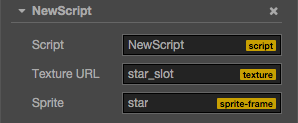
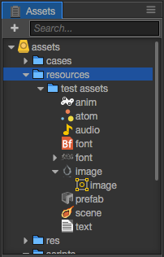

# Acquire and load asset

Cocos Creator has a whole set of uniform asset management mechanisms. In this tutorial, we will introduce

- Classification of assets
- How to set assets in the **Properties** panel
- How to dynamically assets
- How to load remote assets or device files
- Assets dependencies and how to release assets

## Classification of assets

Assets currently can be classified into two different types, one type is called **Asset**, the other is called **Raw Asset**.

### Asset

Most assets like `cc.SpriteFrame`, `cc.AnimationClip` and `cc.Prefab` all belong to Asset. The loading of Asset is uniform and automatic. Assets that rely on each other can be preloaded automatically.

> For example, when the engine is loading the scene, it will first automatically load the assets linked to the scene and if these assets are linked to other assets, then these other assets will also be loaded first. Only when the loading is complete will the loading of the scene be finished.

The script can define an Asset properties:

```javascript
// NewScript.js

cc.Class({
    extends: cc.Component,
    properties: {

        spriteFrame: {
            default: null,
            type: cc.SpriteFrame
        },

    }
});
```

### <a name="raw-asset"></a>Raw Asset

The object received by the existing API previously in Cocos2d is not the Asset object mentioned above but a URL presented by a string. These former asset types that the API uses are called Raw Assets. `cc.Texture2D`, `cc.Font` and `cc.AudioClip` are all Raw Assets. If you are going to use Raw Assets in the engine, all you have to do is to pass the URL of the asset to the engine API, then the engine interior will automatically load the assets represented by this URL.

If you are going to declare a Raw Asset attribute type as `cc.Texture2D` in CCClass, you may want to define it first:

```js
cc.Class({
    extends: cc.Component,
    properties: {
    
        textureURL: {
            default: null,
            type: cc.Texture2D
        }
        
    }
});
```

The problem with writing in this way is that `textureURL` in the code is actually a character string rather than an instance of `cc.Texture2D`. To avoid confusing the two types here, use `url: cc.Texture2D` rather than `type: cc.Texture2D` when declaring the Raw Asset attribute in CCClass.

```js
cc.Class({
    extends: cc.Component,
    properties: {
    
        textureURL: {
            default: "",
            url: cc.Texture2D
        }
        
    }
});
```

## How to set assets in the **Properties** panel

No matter whether using Assets or Raw Assets, as long as you define the type in the script, you can set assets easily in the **Properties** panel. Hypothetically, we could have a component like this:

```js
// NewScript.js

cc.Class({
    extends: cc.Component,
    properties: {
    
        textureURL: {
            default: "",
            url: cc.Texture2D
        },
        spriteFrame: {
            default: null,
            type: cc.SpriteFrame
        },
        
    }
});
```

Here is how it looks like in the **Properties** panel after adding it into the scene:



Then we drag a Texture and a SpriteFrame separately from **Assets** to the corresponding attribute in the **Properties** panel:


The result is as follows:



In this way you can get the set asset directly from the script:

```js
    onLoad: function () {
        var spriteFrame = this.spriteFrame;
        var textureURL = this.textureURL;
        
        spriteFrame.setTexture(textureURL);
    }
```

Although it is very straight forward to set assets in the **Properties** panel, assets can only be pre-set in the scene without dynamic switching. If you need dynamic switching, you need to check the following contents out.

## How to dynamically load

All resources that require dynamically loaded via script, must be placed under `resources` folder or its subfolders, `resources` need to be manually created in the assets folder and must be located in the root directory of the assets,
like this:



The `image/image`, `prefab`, `anim`, `font` is a common Asset, and `image`, `audio` is a common Raw Asset.

> Inside `resources` folder resources, can be associated with dependence to other resources outside the folder, or resource reference could also be an external scene to. Project build time, but was released in ** build ** panel selected scenarios, `resources` all the resources folder, `resources` folders associated with their dependence on external resources are exported. If a resource does not need directly from the script **dynamic** loading, it mustn't be in the `resources` folder.

## How to dynamically load Asset

Creator provides `cc.loader.loadRes` the API to load specific Asset that is located under the Resources directory. And `cc.loader.load` difference is that loadRes should only load a single Asset. Invoke, you only need to pass a relative path to the resources, and **Not** at the end of the path containing the file name extension.

```javascript
// load Prefab
cc.loader.loadRes("test assets/prefab", function (err, prefab) {
    var newNode = cc.instantiate(prefab);
    cc.director.getScene().addChild(newNode);
});

// load AnimationClip
var self = this;
cc.loader.loadRes("test assets/anim", function (err, clip) {
    self.node.getComponent(cc.Animation).addClip(clip, "anim");
});

// load SpriteAtlas, and get one of them SpriteFrame
// Note Atlas resource file (plist) usually of the same name and a picture file (PNG) placed in a directory,
// So should need to in the second parameter specifies the resource type.
cc.loader.loadRes("test assets/sheep", cc.SpriteAtlas, function (err, atlas) {
    var frame = atlas.getSpriteFrame('sheep_down_0');
    sprite.spriteFrame = frame;
});
```

#### Independent of load SpriteFrame

After the image settings for the Sprite will be in the **Assets** to generate a corresponding SpriteFrame. But if
`test assets/image` is loaded directly, and the type will be cc.Texture2D. You must specify the second parameter is the type of resource, then the generated SpriteFrame can be loaded.

```javascript
// load SpriteFrame
var self = this;
cc.loader.loadRes("test assets/image", cc.SpriteFrame, function (err, spriteFrame) {
    self.node.getComponent(cc.Sprite).spriteFrame = spriteFrame;
});
```

> If you specify a type parameter, you will find the specified resource type in the path. When you are in the same path includes multiple names simultaneously under a resource (for example, contains both 'player.clip' and 'player.psd'), or the need to obtain a "sub asset" (for example, gets Texture2D SpriteFrame generated), should need to declare types.

#### Resource Release

`loadRes` loaded in a single resource if you need to release, You can call `cc.loader.releaseRes`, `releaseRes` incoming one with `loadRes` the same path and type parameter.

```javascript
cc.loader.releaseRes("test assets/image", cc.SpriteFrame);
cc.loader.releaseRes("test assets/anim");
```

Also, You can also use `cc.loader.releaseAsset` to release the instance of a specific Asset.

```javascript
cc.loader.releaseAsset(spriteFrame);
```

### How to dynamically load Raw Asset

Raw Asset can be loaded directly from a remote server using a URL, you can also dynamically loaded from the item. In the case of remote loading, The original Cocos2d constant loading method, using cc.loader.load can be. Raw Asset to the project, load the same way as Asset:

```javascript
// load Texture, don't add extension
cc.loader.loadRes("test assets/image", function (err, texture) {
    ...
});
```

#### cc.url.raw

After the success of Raw Asset loading, if you need to pass some form of URL API, you still need to give the full path. You need to use `cc.url.raw` converted to a URL:

```js
// The original URL will complain! File not found
var texture = cc.textureCache.addImage("assets/res/textures/star.png");

// Use cc.url.Raw instead, requiring you to declare resources directory and file name extension
var realUrl = cc.url.raw("res/textures/star.png");
var texture = cc.textureCache.addImage(realUrl);
```

### Resource bulk loading

`cc.loader.loadResDir` can load multiple resources under the same path:

```javascript
// loading all resource in the test assets directory
cc.loader.loadResDir("test assets", function (err, assets) {
    // ...
});

// load all SpriteFrame in the sheep.plist atlas
cc.loader.loadResDir("test assets/sheep", cc.SpriteFrame, function (err, assets) {
    // assets is a SpriteFrame array already contains all SpriteFrame.
    // and loadRes('test assets/sheep', cc.SpriteAtlas, function (err, atlas) {...}) The entire SpriteAtlas object is obtained.
});
```

## How to load remote assets or files in device

Currently in Cocos Creator, we support loading the remote image files, which is very useful to load user picture from social network websites. To load files from such urls, you should call `cc.loader.load`. At the same time you can use the same API to load resources on the local device storage. The `loadRes` APIs mentioned above only apply to the application package resources and hot update resources. Here is how to load remote assets and local
device files:

```javascript
// Remote texture url with file extensions
var remoteUrl = "http://unknown.org/someres.png";
cc.loader.load(remoteUrl, function (err, texture) {
    // Use texture to create sprite frame
});

// Remote texture url without file extensions, then you need to define the file type explicitly
remoteUrl = "http://unknown.org/emoji?id=124982374";
cc.loader.load({url: remoteUrl, type: 'png'}, function () {
    // Use texture to create sprite frame
});

// Use absolute path to load files on device storage
var absolutePath = "/dara/data/some/path/to/image.png"
cc.loader.load(absolutePath, function () {
    // Use texture to create sprite frame
});
```

There still remains some restrictions currently, the most important are:

1. Remote loading does not support resources other than image files (other type of files already planed in the 1.5 / 1.6)
2. This loading method only supports the raw assets, does not support SpriteFrame, SpriteAtlas, Tilemap and other resources (requires Assets Bundle support planned in future version)
3. Remote loading ability on Web is limited by the browser's [CORS cross-domain policy restriction](https://developer.mozilla.org/en-US/docs/Web/HTTP/Access_control_CORS). If the server forbid cross-domain access, loading request will fail, and in WebGL rendering mode, even if the server allows CORS http request, textures loaded can not be rendered, this is due to WebGL security policy restrictions

## Assets dependencies and how to release assets

After resources loaded, they will be cached to the `cc.loader`, in order to avoid sending meaningless http request and repeated loading of resources. Sure thing is that the contents of the cache will consume memory, during game process, some resources may no longer be needed, and you may want to release them, we will cover some important notices for asset releasing here.

** First and most important: Resources depends on each other. **

For example, in the following graph, the Prefab resource contains the Sprite component, the Sprite component depends on the SpriteFrame, the SpriteFrame resource depends on the Texture resource, then the Prefab, SpriteFrame, and Texture resources are all cached by the cc.loader. The advantage of doing so is that there may be another SpriteAtlas resource that depends on the same SpriteFrame and Texture, then when you manually load the SpriteAtlas, loader do not need to request the existing SpriteFrame and Texture again, it will use the cache directly.


After making clear how resource depend on each other, the problem is also revealed. When you choose to release a Prefab, we will not automatically release the other resources it relies on, because there may be other resources that depend on them. So some developers ask us why the memory is still high after they released the resources? The reason is that the basic textures that actually consume memory are not released when you release Prefab or SpriteAtlas.

** Next core problem: We can not track object references in JavaScript. **

In scripting language like JavaScript, because of its weak type feature, memory management is delegated to the Garbage Collection mechanism. We can never know when an object is released by the Garbage Collector, nor can we get any notifications, which means that the engine can not use a reference count mechanism to know whether a resource is still needed. The current cc.loader design actually depends on the developer to tell it when to release resources based on game logic. You can decide to release a resource and all resources it relies on, you can also choose to prevent some of the shared resources from being released. Here is some simple demonstrations:

```javascript
// Release a texture which is no longer need
cc.loader.release(texture);
// Release all dependencies of a loaded prefab
var deps = cc.loader.getDependsRecursively('prefabs/sample');
cc.loader.release(deps);
// If there is no instance of this prefab in the scene, the prefab and its dependencies like textures, sprite frames, etc, will be freed up.
// If you have some other nodes share a texture in this prefab, you can skip it in two ways:
// 1. Forbid auto release a texture before release
cc.loader.setAutoRelease(texture2d, false);
// 2. Remove it from the dependencies array
var deps = cc.loader.getDependsRecursively('prefabs/sample');
var index = deps.indexOf(texture2d._uuid);
if (index !== -1)
    deps.splice(index, 1);
cc.loader.release(deps);
```

** The last thing to keep in mind: JavaScript's garbage collection is not immediate. **

Imagine such scenario, you released the cache of a resource in cc.loader. After that due to some reason, you need it again. At this point garbage collection has not yet begun (you never know when garbage collection will be triggered), or you still hold a reference to this old resource somewhere in your game logic. This means that the resource still exist in memory, but cc.loader have no longer access to it, so it will reload it. This causes the resource to have two copies in the memory, which is wasting. If the same scenario happens to a lot of resources, or resources get loaded even more than once, the pressure on the memory is likely to be high. If you observe such memory usage curve in your game, please carefully check the game logic to see whether there is leaks. If not, the garbage collection mechanism will eventually recover the memory.

The above is resource dependence management in cc.loader and how to release them, this part of the functionality and API design has not yet fully finalized, we are still trying to bring you an API set as easy to use as possible, we will update this document when we enhanced the loader's ability.

---

Continue on to read about [Event/Event System](events.md).
