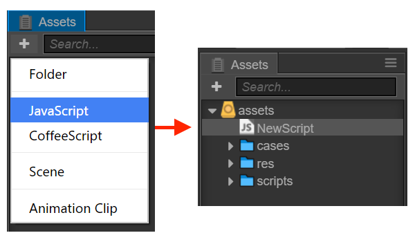
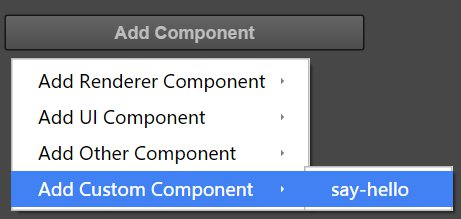

# Creating and using component script

## Creating component script

In Cocos Creator, script is also a part of the asset. You can add and select JavaScript or CoffeeScript to creat a component script
by clicking the "create" button in the asset editor. By this time, you will get a new script in your asset editor:



A simple component script is as follows:

```javascript
cc.Class({
    extends: cc.Component,

    properties: {
    },

    // use this for initialization
    onLoad: function () {
    },

    // called every frame, uncomment this function to activate update callback
    update: function (dt) {
    },
});
```

## Editing script

Cocos Creator has installed a lightweight Code Editor for editors to edit script fast. But we recommend that users choose
their preferred text tool (such as Vim, Sublime Text, WebStorm, VSCode...) to edit script according to their
own need.

By double clicking the script asset, users can open the built-in Code Editor to edit. If you need to use the external tools, please [modify the settings in **Preferences** panel](../getting-started/basics/editor-panels/preferences.md#script-editor).

Edit the script and save it, and Cocos Creator will automatically detect the alteration of the script and compile it quickly.

## Adding script into the scene node

Adding the script into the scene node is actually adding a component to this node. Let's rename the new “NewScript.js” to
“say-hello.js”. Then select the scene node you would like to add, by this time the property of this node will be shown in **Properties**.
There's an "add component" button at the very bottom of **Properties**. Click the button and choose: add user script -> say-hello
to add a new script component.



If everything goes well, you will see your script shown in **Properties** :


**Note:** You can also add script by dragging script asset into **Properties**.


---

Continue on to read about [Declare class with cc.Class](class.md).
