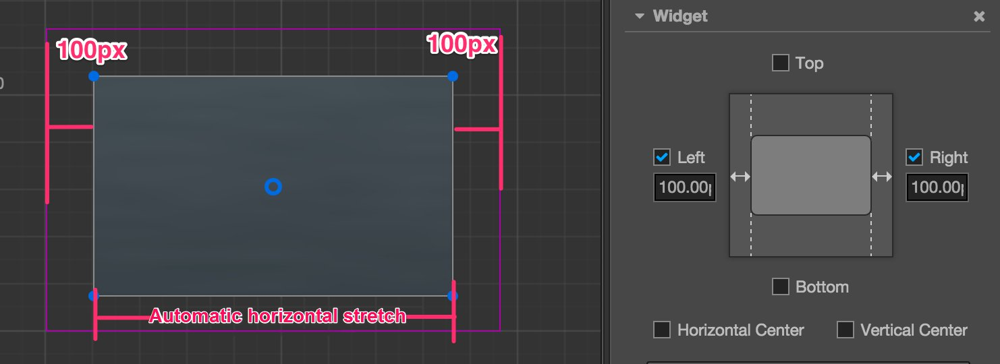

# Alignment strategy

To realize a perfect multi-resolution fit effect, presenting UI elements according to the positions stipulated in the design resolution is not enough. When the width and height of the screen change, UI elements must be able to intelligently sense the positions of the borders of the screen to make sure that they are presenting themselves in the visible area of the screen and being distributed in suitable positions. Such an effect can be realized by **Widget**.

Next, we categorize different alignment workflows according to the categories of elements that need to be aligned:

## Buttons and small elements that need to be aligned by borders

For elements with relatively small areas like a pause menu, in-game gold coins, etc., normally, aligning them by the borders of the screen would be enough. Then only a few simple steps are needed:

1. Set these elements as subnodes of the Canvas node in **Node Tree**
2. Add the Widget component to element nodes
3. Taking alignment with the bottom left corner as an example, open the alignment of `Left` and `Bottom`.
4. Then set up the distance between the node and the borders of the screen. In the picture below, the left margin is set as 50px, right margin is set as 30px.

After setting up the Widget component like this, no matter what the actual screen resolution is , this node element will remain on the bottom left corner of the screen. The distance between the left side of the node's bounding box and left border of the screen remains at 50px. The distance between the bottom of the node's bounding box and the bottom of the screen remains at 30px.

Pay attention! The alignment distance provided by the Widget component refers to the border of the bounding box that is located in the same direction as the child node and parent node. For example, `Left` is ticked off in the above example to align the element with the left border, then the distance between the left border of the child node's bounding box and the left border of the parent node's (i.e., Canvas node, whose bounding box is constantly the same size as the screen) bounding box is the set value: 50px.

## Nest alignment elements

The method of aligning with the border of the screen is introduced above. Because the default alignment reference of Widget is the parent node, we can add different node hierarchies and make the nodes on every hierarchy use the auto alignment function.

Next, we will use a simple example to explain it. Supposing we have a node hierarchical relation as follows:

In the example above, `parent` is a panel, and `button` is a button. We can respectively add Widget component to these two nodes, and respectively set their alignment distance.

For the `parent` node, the distance of aligning the top left corner of the `Canvas` node remains at 80px:

For the `button` node, the distance of aligning the top left corner of the `parent` node remains at 50px:

With a workflow like this, we can group UI elements according to their display areas or functions, and elements of a different hierarchy can be aligned according to design.

## Automatically zooming in/out the size of a node according to alignment requirements

In the above example, two borders that simultaneously align on one axis in opposite directions don't exist. If we want to make a panel that fully covers the width of the whole screen, we can simultaneously tick off the alignment switches `Left` and `Right`:

When simultaneously ticking off the alignment switches in opposite directions, Widget obtains the ability of modifying the `Size` of the node according to alignment requirements. In the picture above, we ticked off the left and right directions and set up margins, then Widget can dynamically set up the `Width` property of the node according to the width of the parent node. As a result, no matter how wide the screen is, the distance between the panel and the left & right borders of the screen remains at 100px permanently.

### Create a node whose size is in accordance with the size of screen

Making use of the features of a node that can automatically zoom in/out, we can make the size of the node the same with that of the screen by setting up the Widget component of the node. Therefore, we don't have to put all the UI elements that need to align with the borders of screen under the Canvas node, but group them according to the requirements of function and logic.

To make such a node, we should first make sure that the size of the parent node of this node remains the same with that of the screen. The Canvas node is the best choice. Next, set up the Widget component of this node according to the following method:

Therefore the size of the node will remain constantly the same with that of the Canvas node when running, i.e., the same as the size of the screen. After being set up like this, the child node of this node can transmit the same screen size by the same settings.

What needs to be noted is that because the Canvas node itself has the function of remaining the same size as that of the screen, there is no need to add the Widget component to the Canvas node.

## Set up percentage alignment distance

After opening the alignment function of a certain direction on the Widget component, apart from margins whose unit is designated as pixels, we can also input a percentage value. Therefore, Widget will multiply the width or height of the parent node on the corresponding axis by the input percentage to get the value of the actual margin.

Let's take a look at a real example. Take a child node that has been directly put under Canvas as an example. We hope this node panel remains on the right side of the screen and constantly covers 60% of the total height of screen. Therefore, setting up the Widget component according to the following picture will realize this effect:

When inputting the margin value when opening alignment direction, Widget can use the pixel unit together with percentage unit according to various needs. For example, input `50%` on the `Left` direction that needs to align with the center line of the screen and input `20px` on the `Right` direction that needs to align with the borders of the screen; when calculating the position and size of the child node at last, all the margins will be positioned after being converted to pixcel distance according to the size of the parent node.

Making use of the percentage alignment distance, we can create UI elements that can zoom in/out infinitely according to the size of the screen. Exerting your imagination, fitting a thousand types of Android phones with one set of resources will be a piece of cake!

---

Continue on to read about [Label Layout](label-layout.md).
