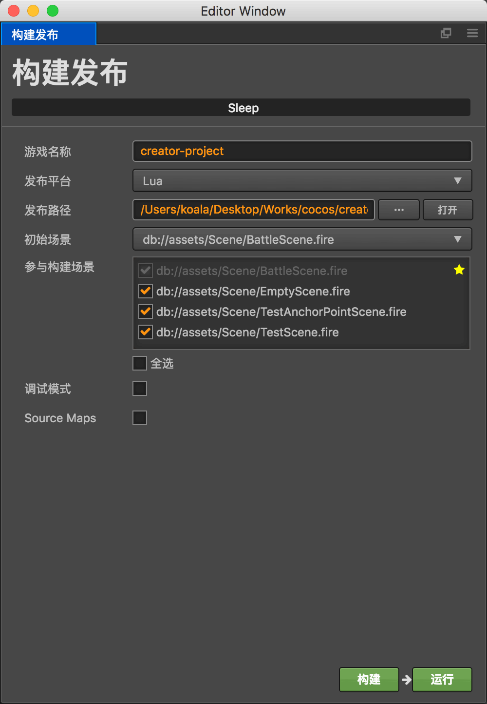
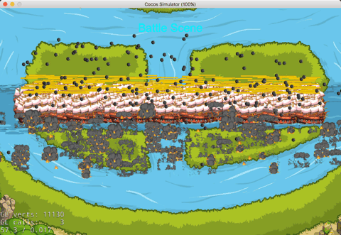

# Lua 引擎支持

作者：Dualface

## 目标

让 Lua 开发者可以使用 Cocos Creator 来搭建场景和 UI，并在 Lua 游戏中正常显示和操作。

## 主要特征

当前支持的特征：

-   Sprite - 精灵：图像显示
-   Canvas - 画布：主要用于自动布局
-   Widget - 部件：可以配合 Canvas 设置自动布局和各种对齐方式
-   Button - 按钮：响应玩家操作
-   EditBox - 编辑框：用于玩家输入文字
-   ParticleSystem - 粒子系统：显示粒子效果
-   TileMap - 地图：显示使用 Tiled 编辑的地图
-   Animation - 动画：仅支持帧动画
-   Label (System Font) - 文字标签：仅支持系统字体
-   Component with Lifetime events - 组件及其生命周期管理


## 目前无法支持的功能

由于 Cocos Creator 使用了一个基于 Cocos2d-x JS 的定制引擎，在 Sprite 的显示上和 Cocos2d-x Lua 有一些区别。所以一些控件暂时无法支持：

-   ProgressBar
-   Layout
-   ScrollView


## 使用说明

目前，要在 Lua 工程中使用 Creator 创建的场景，需要经过三个步骤。我们会在新版里进一步简化操作，提高开发者的工作效率。


### 准备工作

1. 首先需要下载 creator-lua 的最新版本。

    直接下载 [Creator-Lua 模板工程](http://cocos2d-x.org/filedown/CocosCreator-Lua-v1.0)。

    或通过 `git` 下载：

    ```bash
    $ git clone https://github.com/cocos-creator/creator-lua.git
    ```

    后文假定下载后的 creator-lua 目录为 `PATH-TO-CREATOR-LUA` 。

2. 新建一个 Lua 工程

    使用命令 `cocos new -l lua GAME-NAME` 新建一个 Lua 工程。

3. 删除 Lua 工程中的 `src` 和 `res` 目录中的所有文件。然后复制 `PATH-TO-CREATOR-LUA/lua-project/src` 中所有文件和子目录到 Lua 工程的 `src` 目录中。
4. 复制 `PATH-TO-CREATOR-LUA/lua-project/convert-creator-build.sh` 和 `PATH-TO-CREATOR-LUA/lua-project/convert-creator-build.bat` 文件到 Lua 工程目录中。


### 第一步：构建场景

1. 在 Cocos Creator 中，保存编辑好的场景，然后选择菜单“项目 -> 构建发布”
2. 发布平台选择为“Lua”

    

3. 点击“构建”按钮

在完成构建后，发布路径中会包含所有场景及其资源。但这些资源还不能直接供 Lua 工程使用，需要进行一次转换操作。


### 第二步：转换为 Lua 格式（Mac 系统）

1.  启动终端
2.  在命令行中进入 Lua 工程目录
3.  执行：

    ```bash
    cd mygame
    ./convert-creator-build.sh ../creator-project/build/lua
    ```

4.  如果执行正常，转换后将看到 `done` 提示。

### 第二步：转换为 Lua 格式（Windows 系统）

1.  启动命令行窗口
2.  在命令行中进入 Lua 工程目录
3.  执行：

    ```bash
    cd mygame
    convert-creator-build.bat ..\creator-project\build\lua
    ```

4.  如果执行正常，转换后将看到 `done` 提示。

### 第三步：执行

转换完成后，打开工程运行（或者使用 `cocos run` 命令），即可看到场景效果：




### 注意事项

每次在 Creator 中修改场景后，都需要做“构建 -> 转换”操作。

