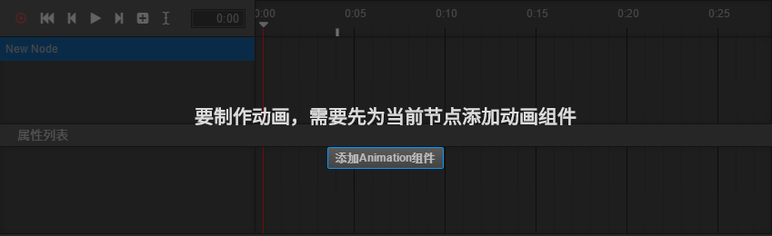
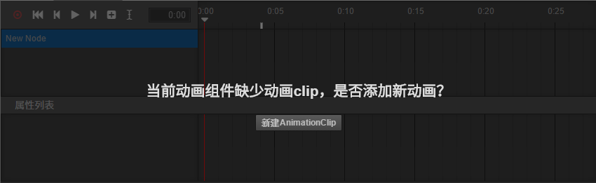

# 创建Animation组件和动画剪辑

## 创建 Animation 组件

在每个节点上，我们都可以添加不同的组件。如果我们想在这个节点上创建动画，也必须为它新建一个 Animation 组件。
创建的方法有两种：

 - 选中相应的节点，在属性检查器中点击右上方的`+`，或者下方的`添加组件`，在其他组件中选择 Animation。
 - 打开动画编辑器，然后在层级管理器中选中需要添加动画的节点，在动画编辑器中点击`添加 Animation 组件`按钮。

## 创建与挂载动画剪辑

现在我们的节点上已经有了 Animation 组件了，但是还没有相应的动画剪辑数据，动画剪辑也有两种创建方式：

 - 在资源管理器中点击左上方的`+`，或者右键空白区域，选择 Animation Clip，这时候会在管理器中创建一个名为 'New AnimationClip' 的剪辑文件。
单单创建还是不够的，我们再次在层级管理器中点选刚刚的节点，在属性检查器中找到 Animation，这时候的 Clips 显示的是 0，我们将它改成 1。
然后将刚刚在资源管理器中创建的 'New AnimationClip' ，拖入刚刚出现的 `animation-clip选择框` 内。
 - 如果 Animation 组件中还没有添加动画剪辑文件，则可以在动画编辑器中直接点击 `新建 AnimationClip` 按钮，根据弹出的窗口创建一个新的动画剪辑文件。
 需要注意的是，如果选择覆盖已有的剪辑文件，被覆盖的文件内容会被清空。

至此我们已经完成了动画制作之前的准备工作，下一步就是要创建动画曲线了。
