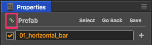

# 预制资源（Prefab）

## 创建预制

在场景中编辑好节点后，直接将节点从 **层级管理器** 拖到 **资源管理器**：

即可创建出一个预置：

## 保存预制

在场景中修改了预置实例后，在 **属性检查器** 中直接点击 **保存**，即可保存对应的预置资源：

## 还原预制

在场景中修改了预置实例后，在 **属性检查器** 中直接点击 **回退**，即可将预置对象还原为资源中的状态：

## 自动同步和手动同步

每个场景中的预置实例都可以选择要自动同步和还是手动同步。 
设为**手动同步**时，当预置对应的原始资源被修改后，场景中的预置实例不会同步刷新，只有在用户手动还原预置时才会刷新。 
设为**自动同步**时，该预置实例会自动和原始资源保持同步。

图中的图标表示当前预置的同步方式，点击图标将会在两种模式之间切换：

上面的图标表示当前预置使用手动同步，点击图标会切换到自动同步：

注意，为了保持引擎的精简，自动同步的预置实例有如下限制：
 - 场景中的预置实例仅能修改预置的根节点自身的 name、active、position 和 rotation 属性，其它子节点和所有组件都必须和原始资源保持一致，否则编辑器会询问是要撤销修改还是要更新原始资源。
 - 自动同步的预置中的组件无法引用该预置外的其它对象，否则编辑器会弹出提示。
 - 自动同步的预置外面的组件只能引用该预置的根节点，无法引用组件和子节点，否则编辑器会弹出提示。

> 这些限制都仅影响编辑器操作，运行时不影响。

## 将预置还原成普通节点

从 **资源管理器** 中删除一个预置资源后，你可以将场景中对应的预置实例还原成普通节点。方法是选中预置实例，然后点击菜单 `节点 > 还原成普通节点`。

## 延迟加载依赖的资源

在 **资源管理器** 中，选中预置资源，可以在 **属性检查器** 中看到“延迟加载资源”选项，该项默认关闭。选中之后，使用 **属性检查器** 关联、loadRes 等方式单独加载预置资源时，将会延迟加载预置所依赖的其它资源，提升部分页游的加载速度。详情请参考[场景的延迟加载](scene-managing.md#async-load-assets)。

继续前往 [骨骼动画资源](spine.md) 说明文档。
