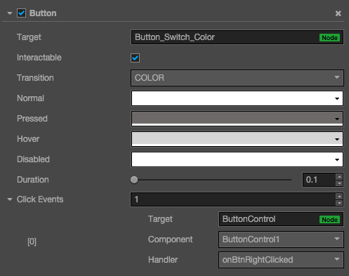
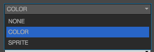
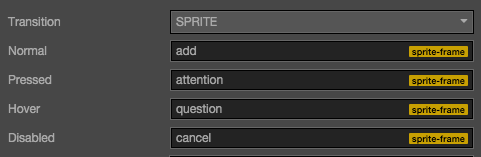

# Button（按钮）组件参考

Button 组件可以响应用户的点击操作，当用户点击 Button 时，Button 自身会有状态变化。另外，Button 还可以让用户在完成点击操作后响应一个自定义的行为。




点击**属性检查器**下面的`添加组件`按钮，然后从`添加 UI 组件`中选择`Button`，即可添加 Button 组件到节点上。

按钮的脚本接口请参考[Button API](../api/classes/Button.html)。

## Button 属性

| 属性 |   功能说明
| -------------- | ----------- |
|interactable| 布尔类型，设为 false 时，则 Button 组件进入禁用状态。
|enableAutoGrayEffect| 布尔类型，当设置为 true 的时候，如果 button 的 interactable 属性为 false，则 button 的 sprite Target 会使用内置 shader 变灰。注意：当 Transition 为 SPRITE 且 disabledSprite 属性有关联一个 spriteFrame 的时候，此时不会使用内置 shader 来变灰
|Transition| 枚举类型，包括 NONE, COLOR 和 SPRITE。每种类型对应不同的 Transition 设置。详情见`Button Transition`章节。
|Click Event| 列表类型，默认为空，用户添加的每一个事件由节点引用，组件名称和一个响应函数组成。详情见`Button 事件`章节


### Button Transition
Button 的 Transition 用来指定当用户点击 Button 时的状态表现。目前主要有 NONE，COLOR，SPRITE 和 SCALE。



### Color Transition


| 属性 |   功能说明
| -------------- | ----------- |
|Normal| Button 在 Normal 状态下的颜色。
|Pressed| Button 在 Pressed 状态下的颜色。
|Hover| Button 在 Hover 状态下的颜色。
|Disabled| Button 在 Disabled 状态下的颜色。
|Duration| Button 状态切换需要的时间间隔。

### Sprite Transition



| 属性 |   功能说明
| -------------- | ----------- |
|Normal| Button 在 Normal 状态下的 SpriteFrame。
|Pressed| Button 在 Pressed 状态下的 SpriteFrame。
|Hover| Button 在 Hover 状态下的 SpriteFrame。
|Disabled| Button 在 Disabled 状态下的 SpriteFrame。

### Scale Transition


| 属性 |   功能
| -------------- | ----------- |
|Duration| Button 状态切换需要的时间间隔。
|ZoomScale| 当用户点击按钮后，按钮会缩放到一个值，这个值等于 Button 原始 scale * zoomScale, zoomScale 可以为负数

### Button 事件


| 属性 |   功能说明
| -------------- | ----------- |
|Target| 带有脚本组件的节点。
|Component| 脚本组件名称。
|Handler| 指定一个回调函数，当用户点击 Button 并释放时会触发此函数。

#### 详细说明

Button 目前只支持 On Click 事件，即当用户点击并释放 Button 时才会触发相应的回调函数。

Button 的回调函数带一个 event 参数，如果需要在回调里面取到 Button 组件，可以通过下面的方法：

```js
callback: function(event) {
    var node = event.target;
    var button = node.getComponent(cc.Button);
}
```

#### 通过脚本添加回调

```js
button.clickEvents.push(new cc.Component.EventHandler(...))
```

---

继续前往 [ProgressBar 组件参考](progress.md) 。
