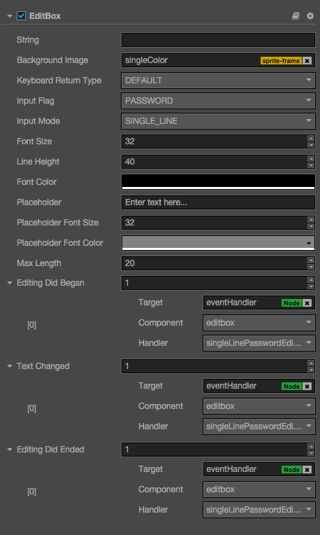

# EditBox 组件参考

EditBox 是一种文本输入组件，该组件让你可以轻松获取用户输入的文本。



点击**属性检查器**下面的`添加组件`按钮，然后从`添加 UI 组件`中选择`EditBox`，即可添加 EditBox 组件到节点上。

EditBox 的脚本接口请参考[EditBox API](../api/classes/EditBox.html)。

## EditBox 属性

| 属性                   | 功能说明                                                                         |
| --------------         | -----------                                                                      |
| String                 | 输入框的初始输入内容，如果为空则会显示占位符的文本                               |
| Background Image       | 输入框的背景图片                                                                 |
| Keyboard Return Type   | 指定移动设备上面回车按钮的样式                                                   |
| Input Flag             | 指定输入标识：可以指定输入方式为密码或者单词首字母大写                           |
| Input Mode             | 指定输入模式: ANY 表示多行输入，其它都是单行输入，移动平台上还可以指定键盘样式。 |
| Font Size              | 输入框文本的字体大小                                                             |
| StayOnTop              | 输入框总是可见，并且永远在游戏视图的上面                                         |
| TabIndex               | 修改 DOM 输入元素的 tabIndex，这个属性只有在 Web 上面修改有意义。                |
| Line Height            | 输入框文本的行高                                                                 |
| Font Color             | 输入框文本的颜色                                                                 |
| Placeholder            | 输入框占位符的文本内容                                                           |
| Placeholder Font Size  | 输入框占位符的字体大小                                                           |
| Placeholder Font Color | 输入框占位符的字体颜色                                                           |
| Max Length             | 输入框最大允许输入的字符个数                                                     |

## EditBox 事件


### Editing Did Began 事件
| 属性            | 功能说明                                               |
| --------------  | -----------                                            |
| Target          | 带有脚本组件的节点。                                   |
| Component       | 脚本组件名称。                                         |
| Handler         | 指定一个回调函数，当用户开始输入文本的时候会调用该函数 |
| CustomEventData | 用户指定任意的字符串作为事件回调的最后一个参数传入。   |

 说明：该事件在用户点击输入框获取焦点的时候被触发。


### Text Changed 事件
| 属性            | 功能说明                                               |
| --------------  | -----------                                            |
| Target          | 带有脚本组件的节点。                                   |
| Component       | 脚本组件名称。                                         |
| Handler         | 指定一个回调函数，当用户正在输入文本的时候会调用该函数 |
| CustomEventData | 用户指定任意的字符串作为事件回调的最后一个参数传入。   |

说明：该事件在用户每一次输入文字变化的时候被触发。

### Editing Did Ended 事件
| 属性            | 功能说明                                             |
| --------------  | -----------                                          |
| Target          | 带有脚本组件的节点。                                 |
| Component       | 脚本组件名称。                                       |
| Handler         | 指定一个回调函数，当用户输入文本结束时会调用该函数。 |
| CustomEventData | 用户指定任意的字符串作为事件回调的最后一个参数传入。 |

说明：在单行模式下面，一般是在用户按下回车或者点击屏幕输入框以外的地方调用该函数。
如果是多行输入，一般是在用户点击屏幕输入框以外的地方调用该函数。

### Editing Return 事件
| 属性            | 功能说明                                                   |
| --------------  | -----------                                                |
| Target          | 带有脚本组件的节点。                                       |
| Component       | 脚本组件名称。                                             |
| Handler         | 指定一个回调函数，当用户输入文本按下回车键时会调用该函数。 |
| CustomEventData | 用户指定任意的字符串作为事件回调的最后一个参数传入。       |

说明：该事件在用户按下回车键的时候被触发, 如果是单行输入框，按回车键还会使输入框失去焦点。

## 详细说明

- Keyboard Return Type 特指在移动设备上面进行输入的时候，弹出的虚拟键盘上面的回车键样式。
- 如果需要输入密码，则需要把 Input Flag 设置为 password，同时 Input Mode 必须是 Any 之外的选择，一般选择 Single Line。
- 如果要输入多行，可以把 Input Mode 设置为 Any。
- 背景图片支持九宫格缩放

注意：如果在 iframe 里面使用，最好把 `stayOnTop` 属性设置为 true

#### 通过脚本代码添加回调

##### 方法一

这种方法添加的事件回调和使用编辑器添加的事件回调是一样的，通过代码添加，
你需要首先构造一个 `cc.Component.EventHandler` 对象，然后设置好对应的 target, component, handler 和 customEventData 参数。

```js
var editboxEventHandler = new cc.Component.EventHandler();
editboxEventHandler.target = this.node; //这个 node 节点是你的事件处理代码组件所属的节点
editboxEventHandler.component = "cc.MyComponent"
editboxEventHandler.handler = "onEditDidBegan";
editboxEventHandler.customEventData = "foobar";

editbox.editingDidBegan.push(editboxEventHandler);
// 你也可以通过类似的方式来注册其它回调函数
//editbox.editingDidEnded.push(editboxEventHandler);
//editbox.textChanged.push(editboxEventHandler);
//editbox.editingReturn.push(editboxEventHandler);


//here is your component file
cc.Class({
    name: 'cc.MyComponent'
    extends: cc.Component,

    properties: {
    },

    onEditDidBegan: function(editbox, customEventData) {
        //这里 editbox 是一个 cc.EditBox 对象
        //这里的 customEventData 参数就等于你之前设置的 "foobar"
    },
    //假设这个回调是给 editingDidEnded 事件的
    onEditDidEnded: function(editbox, customEventData) {
        //这里 editbox 是一个 cc.EditBox 对象
        //这里的 customEventData 参数就等于你之前设置的 "foobar"
    }
    //假设这个回调是给 textChanged 事件的
    onTextChanged: function(text, editbox, customEventData) {
        //这里的 text 表示 修改完后的 EditBox 的文本内容
        //这里 editbox 是一个 cc.EditBox 对象
        //这里的 customEventData 参数就等于你之前设置的 "foobar"
    }
    //假设这个回调是给 editingReturn 事件的
    onEditingReturn: function(editbox,  customEventData) {
        //这里 editbox 是一个 cc.EditBox 对象
        //这里的 customEventData 参数就等于你之前设置的 "foobar"
    }
});
```


##### 方法二

通过 `editbox.node.on('editing-did-began', ...)` 的方式来添加

```js
//假设我们在一个组件的 onLoad 方法里面添加事件处理回调，在 callback 函数中进行事件处理:

cc.Class({
    extends: cc.Component,

	
    properties: {
       editbox: cc.EditBox
    },
    
    onLoad: function () {
       this.editbox.node.on('editbox', this.callback, this);
    },
    
    callback: function (event) {
       //这里的 event 是一个 EventCustom 对象，你可以通过 event.detail 获取 EditBox 组件
       var editbox = event.detail;
       //do whatever you want with the editbox
    }
});

同样的，你也可以注册 'editing-did-ended', 'text-changed' 和 'editing-return' 事件，这些事件的回调函数的参数与 'editing-did-began' 的参数一致。

```