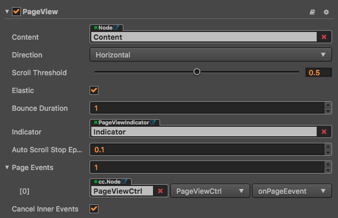
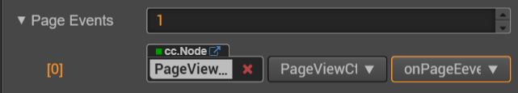

# PageView 组件参考

PageView 是一种页面视图容器.

点击**属性检查器**下面的`添加组件`按钮，然后从`添加 UI 组件`中选择`PageView`，即可添加 PageView 组件到节点上。

页面视图的脚本接口请参考[PageView API](../api/classes/PageView.html)。

## PageView 属性

| 属性 |   功能说明
| -------------- | ----------- |
| Content| 它是一个节点引用，用来创建 PageView 的可滚动内容。
| Direction | 页面视图滚动方向。
| ScrollThreshold | 滚动临界值，默认单位百分比，当拖拽超出该数值时，松开会自动滚动下一页，小于时则还原。
| Elastic | 布尔值，是否回弹。
| Bounce Duration | 浮点数，回弹所需要的时间。取值范围是 0-10。
| indicator | 页面视图指示器组件。
| cancelInnerEvents | 布尔值，是否在滚动行为时取消子节点上注册的触摸事件

## PageView 事件

| 属性 |   功能说明
| -------------- | ----------- |
|Target| 带有脚本组件的节点。
|Component| 脚本组件名称。
|Handler| 指定一个回调函数，当 PageView 的事件发生的时候会调用此函数。

PageView 的事件回调有两个参数，第一个参数是 PageView 本身，第二个参数是 PageView 的事件类型。

## 详细说明

PageView 组件必须有指定的 content 节点才能起作用，conent 中的每个子节点为一个单独页面，该每个页面的大小为 PageView 节点的大小，操作效果分为 2 种：第一种：缓慢滑动，通过拖拽视图中的页面到达指定的 ScrollThreshold 数值（该数值是页面大小的百分比）以后松开会自动滑动到下一页，第二种：快速滑动，快速的向一个方向进行拖动，自动滑倒下一页，每次滑动最多只能一页。

通常一个 PageView 的节点树如下图：

## CCPageViewIndicator 设置

CCPageViewIndicator 是可选的，该组件是用来显示页面的个数和标记当前显示在哪一页。

建立关联可以通过在**层级管理器**里面拖拽一个带有 PageViewIndicator 组件的节点到 PageView 的相应字段完成。

---

继续前往 [PageViewIndicator 组件参考](pageviewindicator.md)。
