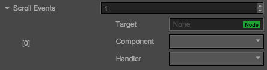

# ScrollView 组件参考

ScrollView 是一种带滚动功能的容器，它提供一种方式可以在有限的显示区域内浏览更多的内容。通常 ScrollView 会与
`Mask`组件配合使用，同时也可以添加`ScrollBar`组件来显示浏览内容的位置。

点击**属性检查器**下面的`添加组件`按钮，然后从`添加 UI 组件`中选择`ScrollView`，即可添加 ScrollView 组件到节点上。

滚动视图的脚本接口请参考[ScrollView API](../api/classes/ScrollView.html)。

## ScrollView 属性

| 属性 |   功能说明
| -------------- | ----------- |
| content| 它是一个节点引用，用来创建 ScrollView 的可滚动内容，通常这可能是一个包含一张巨大图片的节点。
| Horizontal | 布尔值，是否允许横向滚动。
| Vertical | 布尔值，是否允许纵向滚动。
| Inertia | 滚动的时候是否有加速度。
| Brake | 浮点数，滚动之后的减速系数。取值范围是 0-1，如果是 1 则立马停止滚动，如果是 0，则会一直滚动到 content 的边界。
|Elastic | 布尔值，是否回弹。
|Bounce Duration | 浮点数，回弹所需要的时间。取值范围是 0-10。
|Horizontal ScrollBar| 它是一个节点引用，用来创建一个滚动条来显示 content 在水平方向上的位置。
|Vertical ScrollBar| 它是一个节点引用，用来创建一个滚动条来显示 content 在垂直方向上的位置
|ScrollView Events| 列表类型，默认为空，用户添加的每一个事件由节点引用，组件名称和一个响应函数组成。详情见 'Scrollview 事件' 章节

## ScrollView 事件

| 属性 |   功能说明
| -------------- | ----------- |
|Target| 带有脚本组件的节点。
|Component| 脚本组件名称。
|Handler| 指定一个回调函数，当 ScrollView 的事件发生的时候会调用此函数。

Scrollview 的事件回调有两个参数，第一个参数是 ScrollView 本身，第二个参数是 ScrollView 的事件类型。

## 详细说明

ScrollView 组件必须有指定的 content 节点才能起作用，通过指定滚动方向和 content 节点在此方向上的长度来计算滚动时的位置信息，Content 节点也可以通过`UIWidget`设置自动 resize。

通常一个 ScrollView 的节点树如下图：

这里的 Viewport 用来定义一个可以显示的滚动区域，所以通常 Mask 组件会被添加到 Viewport 上。可以滚动的内容可以直接放到 content 节点或者添加节 content 的子节点上。

## ScrollBar 设置

ScrollBar 是可选的，你可以选择只设置水平或者垂直 ScrollBar，当然也可以两者都设置。

建立关联可以通过在**层级管理器**里面拖拽一个带有 ScrollBar 组件的节点到ScrollView的相应字段完成。

---

继续前往 [ScrollBar 组件参考](scrollbar.md)。
