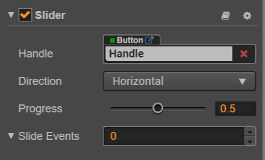

# Slider 组件参考

Slider 是一个滑动器组件。

点击**属性检查器**下面的`添加组件`按钮，然后从`添加 UI 组件`中选择`Slider`，即可添加 Slider 组件到节点上。

滑动器的脚本接口请参考[Slider API](../api/classes/Slider.html)。

## Slider 属性

| 属性 |   功能说明
| -------------- | ----------- |
| handle | 滑块按钮部件，可以通过该按钮进行滑动调节 Slider 数值大小
| direction | 滑动器的方向，分为横向和竖向
| progress | 当前进度值，该数值的区间是 0-1 之间
| slideEvents | 滑动器组件事件回调函数

## Slider 事件

| 属性 |   功能说明
| -------------- | ----------- |
|Target| 带有脚本组件的节点。
|Component| 脚本组件名称。
|Handler| 指定一个回调函数，当 Slider 的事件发生的时候会调用此函数。

Slider 的事件回调有两个参数，第一个参数是 Slider 本身，第二个参数是 Slider 的事件类型。

## 详细说明

Slider 通常用于调节数值的 UI（例如音量调节），它主要的部件一个滑块按钮，该部件用于用户交互，通过该部件可进行调节 Slider 的数值大小。

通常一个 Slider 的节点树如下图：

---

继续前往 [PageView 组件参考](pageviwe.md)。
