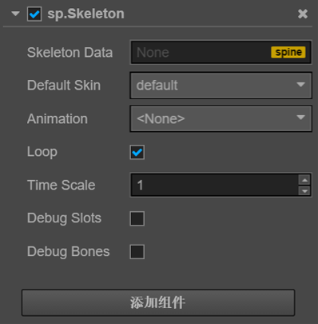

# Spine 组件参考

Spine 组件对骨骼动画（Spine）资源，进行渲染和播放。

点击**属性检查器**下面的添加组件按钮，然后从添加其他组件中选择 Spine Skeleton，即可添加 Spine 组件到节点上。

Spine 的脚本接口请参考[Skeleton API](../api/classes/Skeleton.html)。

## Spine 属性

| 属性 |   功能说明
| -------------- | ----------- |
|Skeleton Data| Spine 导出后的 `.json` 文件
|Default Skin| 默认的皮肤
|Animation| 当前播放的动画
|Loop| 动画是否循环
|Premultiplied Alpha| 图片是否使用预乘，默认为 True。 当图片的透明区域出现色块时需要关闭该选项， 当图片的半透明区域颜色变黑时需要启用该选项。
|Time Scale| 播放速度
|Debug Slots| 显示图片边框
|Debug Bones| 显示骨骼

> 注意：当使用 Spine 组件时，Node 节点上 `Anchor` 与 `Size` 是无效的。
