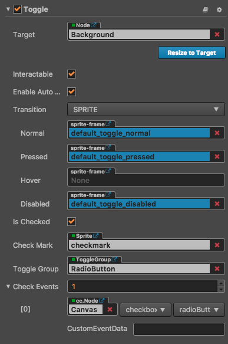

# Toggle 组件参考

Toggle 是一个 CheckBox，当它和 ToggleGroup 一起使用的时候，可以变成 RadioButton。

点击**属性检查器**下面的`添加组件`按钮，然后从`添加 UI 组件`中选择 `Toggle`，即可添加 Toggle 组件到节点上。

Toggle 的脚本接口请参考[Toggle API](../api/classes/toggle.html)。

## Toggle 属性
| 属性 |   功能说明
| -------------- | ----------- |
|isChecked| 布尔类型，如果这个设置为 true，则 check mark 组件会处于 enabled 状态，否则处于 disabled 状态。
|checkMark| cc.Sprite 类型，Toggle 处于选中状态时显示的图片
|toggleGroup| cc.ToggleGroup 类型， Toggle 所属的 ToggleGroup，这个属性是可选的。如果这个属性为 null，则 Toggle 是一个 CheckBox，否则，Toggle 是一个 RadioButton。
|Check Events| 列表类型，默认为空，用户添加的每一个事件由节点引用，组件名称和一个响应函数组成。详情见`Toggle 事件`章节

注意：因为 Toggle 继承至 Button，所以关于 Toggle 的 Button 相关属性的详细说明和用法请参考 Button 组件对应的章节，这里就不再赘述了。

## Toggle 事件

| 属性 |   功能说明
| -------------- | ----------- |
|Target| 带有脚本组件的节点。
|Component| 脚本组件名称。
|Handler| 指定一个回调函数，当 Toggle 的事件发生的时候会调用此函数。

Toggle 的事件回调有两个参数，第一个参数是 event ，第二个参数是 Toggle 本身。

## 详细说明
Toggle 组件的节点树一般为：

这里注意的是，checkMark 组件所在的节点需要放在 background 节点的上面。

---

继续前往 [ToggleGroup 组件参考](toggleGroup.md)。
