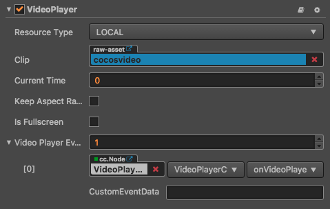
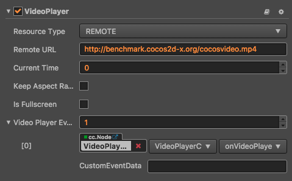

# VideoPlayer 组件参考

VideoPlayer 是一种视频播放组件，该组件让你可以轻松地播放本地和远程视频。

播放本地视频：

播放远程视频：

点击**属性检查器**下面的`添加组件`按钮，然后从`添加 UI 组件`中选择`VideoPlayer`，即可添加 VideoPlayer 组件到节点上。

VideoPlayer 的脚本接口请参考 [VideoPlayer API](../api/classes/VideoPlayer.html)。

## VideoPlayer 属性

| 属性 | 功能说明
|-------- | ----------- |
| Resource Type| 视频来源的类型，目前支持本地（LOCAL）视频和远程（REMOTE）视频
| Clip | 当 Resource Type 为 LOCAL 时显示的字段，指代一个本地视频的路径
| Remote URL | 当 Resource Type 为 REMOTE 时显示的字段，指代一个远程视频的路径
| Current Time | 指定视频播放时的当前时间点
| Keep Aspect Ratio | 是否保持视频原来的宽高比
| Is Fullscreen| 是否全屏播放视频
| Video Player Event| 视频播放回调函数，该回调函数会在特定情况被触发，比如播放中，暂时，停止和完成播放。 详情见`VideoPlayer 事件`章节

## VideoPlayer 事件

### VideoPlayerEvent 事件
| 属性 |   功能说明
| -------------- | ----------- |
|Target| 带有脚本组件的节点。
|Component| 脚本组件名称。
|Handler| 指定一个回调函数，当视频开始播放后，暂停时或者结束时都会调用该函数，该函数会传一个事件类型参数进来。详情见`Video Player Event 类型` 章节

### 事件回调参数

| 名称           | 功能说明                                                              |
| -------------- | -----------                                                           |
| PLAYING        | 表示视频正在播放中。                                                  |
| PAUSED         | 表示视频暂停播放。                                                    |
| STOPPED        | 表示视频已经停止播放。                                                |
| COMPLETED      | 表示视频播放完成。                                                    |
| META_LOADED    | 表示视频的元信息已加载完成，你可以调用 getDuration 来获取视频总时长。 |
| CLICKED        | 表示视频被用户点击了。                                                |
| READY_TO_PLAY  | 表示视频准备好了，可以开始播放了。                                    |

注意：在 iOS 平台上面，全屏模式下面点击视频无法发送 CLICKED 事件，如果需要让 iOS 全屏播放并正确接受 CLICKED 事件，
可以使用 Widget 组件把视频控件撑满，详情请参考引擎自带的 Example-cases 测试例。

## 详细说明
目前此组件只支持Web（PC 和手机）、iOS 和 Android 平台，Mac 和 Windows 平台暂时还不支持，如果在场景中使用此组件，
那么在 PC 的模拟器里面预览的时候可能看不到效果。

此控件支持的视频格式由所运行系统的视频播放器决定，为了让所有支持的平台都能正确播放视频，推荐使用 mp4 格式的视频。

继续前往 [WebView 组件参考](webview.md) 说明文档。
