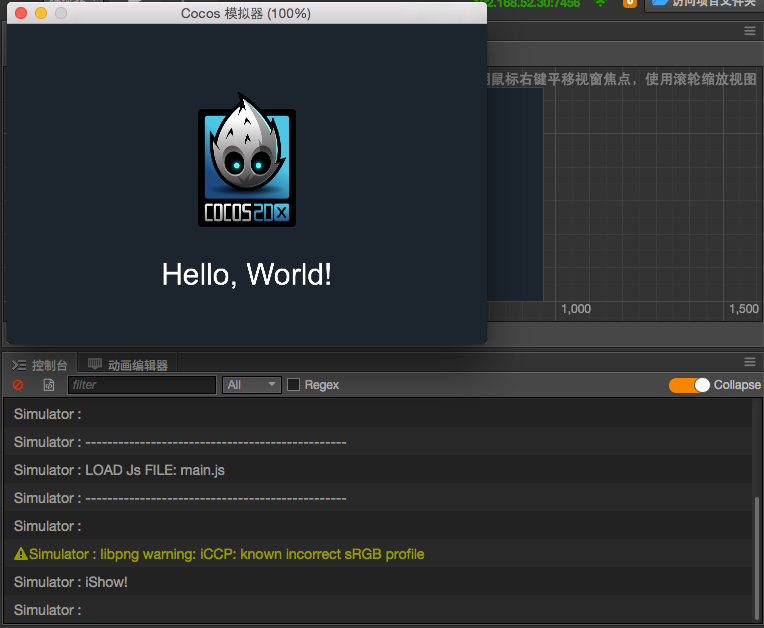

# 预览和构建

在使用主要编辑器面板进行资源导入、场景搭建、组件配置、属性调整之后，我们接下来就可以通过预览和构建来看到游戏在 Web 或原生平台运行的效果了。

## 选择预览平台

在游戏开发过程中我们可以随时点击编辑器窗口正上方的 **预览** 按钮，来看到游戏运行的实际情况。从 **预览** 按钮左边的下拉菜单我们可以从 **模拟器** 和 **浏览器** 中选择预览平台。

注意必须有当前打开的场景才能预览游戏内容，在没有打开任何场景，或者新建了一个空场景的情况下预览是看不到任何内容的。

### 模拟器

选择 **模拟器** 后运行预览，将会使用 Cocos Simulator（桌面模拟器）运行当前的游戏场景。

使用模拟器运行游戏时，脚本中的日志信息（使用 `cc.log` 打印的内容）和报错信息会出现在 **控制台** 面板中。

### 浏览器

选择 **浏览器** 后运行预览，会在用户的默认桌面浏览器中直接运行游戏的网页版本。推荐使用谷歌浏览器（Chrome）作为开发过程中预览调试用的浏览器，因为谷歌浏览器（Chrome）的开发者工具是最为全面强大的。

浏览器预览界面的最上边有一系列控制按钮可以对预览效果进行控制：

- 最左边选择预览窗口的比例大小，来模拟在不同移动设备上的显示效果
- **Rotate** 按钮决定显示横屏还是竖屏
- 左起第三个按钮可以选择 WebGL 或者 Canvas 渲染模式
- **Debug Mode** 里可以选择脚本中的哪些级别的日志会输出到浏览器控制台里。
- **Show FPS** 按钮切换每秒帧数和 Drawcall 数量显示
- **FPS** 限制最高每秒帧数
- **Pause** 暂停游戏

### 浏览器兼容性

Cocos Creator 开发过程中测试的桌面浏览器包括： Chrome，Firefox（火狐），IE11
其他浏览器只要内核版本够高也可以正常使用，对部分浏览器来说请勿开启 IE6 兼容模式。

移动设备上测试的浏览器包括：Safari (iOS)，Chrome，QQ 浏览器，UC 浏览器，百度浏览器，微信内置 Webview。

#### 使用 VS Code 调试

您可以使用 VS Code 在项目工程里直接对游戏预览进行调试，详情请参阅 [使用 VS Code 调试网页版游戏](../coding-setup.md##-vs-code--1)。

#### 使用浏览器开发者工具进行调试

以谷歌浏览器为例，通过功能菜单的 `更多工具/开发者工具` 可以打开开发者工具界面，如上图所示。在开发者工具中，我们可以查看运行日志、打断点进行调试、在调用堆栈中查看每一步各个变量的值、甚至进行资源加载和性能分析。

要学习使用开发者工具进行调试，请阅读[极客学院的 Chrome Dev Tools 使用指南](http://wiki.jikexueyuan.com/project/chrome-devtools/overview.html)，或其他浏览器的开发者工具帮助。

## 构建发布

预览和调试之后，如果您对您的游戏比较满意了，就可以通过主菜单的 `项目/构建发布` 打开 **构建发布** 窗口，来将游戏打包发布到您希望的目标平台上，包括 iOS、Android、HTML5、Windows、Mac、Cocos Play。

详细的构建发布流程，请查阅[跨平台发布游戏](../../publish/index.md)一章的内容。

请注意，使用模拟器运行游戏的效果，和最终发布到原生平台可能会有一定差别，对于任何重要的游戏功能，都请以构建发布后的版本来做最终的测试。