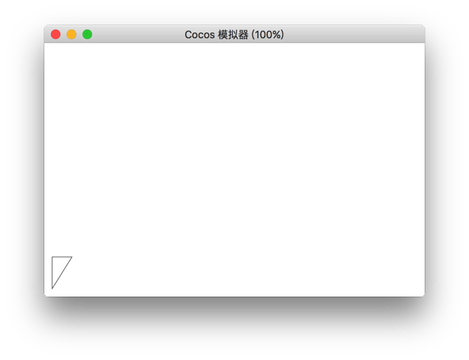

# close

`close()` 方法创建从当前点到开始点的路径。


## 实例

```javascript
var ctx = node.getComponent(cc.Graphics);
ctx.moveTo(20,20);
ctx.lineTo(20,100);
ctx.lineTo(70,100);
ctx.close();
ctx.stroke();
```

<a href="graphics/close.png"></a>

<hr>

返回 [绘图组件](index.md)
