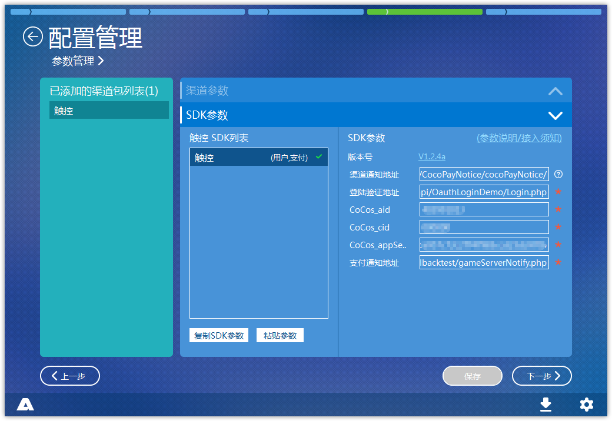

# Cocos Creator 接入 AnySDK

## 概述

从 Creator 1.2 版本起，构建项目的时候就会自动集成 AnySDK 框架，本篇介绍如何接入 AnySDK。更多关于 AnySDK 的资料可以查看 [官方wiki](http://docs.anysdk.com/)。

## 创建游戏

由于目前 AnySDK for Creator 的插件尚未发布，需要从 [官网](http://www.anysdk.com/downloads) 下载独立的 AnySDK 客户端来进行创建游戏和打包。登陆 AnySDK 客户端，创建新游戏，得到三个参数。

关于 AnySDK 客户端更多的介绍可以参考 [客户端使用手册](http://docs.anysdk.com/PackageTool)。  


## 服务端接入

如果游戏接入用户和支付的话，需要游戏服务端处理登陆验证和支付验签相关逻辑，参考以下两篇文档进行接入。  
[统一登陆验证](http://docs.anysdk.com/OauthLogin)  
[订单支付通知](http://docs.anysdk.com/PaymentNotice)


## 客户端接入

### 构建项目

点击菜单 **项目** -> **构建发布**，在该界面构建出 Cosos工 程，构建出来的 Cosos 工程已经自动集成好了 AnySDK。  


### 调用初始化接口

用户无需手动调用初始化接口，需使用构建出的 Cocos 工程中 `frameworks/runtime-src/Classes/SDKManager.cpp` 的 `loadAllPlugins` 方法 `init`方法，传递 appKey、appSecret、privateKey、oauthLoginServer

```cpp
//frameworks/runtime-src/Classes/SDKManager.cpp
std::string oauthLoginServer = "OAUTH_LOGIN_SERVER";
std::string appKey = "APP_KEY";
std::string appSecret = "APP_SERCRET";
std::string privateKey = "PRIVATE_KEY";
    
AgentManager* pAgent = AgentManager::getInstance();
pAgent->init(appKey,appSecret,privateKey,oauthLoginServer);
    
//Initialize plug-ins, including SDKs.
pAgent->loadAllPlugins();
```

`appKey`、`appSecret`、`privateKey` 填写 AnySDK 客户端创建游戏后生成的参数，`oauthLoginServer` 填写游戏服务端用于登陆验证的地址（如不接入用户则随便填写）。

PS：`init`初始化传的参数如果和打包的游戏的参数不一致，会导致渠道包运行的时候就强制退出。

### 调用各系统接口

根据游戏需求，参考以下文档来调用各个系统的接口。  

* [用户系统](http://docs.anysdk.com/UsersystemJS)  
* [支付系统](http://docs.anysdk.com/IapsystemJS)  
* [统计系统][1]
* [分享系统][2] 
* [广告系统][3]
* [推送系统][4] 
* [崩溃分析系统][5] 
* [广告追踪系统](http://docs.anysdk.com/AdTrackingSystemJS)

[1]: http://docs.anysdk.com/AnalyticsSystem(JS)
[2]: http://docs.anysdk.com/ShareSystem(JS)
[3]: http://docs.anysdk.com/AdsSystem(JS)
[4]: http://docs.anysdk.com/PushSystem(JS)
[5]: http://docs.anysdk.com/CrashSystem(JS)


## 打包

Android：编译生成游戏的 apk，该 apk 将作为 AnySDK 客户端打包用的母包。
iOS：Xcode 工程直接作为 AnySDK 客户端打包用的母工程。
H5：无需打包，只需 AnySDK 客户端添加渠道配置。

在 AnySDK 客户端里添加渠道以及自己所需要接入的 SDK，配置好 SDK 的参数（需要自己上 SDK 的后台申请参数），选择游戏母包即可进行打包。


## 备注

目前 H5 只支持渠道 SDK 接入，并且必须使用 AnySDK 企业版，如有需求可联系 AnySDK 商务。

```
陈燕淑  商务主管
触控厦门 | AnySDK 项目组
QQ：173732820
Mob：13950013330 （微信）
E-mail：chenys@anysdk.com、yanshu.chen@chukong-inc.com
网址：www.anysdk.com
Add：厦门市观音山商务中心7号楼1302
```