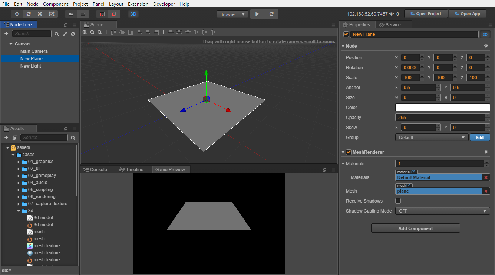
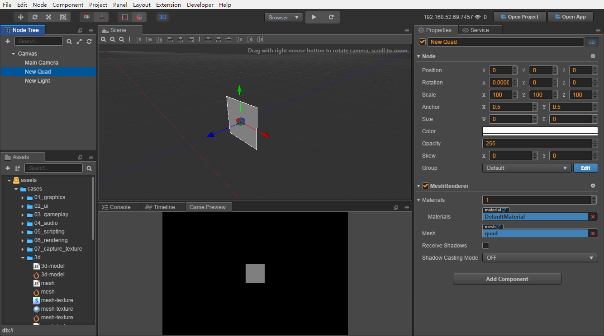

# Primitive 3D Objects

Cocos Creator can import model files generated by most 3D modeling software. Or you can directly create some common primitive 3D objects in Creator, such as Box, Capsule, Sphere, Cylinder, etc.

## How to create

Creator provides the following two ways to create the primitive 3D node.

### Create in code

Cocos Creator provides a `cc.primitive` script interface to create vertex data of primitive 3D model. The vertex data can be used to init the cc.Mesh asset used by [Mesh Renderer Component](mesh-renderer.md).

```js
function createMesh (data, color) {
    let gfx = cc.gfx;
    let vfmt = new gfx.VertexFormat([
        { name: gfx.ATTR_POSITION, type: gfx.ATTR_TYPE_FLOAT32, num: 3 },
        { name: gfx.ATTR_NORMAL, type: gfx.ATTR_TYPE_FLOAT32, num: 3 },
        { name: gfx.ATTR_COLOR, type: gfx.ATTR_TYPE_UINT8, num: 4, normalize: true },
    ]);

    let colors = [];
    for (let i = 0; i < data.positions.length; i++) {
        colors.push(color);
    }

    let mesh = new cc.Mesh();
    mesh.init(vfmt, data.positions.length);
    mesh.setVertices(gfx.ATTR_POSITION, data.positions);
    mesh.setVertices(gfx.ATTR_NORMAL, data.normals);
    mesh.setVertices(gfx.ATTR_COLOR, colors);
    mesh.setIndices(data.indices);
    mesh.setBoundingBox(data.minPos, data.maxPos);

    return mesh;
}

// Create box vertex data
let data = cc.primitive.box(100, 100, 100);
// Create mesh base on vertex data
let mesh = createMesh(data, cc.color(100, 100, 100));
// Set the created mesh to the Mesh Renderer
let renderer = this.getComponent(cc.MeshRenderer);
renderer.mesh = mesh;
```

For more information about `cc.primitive`, please refer to [Primitive API](%__APIDOC__%/en/modules/primitive.html). Users can also download the [TheAviator Demo](https://github.com/cocos/cocos-example-the-aviator) to learn how to use `cc.primitive`.

### Create in the editor

Click on the **+** button in the upper left corner of the **Node Tree** and select **Create 3D Node** to create a Box, Capsule, Sphere, Cylinder and other primitive 3D objects:


#### Creating Box


#### Creating Capsule


#### Creating Cone


#### Creating Cylinder


#### Creating Plane



#### Creating Sphere


#### Creating Torus


#### Creating Quad


