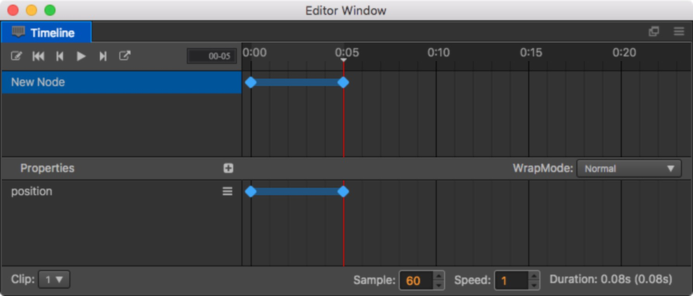
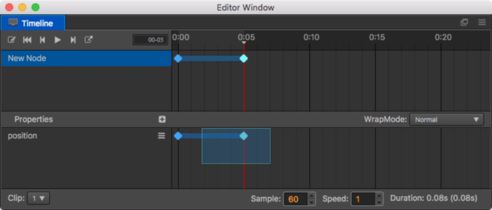

# Editing an Animation curve

Now, that you have mounted Animation clips to the Node, you can create Animation curves in your Animation clips.

First, you need to understand Animation properties. These include the existing properties of the Node, such as, position rotation, etc. and the user-defined properties of the component. Properties that are included in a component will add the name of the component to the beginning of their own name, such as: `cc.Sprite.spriteFrame`.

For example, in the image above, the position curve is the property path and the corresponding blue dots are keyframes.

## Adding a new property path

The normal method for adding a new property path involves first choosing the Node and then clicking `+` in the property field. In the pop up menu, all of the addable properties will be listed. Choose the property that you want to add and a corresponding path will be added.

## Delete a property path

Move the mouse focus to the property path you want to delete. A  button will appear on the right. Click on the button and choose the **Delete the properties** option in the pop up menu and the property will be deleted from the animation data.

## Add an keyframe

Click the  button to the right side of the corresponding property path in the property list, and select the `Insert keyframe` button in the pop up menu. then a frame will be added to the currently selected point in time.

Or modify the corresponding properties path of the Node in the edit mode. It is important to note that if the changed property path does not exist, the operation will be ignored, so if you want to change the key frame automatically, you will need to create the property path in advance.

## Choose an keyframe

Click the created sequence frame and it will be displayed in the selected state. Now the sequence frame will turn from blue to white. If you need to select multiple sequence frames at once, you can hold down the <kbd>ctrl</kbd> key and select the ones you need or directly drag and highlight them in the property field.

## Move an keyframe

If you move the mouse over any selected keyframe, press the left mouse button and drag, the mouse will transform into left and right arrows, this time you can drag all the selected keyframes.

## Modify an keyframe

Select the keyframe to be modified on the timeline and modify the corresponding property directly in the **Property inspector** (make sure the Timeline is in record mode). For example, in the properties list, there are three properties path of position, x, and y. After selecting the keyframe, you can modify the position, x, and y properties in the **Property inspector**.

Or select a location on the timeline that does not have a keyframe, and then modify the corresponding property in the **Properties**, and a keyframe will automatically be inserted.

## Delete an keyframe

After selecting the keyframe, click the  button of the corresponding property path and select `Delete selected frame`. Or directly press the `Delete` key on the keyboard and all the selected keyframe will be deleted.

## Copy / paste keyframes

> Support only v1.9.2 and above

After we select the node, we can press <kbd>ctrl + c</kbd> (Windows) or <kbd>command + c</kbd> (Mac) on the keyboard to copy the selected frame.
Then press <kbd>ctrl + v</kbd> (Windows) or <kbd>command + v</kbd> (Mac) in the new area to paste the newly copied frame to the specified position.

According to the number of selected nodes, there are two ways to index:

1. When you select data from one node, paste it directly onto the current selected node.
2. If the data is replicated on multiple nodes. The path information of the copied node will also be pasted together.

If the copied node does not exist in the pasted node tree, it is displayed as a missing node.

## Node operation

Animations are indexed by the name of the node. Sometimes we change the hierarchical relationship of the node within the **Node Tree**, and the animations in the **Timeline** will not find the corresponding node specified before. 
At this time we need to manually change the search path of the nodes on the animation:

1. Move the mouse to the node that needs to be migrated and click on the menu button that appears on the right
2. Select mobile node data
3. Modify the node's path data

The root node data we can not change, we can modify the follow up node path, For example, if we want to move the `/root/New Node` keyframe to the root node, we can delete New Node, leaving `/root/` and carriage return (`/root/` is the path of the root node that cannot be modified). For another example, we want to move the animation data on the `/root` following node to the `/root/New Node`. We just need to change the path to `/root/New Node`.
