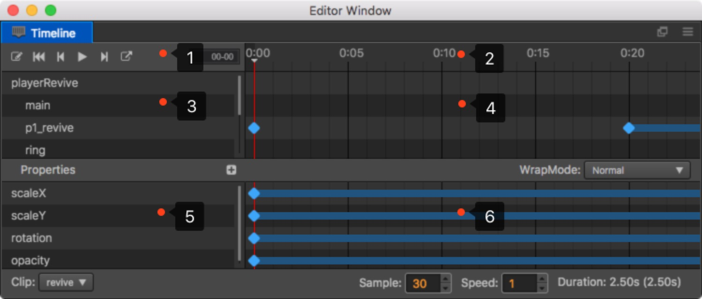

# About Animation

## Animation components and Animation clips

Cocos Creator is a componentized structure. Animation is no exception, it is a component in the Node.

## Animation clips

Animation clips, however, are documents for saving animation data. Animation clips need to be mounted to Animation components to enable the engine to smoothly apply animation data to the Node.

### Index of node data

path is animation component relative path. So, only one data copy of the same name node.

### clip params

**sample**: The number of frames per second data, default 60

**speed**: Animation speed, default 1

**duration**: Animation duration (speed = 1)

**real time**: Play continued real time

**wrap mode**: Play Mode

## Animate Editing Mode

Animation files can only be edited in animation editing mode. However, in edit mode, you cannot **add** / **delete** / **rename** nodes.

- **Open edit mode**

  Select a node that contains the Animation, and contains more than one clip file. And then click on the button in the upper left corner of the animation editor.

- **Close edit mode**

  Click the Edit button in the upper left corner of the **Timeline**. Or click the close button on the top left corner of the **Scene** panel.

## Understanding animation editor

The Animation editor can be divided into 6 parts.

1. Common button field, which displays some common functional buttons, such as: (from left to right) recording status switch, back to the first frame, last frame, play/stop, next frame, create a new animation clip and insert animation event.

2. Timeline and event, which mainly displays timeline. The added user defined events will display here too.

3. Node Tree management, which includes node data that can be influenced by the current animation clip.

4. The preview field of the keyframe in nodes, which mainly displays the preview timeline of all the frames in each node.

5. Property list, which displays the property lists of the currently chosen node that has been included in the chosen animation clip.

6. Key frame. The frame corresponding to each property will display here.

### The units of the timeline explained

The representation of the specific frame time on the timeline is `01-05`. The value consists of two parts, the part in front of colon is the current number of seconds, followed by the current number of frames in the next second.

`01-05` indicates that the current frame is at the time past  1 second and 5 more frames from the beginning of the animation.

Because the frame rate can be adjusted at any time, the time represented by the same frame will vary with the frame rate.

- When the frame rate is 30, `01-05` means 1 + 5/30 = 1.1667 seconds after the animation starts.
- When the frame rate is 10, `01-05` means 1 + 5/10 = 1.5 seconds after the animation starts.

Although the time of current frame changes with the frame rate, but the total frames an animation takes going into a key frame is always the same. If we have frame rate set to 30 and add a key frame to the `01-05` time, that key frame is  always the 35th frames from the beginning of the animation. Even if we change the frame rate to 10, the key frame is still the 35th of the whole animation, but the time of the key frame now reads as `03-05`. It is three times the value of the time before.

## Basic operation

### Modify the zoom proportion of timeline

What should I do if I feel that the range displayed by the **Timeline** is too small, and I need to scale it down so that more key frames are displayed in the **Timeline**?

- Scroll the mouse wheel in the area 2, 4 and 6 in the image above, and the display percentage of the timeline can be zoomed in/out.

### Modify the display area of timeline

- Press Shift button on the keyboard, left-click area 2, 4, 6 in the image above and drag it to the left/right.

- Press down the middle mouse button in area 2, 4, 6 in the image above and drag it.

### Modify the currently chosen timeline node

- Click or drag any position in the timeline (area 2) area, you can modify the current time node.

- Drag the marked red line in area 4.

### Enter/exit recording status

- There is a red button on the left side of graph 1. Click it and you will open/close the recording status.

- The adding and deletion of the property frame and path will automatically open the recording status.

- The playing of the animation will automatically open the recording status.

- When playing, operations like saving the scene, etc., will close the recording status.

### Play/stop animation

- Click the Play button in graph 1, which will automatically turn into Stop. Click the button again and the animation will be stopped.

- When playing, operations like saving the scene, etc. will stop playing.

## Shortcut key

- **left**: Previous frame

- **right**: Next frame

- **delete**: Delete the selected keys

- **k**: Forward the animation

- **j**: Backward animation

- **ctrl/cmd + left**: Jump to the first frame

- **ctrl/cmd + right**: Jump to the last frame
