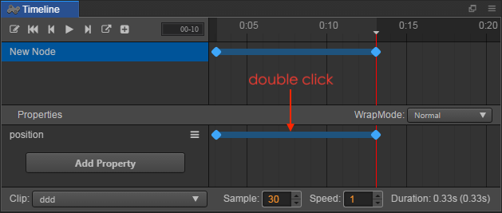

# Editing a time curve

We have already created some basic animations. However, sometimes we need to use **EaseInOut** and other easing effects between two frames. So how can this be achieved in the **TimeLine**?

First, we need to create two unequal frames on one path. For example, create two key frames on a **position** property path of the **TimeLine**, with the position (0, 0) and (100, 100), then a connecting blue line between these two frames will appear:

Double click the connecting blue line and the time curve editor will open. There are two buttons on the far left, the close panel button on the top and the save button on the bottom.

## Using a pre-set curve

We can select various pre-set effects from the left-hand side of the curve editor, such as **Ease In**, etc. After selecting, some pre-set parameters will appear on the right side of pre-set effects list. These can be chosen according to your needs.

## A user-defined curve

Sometimes the pre-set curve cannot meet the needs of the animation, we can also modify the curve manually.

In the preview image to the right of the time curve editor, there are two gray control points, By dragging these control points, the path of the curve can be modified. 
If the control points need to be dragged outside of the visual field, you can use the mouse wheel or small plotting scale on the top right corner to zoom in/out of the preview image. The proportions supported range from 0.1 to 1.

