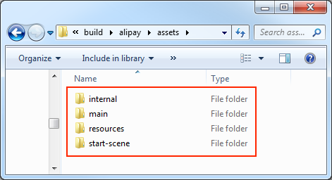

# Asset Bundle Overview

> Author: Santy-Wang, Xunyi

Starting with v2.4, Creator officially supports **Asset Bundle**. The Asset Bundle is a modular resource tool that allows developers to divide the resources such as textures, scripts, scenes, etc. into different Asset Bundles according to the project requirements. Then, as the game runs, load different Asset Bundles as needed to minimize the number of resources to be loaded at startup. thus reducing the time required for the first download and loading of the game.<br>
The Asset Bundle can be placed in different places as needed, such as on a remote server, locally, or in a subpackage of a mini game platform. It also can be reused across projects to load Asset Bundle in subprojects.

## The built-in Asset Bundle

Starting with v2.4, all resources in the project will be placed in the Creator's four built-in Asset Bundle folders by category.



| Built-in Asset Bundle | Function Explanation | Configuration |
| :--------------- | :--------- | :-------- |
| `internal`    | Store all built-in resources and their dependent resources | By configuring the `internal -> resources` folder in the **Assets** panel. But currently there is no support for changing the default configuration |
| `main`        | Store all scenes checked in the **Included Scenes** selection box of the **Build** panel and their dependent resources  | By configuring the **Main Bundle Compress Type** and **Main Bundle Is Remote** options of the **Build** panel. |
| `resources`   | Store all resources in the `resources` directory and their dependent resources  | By configuring the `assets -> resources` folder in the **Assets** panel. |
| `start-scene` | If you check the **Start Scene Asset Bundle** option in the **Build** panel, the first scene will be built into the `start-scene` folder. Please refer to the [Start Scene Loading](../publish/publish-wechatgame.md#speed-up-the-loading-of-the-start-scene) for details.  | Cannot be configured. |

Like other Asset Bundles, the built-in Asset Bundle (except for `internal`) also can be configured for different platforms.

After the build, the built-in Asset Bundle will be generated in different locations depending on the configuration, see the [Configure the Asset Bundle](../scripting/asset-bundle.md#configuration) documentation for the configuration methods and generation rules.

### Loading the built-in Asset Bundle

The built-in Asset Bundle can be loaded in two ways:

- Configure the **Resource Server Address** in the **Build** panel at build time.
- Modify the code in `main.js` through the custom build template feature, as follows:

  ```js
  // ...

  let bundleRoot = [];
  // Add the URL where "internal" bundle is located.
  bundleRoot.push('http://myserver.com/assets/internal');
  // If "resources" bundle exists, add the URL where "resources" bundle is located.
  bundleRoot.push('http://myserver.com/assets/resources');
  // Add the URL where "main" bundle is located.
  bundleRoot.push('http://myserver.com/assets/main');

  var count = 0;
  function cb (err) {
      if (err) {
          return console.error(err.message, err.stack);
      }
      count++;
      if (count === bundleRoot.length + 1) {
          cc.game.run(option, onStart);
      }
  }

  cc.assetManager.loadScript(settings.jsList.map(x => 'src/' + x), cb);

  for (let i = 0; i < bundleRoot.length; i++) {
      cc.assetManager.loadBundle(bundleRoot[i], cb);
  }

  ```

## Priority

When the folder is set to Asset Bundle, the resources in the folder and the related dependent resources outside the folder are merged into the same Asset Bundle. It is possible to have a resource that is not in the Asset Bundle folder, but belongs to both Asset Bundles, because it is depended upon by both Asset Bundles. As shown in the figure:

 

Another possibility is that a resource is in one Asset Bundle folder, but is also depended upon by other Asset Bundles. As shown in the figure:


In both cases, `resource c` belongs to both `Asset Bundle A` and `Asset Bundle B`. So which Asset Bundle does `resource c` actually exist in? This needs to be specified by adjusting the priority of the Asset Bundle.<br>
Creator opens up 10 configurable priorities, and the editor will build the Asset Bundle in **descending order** of priority at build time.

- When the same resource is referenced by multiple Asset Bundles with **different priorities**, the resource will be placed in the high-priority Asset Bundle, while the lower-priority Asset Bundle stores only one record message. In this case the lower-priority Asset Bundle relies on the higher-priority Asset Bundle.<br>
If you want to load this shared resource in a lower-priority Asset Bundle, you must load the higher-priority Asset Bundle before loading the lower-priority Asset Bundle.
- When the same resource is referenced by multiple Asset Bundles of the **same priority**, the resource will be copied in each Asset Bundle, with no dependencies between the different Asset Bundles, and they can be loaded in any order. So try to make sure that the Asset Bundle that the shared resource (e.g. `Texture`, `SpriteFrame`, `Audio`, etc.) is in has a higher priority, so that more lower-priority Asset Bundles can share resources, thus minimizing the package size.

The four built-in Asset Bundle folders are prioritized as follows:

| Asset Bundle | Priority |
| :--- | --- |
| `internal`    | 11 |
| `main`        | 7  |
| `resources`   | 8  |
| `start-scene` | 9  |

When the four built-in Asset Bundles contain the same resources, the resources are stored in the higher priority Asset Bundle -- `internal` folder. It is recommended that other custom Asset Bundle priorities are not higher than the built-in Asset Bundle, so that the resources in the built-in Asset Bundle can be shared whenever possible.

## Compression Type

Creator currently provides **Default**, **None**, **Merge All Json**, **Mini Game Subpackage**, and **Zip** compression types for optimizing the Asset Bundle. All Asset Bundles use the **Default** compression type by default, and you can reset the compression type for all Asset Bundles including the built-in Asset Bundle (except for `internal`).

| Compression Type | Function Explanation |
| :------ | ------ |
| **Default**        | When building the Asset Bundle, JSON files for interdependent resources are merged together to reduce the number of load requests at runtime. |
| **None**           | When building the Asset Bundle, there is no compression operation. |
| **Merge All Json** | When building the Asset Bundle, the JSON files for all resources are merged into one, which minimizes the number of requests, but may increase the load time for a single resource. |
| **Mini Game Subpackage** | On a mini game platform that provides subpackaging, the Asset Bundle will be set as a subpackage of the mini game. For details, see [Mini Game Subpackage](../publish/subpackage.md) documentation. |
| **Zip**            | On some mini game platforms, the resource file will be compressed into a Zip file when building the Asset Bundle, reducing the number of load requests at runtime. |

If you use different compression types for the Asset Bundle on different platforms, then the Asset Bundle will be built according to the settings of the corresponding platform.

If you used Subpackage Loading in your old project, that is, if you checked the **Subpackage** option in the **Properties** panel, then when the project is upgraded to the v2.4, Creator will automatically convert it to an Asset Bundle, and set the compression type of this Asset Bundle on supported platforms to **Mini Game Subpackage**.

## Construction of the Asset Bundle

At build time, all the **code** and **resources** in the folder configured as the Asset Bundle are treated as follows.

- **Code**: All the code in the folder is merged into an entry script file named `index.js` or `game.js`, depending on the release platform, and removed from the main package.
- **Resources**: All resources in the folder and the related dependent resources outside the folder are placed in the `import` or `native` directory.
- **Resource Configuration**: All resource configuration information including path, type, and version information is merged into a file named `config.json`.

The structure of the Asset Bundle directory generated after build is shown below:


### Scripts in the Asset Bundle

The Asset Bundle supports script subpackaging. If your Asset Bundle includes the script files, then all the scripts will be merged into a single **js** file and removed from the main package. When loading the Asset Bundle, this **js** file will be attempted to be loaded.

> **Notes**:
>
> 1. Some platforms do not allow the loading of remote script files, such as the WeChat Mini Game, and Creator will copy the code of the Asset Bundle to the `src/scripts` directory to ensure normal loading.
> 2. It is recommended that scripts in the different Asset Bundles do not reference each other, otherwise you may not find the corresponding script at runtime. If you need to reference certain classes or variables, you can share them by exposing them in your own global namespace.

## FAQ

- **Q**: What is the difference between Asset Bundle and pre v2.4 resource subpackage?<br>
  **A**:
  1. Resource subpackage is actually splitting out some textures, meshs into a separate packages, but the package is incomplete and illogical and cannot be reused.<br>
  while Asset Bundle is modularizing resources through logical division. The Asset Bundle includes resources, scripts, metadata and resource lists, so it is complete, logical and reusable, and we can load an entire scene or any other resources from Asset Bundle. By splitting the Asset Bundle, you can greatly reduce the number of `json` and the size of `settings.js` in the first package.

  2. Resource subpackage is essentially a basic function controlled by the mini game platform. For example, the WeChat Mini Game supports subpackage, and then Creator made a layer of encapsulation on top of that to help the developers set up resource subpackage. If the WeChat Mini Game doesn't support subpackage anymore, neither does the Creator.<br>
  While the Asset Bundle is designed and implemented entirely by Creator, it is a modular tool to help developers divide their resources, independent of the platform, and can theoretically be supported on all platforms.

  3. Resource subpackage is related to the platform, meaning that it needs to be set up in the way required by the platform. For example, the subpackage of the WeChat Mini Game cannot be placed on the remote server, and can only be placed on Tencent's server.<br>
  While the Asset Bundle doesn't have these restrictions, the Asset Bundle can be placed locally, on a remote server, or even in a subpackage of the WeChat Mini Game.

- **Q**: Does the Asset Bundle support the lobby plus sub games mode?<br>
  **A**: Absolutely, subgame scenes can be placed in the Asset Bundle and loaded when needed, and subgames can even be pre-built as an Asset Bundle in other projects and then loaded for use in the main project.

- **Q**: Can the Asset Bundle reduce the size of `settings.js`?<br>
  **A**: Absolutely. In fact, as of v2.4, the packaged project is entirely based on the Asset Bundle, and the `setting.js` no longer stores any configuration information related to the resource, all configuration informations are stored in the `config.json` of each Asset Bundle. Each `config.json` stores only the resource information in the respective Asset Bundle, which reduces the size of the first package. This can simply be understood as all the `config.json` combined equal to the previous `settings.js`.

- **Q**: Does the Asset Bundle support cross project reuse?<br>
  **A**: Absolutely support, but the following conditions must be met:
  1. The engine version is the same
  2. All scripts referenced in the Asset bundle are placed under the Asset bundle.
  3. The Asset Bundle has no other external dependency bundle, and if it does, it must be loaded.

- **Q**: Does the Asset Bundle support split first scene?<br>
  **A**: Currently only supported on mini game platforms. You can check the **Start Scene Asset Bundle** in the **Build** panel and the first scene will be put into the `start-scene` of the built-in Asset Bundle to separate the first scene.

- **Q**: Does the Asset Bundle support nesting? For example, if there is a folder B in folder A, can both A and B be set as Asset Bundle?<br>
  **A**: Asset Bundle does not support nesting, please avoid using it as such.

For more information on the configuration, loading, and fetching of the Asset Bundle, see the [Asset Bundle Configuration and Loading](../scripting/asset-bundle.md) documentation.
