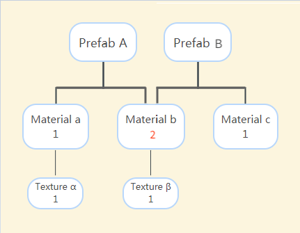

# Release Of Resources

> Author: Santy-Wang, Xunyi

A resource release module is provided in Asset Manager to manage the release of resources.

When a resource is loaded, it is temporarily cached in `cc.assetManager` for the next reuse. However, this also causes a constant growth in memory and video memory, so some resources can be released either by **Auto Release** or **Manual Release** if you don't need to use them.<br>
Releasing a resource will destroy all internal properties of the resource, such as data associated with the rendering layer, and move out of the cache, thus freeing up memory and video memory (for textures).

## Auto Release

The automatic release of a scene can be set directly in the editor. When you select the scene in the **Assets** panel, the **Auto Release Assets** option appears in the **Properties** panel.


Once checked, click the **Apply** button on the top right, and then all dependent resources of the scene will be automatically released when you switch the scene. It is recommended to check the **Auto Release Assets** option for all scenes to ensure low memory consumption, except for some high usage scenes (such as the main scene).

In addition, all `cc.Asset` instances have member functions `cc.Asset.addRef` and `cc.Asset.decRef` for increasing and decreasing the reference count, respectively. Once the reference count is 0, Creator will automatically release the resource (it needs to pass a release check first, see the following section for details)

```js
start () {
    cc.resources.load('images/background', cc.Texture2D, (err, texture) => {
        this.texture = texture;
        // Add references to resources when you need to use them.
        texture.addRef();
        // ...
    });
}

onDestroy () {
    // Reduce references to resources when you don't need to use them. Creator will try to auto-release them after calling decRef.
    this.texture.decRef();
}
```

The advantage of auto-release is that you don't have to explicitly call the release interface, you just need to maintain the reference count of the resource and Creator will release it automatically based on the reference count. This greatly reduces the possibility of releasing resources by mistake, and you don't need to understand the complex referencing relationships between resources. For projects with no special requirements, it is recommended that you use automatic release to release resources as much as possible.

#### Release Check

To prevent rendering or other problems caused by incorrectly releasing resources being used, Creator will perform a series of checks before auto-releasing resources:

1. If the reference count of the resource is 0, that is, there are no references to it elsewhere, then no follow-up check is required, the resource is destroyed directly and the cache is removed.

2. Once the resource is removed, a release check for its dependent resources is triggered synchronously, and the reference counts of all direct dependent resources (excluding descendants) of the resource after the cache is removed are reduced by 1, and a release check is triggered synchronously.

3. If the reference count of the resource is not 0, that is, there are references to it elsewhere, a circular reference check is required at this point to avoid having its own offspring refer to it. If the reference count is still not 0 after the cyclic reference check, terminate the release. Otherwise, destroy the resource directly, remove the cache, and trigger a release check for its dependent resources (as in step 2).

### Manual Release

When a more complex resource release mechanism is used in a project, you can call the relevant interfaces of the Asset Manager to manually release resources. For example:

```js
cc.assetManager.releaseAsset(texture);
```

Since the resource management module was upgraded in v2.4, the release interface differs slightly from the previous version:

1. The `cc.assetManager.releaseAsset` interface can only release a single resource, and for the sake of uniformity, the interface can only release resources through the resource itself, not via attributes such as resource uuid, resource url, etc. 

2. When releasing a resource, you only need to focus on the resource itself and the engine will automatically release its dependent resources instead of fetching them manually via `getDependsRecursively`.

> **Note**: the `release` series interfaces (Such as `release`, `releaseAsset`, `releaseAll`) will release the resource directly without a release check, only resource's dependent resources will have a release check. So when the `release` series interfaces are called explicitly, you can be sure that the resource itself will always be released.

## Reference Count Statistics

Before v2.4, Creator chose to give the developer control over the release of all resources, both the resource itself and its dependencies, and the developer had to manually obtain all the dependencies of the resource and select the dependencies to be released. This way gave the developer the most control, and worked well for small projects. But as Creator grows, the size of the project grows, the resources referenced by the scene grows, and other scenes may reuse those resources, which causes increasing complexity in releasing resources and it is very difficult for the developer to master the usage of all resources.

To address this pain point, the Asset Manager provides a set of resource release mechanism based on the reference counting, so that developers can release resources simply and efficiently, without worrying about rapid expansion of the project size.<br>
It should be noted that the Asset Manager only automatically counts static references between resources and does not truly reflect how the resources are dynamically referenced in the game, you need to control the dynamic references yourself to ensure that the resources are released correctly. The reasons are as follows:

- JavaScript is a language with a garbage collection mechanism that manages its memory, so the engine has no way of knowing if a resource has been destroyed in the browser environment.
- JavaScript does not provide the assignment operator overloading, which the reference count statistics are highly dependent on.

### Static Referencing of Resources

When you edit the resources in the editor (such as the scene, prefab, material, etc.), you need to configure some other resources in the properties of those resources, such as setting the texture in the materials, setting the SpriteFrame on the Sprite component of the scene. Then these references will be recorded in the serialized data of the resources, which the engine can use to analyze the list of dependent resources, and a reference relationship like this is the static reference.

The statistics for the static references of resources by the engine are as follows:

1. When loading a resource using `cc.assetManager` or Asset Bundle, the engine records all **direct dependent resources** for the resource in the underlying load pipe, adds 1 to the reference count of all **direct dependent resources**, and then initializes the reference count to 0 for the resource.

2. When releasing a resource, obtain all the **direct dependent resources** information recorded previous for the resource, and subtract the reference count of all dependent resources by 1.

This is because a resource can only be auto-released if its reference count is 0 in the release check. So the above steps ensure that the dependent resources of the resource cannot be released before the resource itself, because the reference count of the dependent resources is definitely not 0. That is, as long as a resource itself is not released, its dependent resources will not be released, thus ensuring that the release will not be done incorrectly when reusing the resource. For example:

1. Suppose you now have a Prefab A that depends on both Material a and Material b. Material a references Texture α, and Material b references Texture β. After loading Prefab A, the reference count for both Material a and Material b are 1, and the reference count for both Texture α and Texture β are also 1.

    

2. Suppose you now add a Prefab B that depends on both Material b and Material c. After you load the Prefab B, the reference count to Material b is 2, because it is referenced by both the Prefab A and B. The reference count to Material c is 1, and the reference counts for Textures α and β are still 1.

    

3. When the Prefab A is released, the reference count for the Materials a and b each decreases by 1.
    - The reference count of the Material a changes to 0 and is released; so the reference count of the Texture α minus 1 changes to 0 and is also released.
    - The reference count of the Material b changes to 1 and is retained, so the reference count of the Texture β is still 1 and is also retained.
    - Because the Prefab B is not released, the reference count for the Material c remains at 1 and is retained.
    
    

### Dynamic Referencing of Resources

When you do not make any settings for a resource in the editor, but instead dynamically load the resource and set it to the component of the scene via code, the reference relationships of the resource are not recorded in the serialization data, and the engine cannot count this part of the reference relationships, which are dynamic references.

If you are using dynamically loaded resources in your project for dynamic referencing, for example:

```js
cc.resources.load('images/background', cc.SpriteFrame, function (err, spriteFrame) {
    self.getComponent(cc.Sprite).spriteFrame = spriteFrame;
});
```

At this point, the SpriteFrame resource is set to the Sprite component and the engine does not do anything special, the reference count of the SpriteFrame remains 0. If the dynamically loaded resources need to be referenced, held, or reused over time, it is recommended to use the `addRef` interface to manually increase the reference count. For example:

```js
cc.resources.load('images/background', cc.SpriteFrame, function (err, spriteFrame) {
    self.getComponent(cc.Sprite).spriteFrame = spriteFrame;
    spriteFrame.addRef();
});
```

Increasing the reference count ensures that the resource will not be released early by mistake. Always remember to use `decRef` to remove the reference count and set the resource reference to `null` if you do not need to reference the resource and related components, or if the node is destroyed. For example:

```js
this.spriteFrame.decRef();
this.spriteFrame = null;
```
