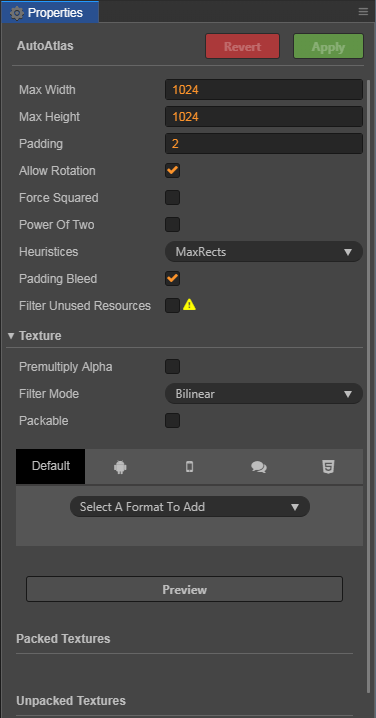

# Auto Atlas Asset

**Auto Atlas Asset** is a sprite sheet As a Cocos Creator comes with the map function, you can specify a series of broken plans packaged into a large picture, the specific role and Texture Packer function is very similar.

## Create an Auto Atlas asset

In **Assets** panel right-click on a folder, and click the following context menu item **Create -> Auto Atlas**. It will create a **AutoAtlas.pac** asset to hold your atlas configuration for current folder.

With an **Auto Atlas asset** created, all **SpriteFrame** assets in the current folder including sub-folders will be used to generate a sprite sheet atlas during build process.  And all SpriteFrame assets added to the folder or its sub-folder will be added to the atlas automatically in the future.

If there're settings for **SpriteFrame** assets (such as trim), they will be preserved in the **SpriteFrame** assets in the generated atlas.

## Configure the Auto Atlas asset

After selecting an **Auto Atlas asset** in the **Assets** panel, the **Properties** panel will display all configurable properties for the **Auto Atlas asset**.

| property | Description
| -------------- | ----------- |
| Max Width  |The maximum width of a single atlas
| Max Height | The maximum height of a single atlas
| Padding | The spacing between sprites in the atlas
| Allow Rotation | Allows rotation of the sprites
| Force Squared | Whether to force the Atlas size to be set to square
| Power Of Two | Whether to set the map size to a power of two number
| Heuristices | Atlas packaging strategy, the optional strategies are [BestShortSideFit, BestLongSideFit, BestAreaFit, BottomLeftRule, ContactPointRule]
| Padding Bleed | Padding with one pixel bleed area for each textures in atlas, the bleed area will copy the nearest pixel in the original texture. This feature is also known as "Extrude".
| Filter Unused Resources | The option will not work in preview process, it only work in build process

For **Premultiply Alpha**, **Filter Mode**, **Packable** parameters of the Texture section, please refer to document [Texture](./sprite.md#texture-%E5%B1%9E%E6%80%A7). For the setting of Texture format, please refer to document [Texture Compression](./compress-texture.md).

After the configuration is complete, you can click the **Preview** button to preview the results of the packaging. The results of the current Auto Atlas configuration will be displayed in the area below the **Properties** panel.

The results are:

- **Packed Textures**: display packaged atlas texture and related information, if there're multiple textures, they will be listed in the preview area.
- **Unpacked Textures**: showing textures that can not be packed into the Atlas. The cause may be that the size of these sprites are larger than the maximum size of the atlas texture.

## Generate atlas

With **Auto Atlas asset** created correctly, you can build your scenes or animations using the original sprite textures. During the **Build** process, Cocos Creator will automatically pack all **SpriteFrame** with Auto Atlas asset in the folder into atlas and update reference to them in the whole project automatically.

> **Note**: if Premultiply Alpha is enabled on the texture, it will be invalid when generating the atlas. If you need to use the Premultiply Alpha, you can check Premultiply Alpha on the Auto Atlas.
