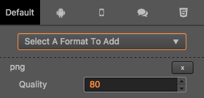

# Texture Compression

Cocos Creator allows you to directly set the compression method for textures in the editor, and then automatically compresses textures during project publishing. It supports exporting multiple image formats for the same platform simultaneously, and the engine will load the appropriate compressed texture based on the device's support for compressed texture formats.

## Advantages of Compressed Textures

* For compressed textures like PNG, JPG, WEBP, etc.
    - Configuring compressed textures allows compressing texture pixel data during project build to reduce resource size and improve game resource download speed.
* For GPU compressed textures like ASTC, ETC1, ETC2, PVRTC, etc.
    - Configuring compressed textures allows converting texture pixel data into GPU-specific compressed formats during project build. These formats can be used directly in GPU memory without runtime decompression, significantly reducing memory usage, lowering bandwidth requirements, and improving game rendering performance and loading speed.

> **Note**:
> * For non-GPU compressed texture formats like PNG, JPG, WEBP, compressing image quality does not reduce the time to decode image resources or reduce game memory.
> * Compressing PNG, JPG, WEBP and other format images uses the [sharp](https://github.com/lovell/sharp) open source library. Its compression ratio is slightly lower than [tinypng](https://tinypng.com/) and may result in larger images after compression. If you need to optimize this issue, it is recommended to use [custom plugins](../extension/index.md) to solve it yourself.

## Configuring Texture Compression

Cocos Creator supports importing pictures in multiple formats. However, in the actual game running, we do not recommend using the original image as a resource to load.

For example, on the mobile platform may only need the original image 80% or less image quality, or the .png which does not use a Alpha Channel, can be converted into JPG format. This reduces the storage space for a large portion of the image.

Before Cocos Creator v2.4, texture compression configuration was only supported on **Android**, **iOS**, **Web** and **WeChat Mini Game** platforms.
Starting with v2.4, texture compression configuration is supported on all mini game platforms.

| Image Format | Android | iOS | Mini Games | Web | Windows | Mac |
| :----------- | :------ | :-- | :--------- | :-- | :------ | :-- |
| PNG | Supported | Supported | Supported | Supported | Supported | Supported |
| JPG | Supported | Supported | Supported | Supported | Supported | Supported |
| WEBP | Natively supported on Android 4.0+, other versions can use [parsing library](https://github.com/alexey-pelykh/webp-android-backport) | Can use [parsing library](https://github.com/carsonmcdonald/WebP-iOS-example) | Supported | [Partially supported](https://caniuse.com/#feat=webp) | Not supported | Not supported |
| PVR | Not supported | Supported | Supported on iOS devices | Supported on iOS devices | Not supported | Not supported |
| ETC1 | Supported | Not supported | Supported on Android devices | Supported on Android devices | Not supported | Not supported |
| ETC2 | Partially supported, depends on mobile hardware | Not supported | Not supported | Supported on some Android devices | Not supported | Not supported |
| ASTC | Supported (Android 5.0+) | Supported (iOS 9.0+/iPhone6+) | Supported on platforms like WeChat, Douyin, Alipay, Taobao, etc. For details, see [Compressed Texture Support Details for Each Platform](#Compressed-Texture-Support-Details-for-Each-Mobile-Platform). Note: Developer tools do not support, requires real device debugging | Partially supported | Not supported | Not supported |

By default, Cocos Creator outputs the original image when it is built. If you need to compress an image at build time, you can select this image in the **Assets** and edit the texture format in the **Properties**.

### Compressed Texture Support Details for Each Mobile Platform

In addition to `JPG` and `PNG` which are supported across all platforms, the support for other texture compression formats is as follows:

| Platform Name | Supported Compression Formats |
| :------------ | :---------------------------- |
| Web Mobile | ASTC / ETC1 / ETC2 / PVR / WEBP |
| WeChat Mini Game | ASTC / ETC1 / ETC2 / PVR |
| ByteDance Mini Game | ASTC / ETC1 / ETC2 / PVR |
| Alipay Mini Game | ASTC / ETC1 / PVR |
| Taobao Mini Game | ASTC / ETC1 / PVR |
| OPPO Mini Game | ETC1 |
| vivo Mini Game | ETC1 / ASTC |
| Huawei Quick Game | ETC1 |
| Xiaomi Quick Game | ETC1 |
| iOS | ASTC / ETC1 / ETC2 / PVR / WEBP |
| Android / Huawei AGC | ASTC / ETC1 / ETC2 / WEBP |

## Texture Compression Details

Cocos Creator will find out if the compressed texture is configured when the image is built, if not, continue to find out if the default configuration is made, and if not, output the original image.

If the configuration of the compressed texture is found, texture compression is performed according to the configuration found. In one platform you can specify multiple texture formats, and when you build, each texture format generates a image in the specified format based on the original image compression.

At runtime, not all these generated images will be loaded, and the engine will choose to load images in the appropriate format, depending on the support of the actual devices.

[cc.macro.SUPPORT_TEXTURE_FORMATS](%__APIDOC__%/en/classes/macro.html#supporttextureformats) lists all the image formats supported by the current platform, and when the engine loads the image, it will find the format with the highest priority in the list to load from the generated image.

You can customize the image resource support for the platform and the priority of the load order by modifying `cc.macro.SUPPORT_TEXTURE_FORMATS`.

> **Note**: the simulator may not support compressed texture, please test on physical device.

## Example

In the example diagram above, the default platform is configured with compressed textures in `PNG` format, the Web platform is configured with `PVR`, `PNG` format, and other platforms do not add any configuration. Then when building a Web platform, this image will be compressed into `PVR`, `PNG` two formats, and only `PNG` format images will be generated when building other platforms.

On the Web platform, only iOS devices support loading the `PVR` format. So only browsers on iOS devices will load images in `PVR` format, browsers on other devices will load images in `PNG` format.

## Separate Alpha

Both the `ETC1` and `PVR` formats use a fixed space to store the color values for each pixel. When you need to store the 4 channels of the RGBA, the display quality of the texture can become very low.

So Creator provides a Separate Alpha option, which extracts the Alpha channels of the texture and merges them under the texture, and then compresses the entire texture in the RGB 3 channels format. This improves the storage space for each channel and the quality of the map improves.

