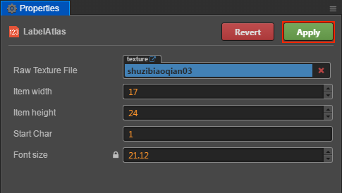

# LabelAtlas Asset

**LabelAtlas Asset** is a user defined asset, it's used for configuring LabelAtlas.

## Create LabelAtlas Asset

In **Assets** panel right-click on a folder, and click the following context menu item **New -> LabelAtlas**. It will create a **LabelAtlas.labelatlas** asset.

Before using **LabelAtlas asset**, you need some configurations. eg, configure a pre-drawn picture that contains the font style, as shown below:

## Configuration of LabelAtlas asset

After selecting an **LabelAtlas asset** in the **Assets** panel, the **Properties** panel will display all configurable properties for the **LabelAtlas asset**.

| property       | Description
| --------------   | -----------
| Raw Texture File | Specify a pre-drawn picture that contains the font style you want
| Item Width       | Specify the width of each character
| Item Height      | Specify the height of each character
| Start Char       | Specify the start char, even if the start char is a *space*, you also need insert a space. |

When the configuration is complete, click the **Apply** button at the top right of the **Properties** to save the settings.

## Using LabelAtlas asset

It's quite simple to use the LabelAtlas asset. You just need setup a new Label component and drag the LabelAtlas asset to the **Font** attribute of the Label component. Please refer to [Label Component](../components/label.md) for details.
