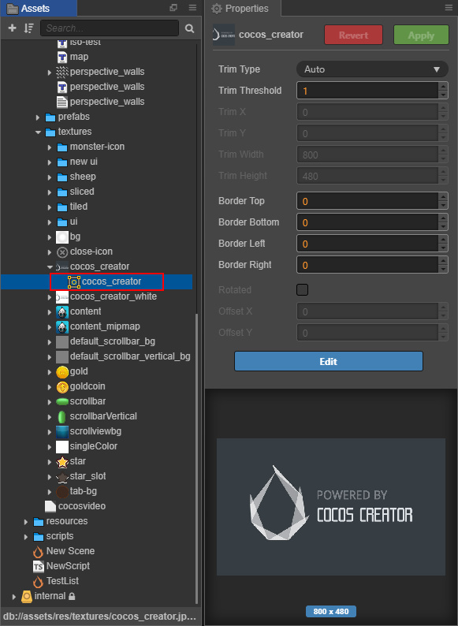

# Texture

Textures are used for rendering in games. Generally, textures are created by image processing softwares (e.g. Photoshop, mspaint). Now Cocos Creator supports two formats of images: **JPG** & **PNG**.

## Import Textures

You can import textures by default way, then you can see the textures in **Assets** panel like this:

In the **Assets** panel, the texture's icon is a thumbnail of itself. Once you select a texture in **Assets** panel, the thumbnail will also be shown at the bottom of **Properties** panel. Please **DO NOT** modify the properties of texture in **Properties** panel, unless you know what you are doing.

## Texture Properties

| property | Function explanation |
| --- | --- |
| Type | Includes two modes: **Raw** and **Sprite**. **Raw** means that only texture are generated. **Sprite** means that `cc.SpriteFrame` is generated. Please refer to section **Texture & SpriteFrame** below for details.|
| Premultiply Alpha | If set, the RGB channel is multiplied by the alpha channel. |
| Wrap Mode | Wrap modes. Includes two modes: **Clamp** and **Repeat**. When the `Type` is set to `Sprite`, the wrap mode is meaningless because the UV of `Sprite` does not go beyond \[0, 1\]. |
| Filter Mode | Filter modes. Includes three modes: **Point**, **Bilinear** and **Trilinear**. |
| genMipmaps | Whether to enable automatic generation of mipmap. |
| packable | Whether this texture is allowed to be packed into Dynamic Atlas. |

### Premultiply Alpha

- **Premultiply Alpha**: Indicates that the Alpha channel is premultiplied with the RGB channel when RGB is stored. For example, a red color with transparency of 50%, RGB is (255, 0, 0), the stored color value after premultiplying is (127, 0, 0, 0.5).

- **Non-Premultiply Alpha**: Indicates that the Alpha channel will not be premultiplied with the RGB channel. Then the red color with transparency of 50% described above, the stored color value is (255, 0, 0, 0.5).

Then why use Premultiply Alpha? In texture rendering, transparent textures uses Alpha Blending for blending, and the blending formula is:

**result = source.RGB \* source.A + dest.RGB \* (1 - source.A);**

Set the blend function to `gl.blendFunc(gl.SRC_ALPHA, gl.ONE_MINUS_SRC_ALPHA)`.

When using Premultiply Alpha, the above calculations are simplified to:

**result = source.RGB + dest.RGB * (1 - source.A);**

Set the blend function to `gl.blendFunc(gl.ONE, gl.ONE_MINUS_SRC_ALPHA)`.

But using Premultiply Alpha is not just to simplify the calculations to improve efficiency, but also because the texture of Non-Premultiply Alpha does not correctly perform linear interpolation.

Suppose there are two adjoining pixel colors, one is red with 100% transparency (255, 0, 0, 1.0), and the other is a green 10% transparency (0, 255, 0, 0.1). Then when the texture is scaled, the color between the two vertices is the result of linear interpolation. If it is Non-Premultiply Alpha, then the result is:

`(255, 0, 0, 1.0) * 0.5 + (0, 255, 0, 0.1) * (1 - 0.5) = (127, 127, 0, 0.55)`

If Premultiply Alpha is used, the green's stored value becomes (0, 25, 0, 0.1), and the result of linear interpolation with red is:

`(255, 0, 0, 1.0) * 0.5 + (0, 25, 0, 0.1) * (1 - 0.5) = (127, 12, 0, 0.55)`

The corresponding color values are expressed as:

As can be seen from the figure above that the color after the interpolation using the color value of Non-Premultiply Alpha is greenish, the green with 10% transparency has more proportion, and the red with 100% transparency is less. And the interpolation result obtained with Premultiply Alpha is correct and as expected. Therefore, in actual projects, you can make appropriate selections based on the specific use of the texture.

### Wrap Mode

In general, texture coordinates UV's values range is [0, 1]. When the texture coordinates in the passed vertex data exceed the range of [0, 1], the texture coordinates of out of range can be processed through different wrap modes. There are two wrap modes:

- **Clamp mode**

  Intercept texture coordinates between 0 and 1 and copy texture coordinates [0, 1] only once. For texture coordinates beyond the [0, 1] range, will use the texture coordinates content at the edge to extend.

- **Repeat mode**

  For texture coordinates beyond the [0, 1] range, will use the texture coordinates [0, 1] to repeat.

  > **Note**: the repeat mode is invalid when the width and height of the texture is not a power of two.

### Filter Mode

When the original size of Texture does not match the size of the texture image mapped on the screen, the mapping of the texture unit to the pixel through different texture filtering methods produces a different effect. There are three filter modes:

- **Point filtering**

  It simply uses the color of the texel closest to the pixel center for the pixel color. The advantage is that the algorithm is simple and the computation is small. While simple, this results in a large number of artifacts - texture `blockiness` during magnification, and aliasing and shimmering during minification.

- **Bilinear filtering**

  The four nearest texels to the pixel center are sampled (at the closest mipmap level), and their colors are combined by weighted average according to distance. This removes the `blockiness` seen during magnification, as there is now a smooth gradient of color change from one texel to the next, instead of an abrupt jump as the pixel center crosses the texel boundary. But the computation is also slightly larger than the Point filtering.

- **Trilinear filtering**

  Based on Bilinear filtering, Trilinear filtering performs texture lookup and bilinear filtering on the two closest mipmap levels (one higher and one lower quality), and then linearly interpolating. Compared with Point filtering and Bilinear filtering, the final sampling result is the best, but the computation is also the largest.

  > **Note**: the Trilinear filtering in the current engine version is consistent with the Bilinear filtering effect.

### genMipmaps

Intended to increase rendering speed and reduce aliasing artifacts, images are processed into sequences which consist of a series of precomputed and optimized textures, called mipmaps.

Each bitmap image of the mipmap set is a downsized duplicate of the main texture, but at a certain reduced level of detail. A high-resolution mipmap image is used for high-density samples, such as for objects close to the camera. Lower-resolution images are used as the object appears farther away.

When texture filtering is set to Trilinear filtering, interpolation occurs between the two nearest levels. The rendering speed increases because the mipmap image is smaller than the original when rendering remote objects, which improves the cache hit ratio in the video card sampling process. At the same time, due to the low precision of the small image of mipmap, the Moire striation is reduced, which can anti-aliased on the picture. Also because some extra textures are generated, mipmap requires about one-third of the additional memory space.

### Texture packing

If the engine has [Dynamic Atlas](../advanced-topics/dynamic-atlas.md) enabled, appropriate textures are automatically and dynamically merged in the beginning scene into a larger texture to reduce drawcalls. However, merging the textures into the large texture will modify the UV coordinates of the original texture, if the UV coordinate of the texture is used in the custom effect, the UV calculation in effect will be incorrect, and the packable property of the texture needs to be set to **false** to prevent the texture from being packaged into the dynamic atlas.

## Texture & SpriteFrame

In **Assets** panel, there is a triangle at the left side of texture. You can see the sub-asset of the texture by click the triangle. Cocos Creator will automatically create a SpriteFrame asset with the same name below each imported Texture when the **Type** property is set to **Sprite**.

| Property | Description |
| :--- | :--- |
| Trim Type | Set the trim type, including: 1. Auto -- Automatic trim 2. Custom -- Custom trim 3. None -- No trim, use original texture For details, please refer to the [Auto Trim for SpriteFrame](trim.md) documentation |
| Trim Threshold | Set the transparency threshold, trim off the pixels whose transparency is below the set value. The default value is 1, and the range of values is 0~1. Only takes effect when **Trim Type** is set to **Auto**.  |
| Trim X, Y, Width, Height | Sets the trim rect, only takes effect when **Trim Type** is set to **Custom**. |
| Border Top, Bottom, Left, Right | Set the texture margins of the 9-sliced, which can be edited visually by clicking on the **Edit** button below.  |
| Rotated  | Read-only property, cannot be changed. Used to see if the sub-asset in the Texture Packer asset is rotated. |
| Offset X, Y | Read-only property, cannot be changed. Used to view the offset of the rectangle in Texture Packer asset. |

SpriteFrame is an asset used by the core component **Sprite**. **Sprite** components can show different images by set/change `spriteFrame`. Please refer to the [Sprite component](../components/sprite.md) documentation for additional details.

Why SpriteFrame? Besides a SpriteFrame from a Texture, there is another asset, Atlas, which contains many SpriteFrames. Please refer to the [Atlas](atlas.md) documentation for details.

The API documentation for Texture & SpriteFrame:

- [Texture](%__APIDOC__%/en/classes/Texture2D.html)
- [SpriteFrame](%__APIDOC__%/en/classes/SpriteFrame.html)

## SpriteFrame Usage

You can create a node with **Sprite** component by dragging a SpriteFrame asset from **Assets** to **Node Tree** or **Scene**.

After that, you can change the SpriteFrame by dragging a SpriteFrame/Texture asset to the `Sprite Frame` property of **Sprite** component.

Also you can drag a SpriteFrame asset to an existing SpriteFrame animation in the **Timeline**. You can reference the usage by [Editing Sprite Animation](../animation/sprite-animation.md).

### The Black Edge Problem of Texture

When importing image resources into the editor, the default filter mode used is **Bilinear**, while for the Sprite component, the default SrcBlendFactor is **SRC_ALPHA**. Under these conditions, for PNG images with translucent pixels, the translucent edges often have a black border problem in the editor and preview. The reason is that low-resolution images are unsampled when displayed on a higher-resolution display device, which is called image interpolating, and when pixel interpolation is done, translucent edges are interpolated with transparent pixels (0, 0, 0, 0) to produce black pixels with low transparency. There are usually several ways to avoid the problem of black edges in images:

1. Filter Mode uses **Point** Mode. (Recommended, need to be able to accept the sawtooth problem)
2. When the image is made in PS and other tools, add a background layer, set the color to the color of the translucent edge, and then set the transparency of the background layer to such as 1/100 of the low transparency. (Recommended)
3. When exporting images, set to a higher resolution to avoid image interpolation and enlargement when displayed to the device. (Not recommended.)
4. The engine's Auto Atlas provides an option to expand the edges of translucent images, which will automatically expand the edges of translucent images when checked. Other atlas packing tools will generally have similar processing options. (Recommended)
5. Set Sprite's SrcBlendFactor to ONE to premultiply the images, but this may affect the batch merge of the images, which the developer will need to decide depending on the usage scenario. (The Premultiply Alpha option for texture needs to be checked.)

### Performance Attentions

If you are using single Texture assets for Sprite. It can't use batch render at the runtime of the game. Now you can't batch change the SpriteFrame reference from single Texture to Atlas in Cocos Creator. So, please combine textures into atlas as early as possible and use them through the SpriteFrame reference in Atlas.

In addition, the `cc.macro.CLEANUP_IMAGE_CACHE` in the engine indicates whether to delete the DOM Image cache after uploading the texture to the GPU. Specifically, we free this memory by setting `image.src` to an empty string. Normally, you don't need to turn this option on because Image objects use very little memory on the web. But in the current version of WeChat Mini Game, the Image object caches the decoded Image data, which takes up a lot of memory. Therefore, we enable this option on WeChat Mini Game by default to release the memory of Image object immediately after uploading GL texture to avoid excessive memory consumption.
