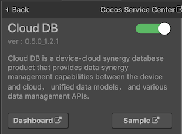
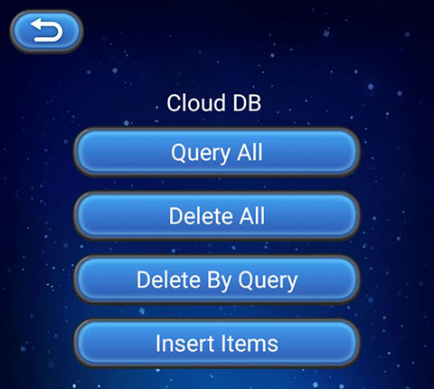

> **Note**: this version of the documentation has been archived and is no longer maintained. Please move to the [latest version](https://service.cocos.com/document/en/agc-clouddb.html).

# Cloud DB (AppGallery Connect) Quick Start

In the traditional mobile application development, developers have to build each service from the ground-up, leading to heavy development workload and high technical requirements. In addition to writing application logic, developers need to perform data management, device-cloud data synchronization, and server deployment and maintenance.

[Cloud DB](https://developer.huawei.com/consumer/en/doc/development/AppGallery-connect-Guides/agc-clouddb-introduction) is a device-cloud synergy database product that provides data synergy management capabilities between the device and cloud, unified data models, and various data management APIs. In addition to ensuring data availability, reliability, consistency, and security, CloudDB enables seamless data synchronization between the device and cloud, and supports offline application operations, helping developers quickly develop device-cloud and multi-device synergy applications. As a part of the AppGallery Connect solution, Cloud DB builds the Mobile Backend as a Service (MBaaS) capability for the AppGallery Connect platform. In this way, application developers can focus on application services, greatly improving the production efficiency.

### Apply for Test Qualification

The Cloud DB service is currently in beta testing. If you want to use this service, please download and fill in an [application form](https://communityfile-drcn.op.hicloud.com/FileServer/getFile/cmtyManage/011/111/111/0000000000011111111.20201030091810.06962989220424325009804976035185:50511103085702:2800:64FD098C479820A4BC92E57D8F71B71FB53A5816702A9C89A07D54FF5332B227.xlsx?needInitFileName=true), and send it to `agconnect@huawei.com` to submit the application.

Set your email title format as: **[Cloud DB]-[Company name]-[Developer account ID]-[App ID]**. For details about how to query the app ID, see [Querying App Information](https://developer.huawei.com/consumer/en/doc/appgallery_queryappinfo). After receiving your application, Huawei operations personnel will reply to you within 1 to 3 working days.

### Charge

The Cloud DB service is currently in beta testing and **free** of charge. Huawei will send an email to you to announce related charging policies and fee rate one month in advance of formal charge. When you enable the Cloud DB zone service, the system provides the following free Cloud DB zone service quotas by default:

| Service Type | Quota |  
| :--- | :--- |  
| Storage capacity on the Cloud | 2GB | 
| Maximum number of concurrent connections | 150 | 
| Maximum number of operations per second in the Cloud DB zone | 10 | 

When using Cloud DB service, if the free resource quota cannot meet the developer's current application needs, please download the [application form](https://communityfile-drcn.op.hicloud.com/FileServer/getFile/cmtyManage/011/111/111/0000000000011111111.20201030091810.06962989220424325009804976035185:50511103085702:2800:64FD098C479820A4BC92E57D8F71B71FB53A5816702A9C89A07D54FF5332B227.xlsx?needInitFileName=true) and fill in the content, and then send it to the email address to submit the application. The email address and email header format are consistent with the [Apply for Test Qualification](#apply-for-test-qualification).

### Version Update Description

- Latest Version: 0.5.5_1.2.3.301

    - Fix the problem of database insertion failure caused by the usage of JSON parsing library.

- v0.5.4_1.2.3.301

    - Fix the crash caused by the generator not adapting to the index of the new version of FORMAT-VERSION.
    - Fix the crash caused by a Query type conversion problem.

- v0.5.3_1.2.3.301

    - Updated SDK to v1.2.3.301.
    - Fix the bug that the querier can only query String type.
    - Add `openCloudZone2` asynchronous method, `remove` remove listener method.
    - Add `getObjectTypeName` and `getPackageName` methods to the query result set object.
    - Remove `setUpgradeProcessMode`, `deleteAll` method.
    - If you are using the `data.zoneId` parameter in the callback, please modify it to `data.zone.zoneId`.
    - Modify the `subscribe` method, supports using only the equal-value subscription, that is, the `equalTo()` method to construct query conditions.
    
- v0.5.0_1.2.1.301

    - Integrated Huawei AGC Cloud DB service.

## Enable Cloud DB Service

- Ensure that the Cloud DB service test qualification application has been passed.

- Use Cocos Creator to open the project that needs to be connected to Cloud DB service.

- Cloud DB service depends on Auth Service, please enable the [Auth Service (AGC)](./agc-auth.md) before integrating the Cloud DB service.

- Click on **Panel -> Service** in the menu bar to open the Service panel, select **Cloud DB** service to go to the service detail page, and then click on the **Enable** button in the top right to enable the service. For details, please refer to the Cocos Service [Operation Guide](./index.md#usage) documentation.

  

- Please refer to [Managing Object Types](https://developer.huawei.com/consumer/en/doc/development/AppGallery-connect-Guides/agc-clouddb-agcconsole-objecttypes) document, export object types file in **JSON** format, import into the **Cloud DB Config File** parameter at the bottom of the Cloud DB service panel, then get the version number from the AGC Cloud DB console, and fill it in the **Cloud DB Object Version** option.

  

### Configs HUAWEI Config File

Most of HUAWEI Services need the `agconnect-services.json` configuration file. If there are operations such as newly opened services, please update the file in time.

- Sign in to [AppGallery Connect](https://developer.huawei.com/consumer/en/service/josp/agc/index.html) find your project from the project list and select the app on the project card.

- On the **Project Setting** page, click the configuration file **agconnect-services.json** to download it. The `agconnect-services.json` file **must be copied manually** to the `settings` directory of the project directory after downloading or updating.

  

- For Creator v2.4.3 and above, if you want to publish to the [HUAWEI AppGallery Connect](../publish/publish-huawei-agc.md), you can select the downloaded or updated configuration file directly in the **Build** panel, no need to copy it manually.

  

### Verify whether the service is integrated successfully

- Once the Cloud DB service is integrated, we can verify the success of the Cloud DB service integration by adding simple code to the script.

  ```js
  // "Types" can be replaced with the name of Storage instance
  let db = huawei.agc.db;
  let config = db.AGCCloudDBZoneConfig.createConfig("Types", db.SyncProperty.CLOUDDBZONE_CLOUD_CACHE);
  let query = db.AGCCloudDBZoneQuery.where("Types", "queryTest");
  let zone = db.dbService.openCloudDBZone(config, true);
  let result = zone.querySync(query, huawei.agc.db.QueryPolicy.POLICY_QUERY_FROM_CLOUD_PRIOR);
  console.log('Cloud DB', 'query : ' + JSON.stringify(result));
  ```

- Download <a href="agc-clouddb/cdb-agccloudedb.json.zip" target="_blank">database file</a> for test, import it into the AGC console after decompression.

  

- [Publish to the Android platform](../publish/publish-native.md) after the code is added. Please make sure that the **Package Name** on the **Build** panel is consistent with the **Package Name** set in the AppGallery Connect console.

- Run the project on a phone, if you can see the data output in Logcat, which means the integrate is successful.

  

## Sample Project

Developer can get a quick taste of the Cloud DB service with the Sample project.

- Click on the **Sample** button in the Cloud DB service panel, clone or download, and open the project in Cocos Creator.

- Import the `attach/agcclouddb.json` file in the project into the AGC Cloud DB console, otherwise the Cloud DB database module in the Sample project will not run normally.

- After importing, you can open the **Build** panel to compile the project by clicking **Project -> Build** in the Creator editor menu bar. Cocos Creator v2.4.1 and above, you could [publish to HUAWEI AppGallery Connect](../publish/publish-huawei-agc.md). Below Creator v2.4.1 could [publish to the Android platform](../publish/publish-native.md).

- Once the Sample project is running on the phone, click the **DB** button on the homepage for testing.

  

## Developer Guide

Cloud DB supports multiple data types. Currently, the Cloud DB service provided by Cocos Service, supports `Boolean`, `Integer`, `Long`, `Float`, `Double` and `String` types.

This document refers to the AppGallery Connect documentation - [Getting Started](https://developer.huawei.com/consumer/en/doc/development/AppGallery-connect-Guides/agc-clouddb-get-started).

### Initializing

When developers use Cloud DB service, they need to perform initialization operations first.

#### Set listener (optional)

If you need to handle the error return, you can set up the `error` listener.

**Example**:

```js
huawei.agc.db.dbService.on("error", data => console.log("Cloud DB", `error : [${data.zone.zoneId}][${data.typeName}] ${data.errCode}:${data.errMsg}`), this);
```

| Parameter | Description |  
| :--- | :--- |
| zoneId | Name of Cloud DB zone, represents a unique data storage zone. |
| typeName | Name of Storage instance. |
| errCode | Error code, please refer to [getCode](https://developer.huawei.com/consumer/en/doc/development/AppGallery-connect-References/clouddb-agconnectclouddbexception#getCode) document. |
| errMsg | Error Message |

If you need to use the [Updating Listening in Real Time](https://developer.huawei.com/consumer/en/doc/development/AppGallery-connect-Guides/agc-clouddb-update-listen) function, you can set up `subscribe` listener.

**Example**:

```js
huawei.agc.db.dbService.on("subscribe", data => console.log("Cloud DB", `subscribe : [${data.zone.zoneId}][${data.typeName}][${data.queryId}][${data.subscribeId}] ${data.result}`), this);
```

| Parameter | Description |  
| :--- | :--- |  
| zoneId | Name of Cloud DB zone, represents a unique data storage zone. |
| typeName | Name of Storage instance. |
| queryId | Custom query ID, for query interface. Only the equal-value subscription, that is, the [equalTo()](https://service.cocos.com/document/api/classes/huawei.agc.db.agcclouddbzonequery.html#equalto) method can be used to construct query conditions. The query conditions must contain at least one field and at most five fields. The **AND** operation is used between multiple query conditions. |
| subscribeId | Subscribe listener id |
| result | Return message |

#### Open the Cloud DB zone

Open the cloud DB zone by calling the `openCloudDBZone` or `openCloudDBZone2` method.

`openCloudDBZone(config: AGCCloudDBZoneConfig, isAllowToCreate: boolean): AGCCloudDBZone`

`openCloudDBZone2(config: AGCCloudDBZoneConfig, isAllowToCreate: boolean): void`

| Parameter | Description |  
| :--- | :--- |
| config | AGCCloudDBZoneConfig object, which is used to create or open a configuration file of Cloud DB zone. |
| isAllowToCreate | Specifies whether to allow Cloud DB zone object creation. |

**Example**:

```js
let config = huawei.agc.db.AGCCloudDBZoneConfig.createConfig("test", huawei.agc.db.SyncProperty.CLOUDDBZONE_CLOUD_CACHE);
this._zone = huawei.agc.db.dbService.openCloudDBZone(config, true);
```

```js
huawei.agc.db.dbService.on("db", data => this._zone = data.zone, this);

let config = huawei.agc.db.AGCCloudDBZoneConfig.createConfig("test", huawei.agc.db.SyncProperty.CLOUDDBZONE_CLOUD_CACHE);
huawei.agc.db.dbService.openCloudDBZone2(config, true);
```

### Inserting Data

Developer can use the **synchronized** `insertSync` method to insert or modify data.

`insertSync(objs : any[], typeName: string): number`

| Parameter | Description |  
| :--- | :--- |
| objs | Object list data to be written. |
| typeName | Name of Storage instance. |

**Example**:

```js
let objs = [{id: "1", name: "name1"}, {id: "2", name: "name2"}];
let count = this._zone.insertSync(objs, "test");
console.log('Cloud DB', 'insert count : ' + count);
```

### Querying Data

Developer can use the **synchronized** `querySync` method to query data.

`querySync(query: AGCCloudDBZoneQuery, policy: QueryPolicy): any[]`

| Parameter | Description |  
| :--- | :--- |
| objs | A AGCCloudDBZoneQuery object, which indicates the query condition. |
| policy | Query policy, which specifies the data source to be queried. |

**Example**:

```js
let query = huawei.agc.db.AGCCloudDBZoneQuery.where("test", "queryTest");
let result = this._zone.querySync(query, huawei.agc.db.QueryPolicy.POLICY_QUERY_FROM_CLOUD_PRIOR);
console.log('Cloud DB', 'query : ' + JSON.stringify(result));
```

It supports adding query conditions, supported methods can refer to [API document - AGCCloudDBZoneQuery](https://service.cocos.com/document/api/classes/huawei.agc.db.agcclouddbzonequery.html).

**Example**:

```js
let query = huawei.agc.db.AGCCloudDBZoneQuery.where("test", "deleteTest").lessThan('id', "5");
```

### Deleting Data

Developer can use the **synchronized** `deleteSync` method to delete data, it supports adding query conditions.

`deleteSync(queryIdOrObjs: AGCCloudDBZoneQuery | any[], policy = QueryPolicy.POLICY_QUERY_FROM_CLOUD_PRIOR): number`

| Parameter | Description |  
| :--- | :--- |
| queryIdOrObjs | A AGCCloudDBZoneQuery object, which indicates the query condition, or list of CloudDBZoneObject should be deleted. |
| policy | Query policy, which specifies the data source to be queried, it is used in case of AGCCloudDBZoneQuery only. |

**Example**:

```js
let query = huawei.agc.db.AGCCloudDBZoneQuery.where("test", "deleteTest").lessThan('id', "5");
let count = this._zone.deleteSync(query, huawei.agc.db.QueryPolicy.POLICY_QUERY_FROM_CLOUD_PRIOR);
console.log('Cloud DB', 'delete count : ' + count);
```

## Reference Links

- [Working Principle](https://developer.huawei.com/consumer/en/doc/development/AppGallery-connect-Guides/agc-clouddb-introduction#h1-1603975887838-0)
- [Technical Specifications](https://developer.huawei.com/consumer/en/doc/development/AppGallery-connect-Guides/agc-clouddb-introduction#h1-1603848492635)
- [FAQs](https://developer.huawei.com/consumer/en/doc/development/AppGallery-connect-Guides/agc-clouddb-faq)

## API Reference

Please refer to the [Cloud DB - API Reference](https://service.cocos.com/document/api/modules/huawei.agc.db.html).

