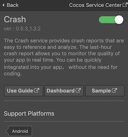

> **Note**: this version of the documentation has been archived and is no longer maintained. Please move to the [latest version](https://service.cocos.com/document/en/agc-crash.html).

# Crash (AppGallery Connect) Quick Start

[Crash](https://developer.huawei.com/consumer/en/doc/development/AppGallery-connect-Guides/agc-crash-introduction) Service of AppGallery Connect is a lightweight crash analysis service, in which Huawei provides a Crash SDK that can be quickly integrated into your app, **without the need for coding**.

### Functions

- The Crash service provides real-time reports for the last 24 hour, allowing you to monitor the quality of your app in real time.

- In addition, the Crash service automatically categorizes crashes, and provides indicator data of the crashes, allowing you to prioritize the most important crashes. You can view information about a specific crash, and analyze the app and Android versions with the crash. You can also view information about the app, operating system, and device corresponding to a specific crash, as well as the crashed stack. All the information is enormously helpful in locating and resolving crashes.

- The Crash service can also detect major crashes in real time. After you enable crash notifications, AppGallery Connect can send you an email when a major crash occurs.

### Version Update Description

- Latest Version: 0.5.5_1.4.1.300

    - Update the SDK and fix some bugs.

- v0.5.3_1.3.2

    - Integrated Huawei AGC Crash service.

## Enable Crash Service

- Use Cocos Creator to open the project that needs to be connected to Crash service.

- Since the Crash service uses the HUAWEI Analytics Kit to report crash event, please enable the [Analytics Kit (HMS Core)](./hms-analytics.md) before integrating the Crash service.

- Click on **Panel -> Service** in the menu bar to open the Service panel, select Crash service to go to the service detail page, and then click on the **Enable** button in the top right to enable the service. For details, please refer to the Cocos Service [Operation Guide](./index.md#usage) documentation.

  

### Configs HUAWEI Config File

Most of HUAWEI Services need the `agconnect-services.json` configuration file. If there are operations such as newly opened services, please update the file in time.

- Sign in to [AppGallery Connect](https://developer.huawei.com/consumer/en/service/josp/agc/index.html) find your project from the project list and select the app on the project card.

- On the **Project Setting** page, click the configuration file **agconnect-services.json** to download it. The `agconnect-services.json` file **must be copied manually** to the `settings` directory of the project directory after downloading or updating.

  

- For Creator v2.4.3 and above, if you want to publish to the [HUAWEI AppGallery Connect](../publish/publish-huawei-agc.md), you can select the downloaded or updated configuration file directly in the **Build** panel, no need to copy it manually.

  

### Verify whether the service is integrated successfully

Generally, there is a low probability of an app crashing, so the Crash service SDK provides a method to manually create a crash, which can be invoked to determine if the Crash service was successfully accessed.

- Add simple code to the script.

  ```js
  console.log("Call crash method after 5 seconds.");
  this.scheduleOnce(function(){
      huawei.agc.crash.CrashService.testIt();
  },5);
  ```

- You can [publish to the Android platform](../publish/publish-native.md) after the code is added. Please make sure that the **Package Name** on the **Build** panel is consistent with the **Package Name** set in the AppGallery Connect console.

- Run the project on a phone, then login the [AppGallery Connect](https://developer.huawei.com/consumer/en/service/josp/agc/index.html) console, open the project, go to **Quality -> Crash**. If you can see crash data (usually displayed within 5 minutes), which means the integrate is successful.

  

## Sample Project

Developer can get a quick taste of the Crash service with the sample project.

- Click on the **Sample** button in the Crash service panel, clone or download, and open the project in Cocos Creator.

- After enabling the Crash service and configuring the HUAWEI configuration file as described above, you can open the **Build** panel to compile the project by clicking **Project -> Build** in the Creator editor menu bar. Cocos Creator v2.4.1 and above, you could [publish to HUAWEI AppGallery Connect](../publish/publish-huawei-agc.md). Below Creator v2.4.1 could [publish to the Android platform](../publish/publish-native.md).

- Once the Sample project is running on the phone, click the **Crash** button on the homepage for testing.

  

## Developer Guide

Crash service without the need for coding. The following methods are optional.

### Enable Crash Collection

`enableCrashCollection(enable: boolean): void`

This method is used to enable or disable the crash data reporting function. The function is enabled by default, indicating that the Crash service will collect and report crash data. If you do not want the Crash service to automatically collect or report crash data, disable the function.

**Parameter Description**:

| Parameter | Description | 
| :---------- | :------------- |  
|  enable    | 	Indicates whether to enable the crash data reporting function.<br>**false**: Disable the crash data reporting.<br>**true**: Enable the crash data reporting. | 

**Example**:

```js
huawei.agc.crash.CrashService.enableCrashCollection(false);
```

### Trigger a Crash

`testIt(): void`

This method is used to trigger a crash for testing an app. This method can be used to test the Crash service of your app during debugging. Do not use it in any formally released app.

**Example**:

```js
huawei.agc.crash.CrashService.testIt();
```

### Set Custom User ID

`setUserId(userId: string): void`

**Parameter Description**:

| Parameter | Description | 
| :---------- | :------------- |  
| userId | A user unique anonymous identifier generated by the developer based on an algorithm. The maximum length is 1KB, over which it is truncated. If a user identifier needs to be cleared, reset the parameter to an empty string. Clearing a user identifier does not remove existing crash logs. |

**Example**:

```js
huawei.agc.crash.crashService.setUserId('user001');
```

### Set Custom Key-value Pair

`setCustomKey(key: string, value: any): void`

Set the key and value of a custom. The value can be `boolean`/`string`/`number`/`float` type.

**Parameter Description**:

| Parameter | Description | 
| :---------- | :------------- |  
| key | The **key** of a custom key-value pair, the maximum length of each key is 1KB, any more than that will be truncated. A maximum of 64 key-value pairs can be supported, no more values will be stored beyond this limit. |
| value | The **value** of a custom key-value pair, supports `boolean`/`string`/`number`/`float` types. The maximum length of each value is 1KB, any more than that will be truncated. A maximum of 64 key-value pairs can be supported, no more values will be stored beyond this limit.|

**Example**:

```js
huawei.agc.crash.crashService.setCustomKey('floatKey123', 123.11);
huawei.agc.crash.crashService.setCustomKey('intKey123', 123);
huawei.agc.crash.crashService.setCustomKey('stringKey123', 'crash');
huawei.agc.crash.crashService.setCustomKey('booleanKey123', true);
```

### Records Custom Log

`log(level: LOG, content: string): void`

**Parameter Description**:

| Parameter | Description | 
| :---------- | :------------- |  
| level | Custom log level. Currently, the following levels are supported:<br>**huawei.agc.crash.LOG.DEBUG**: A log of the DEBUG level is recorded.<br>**huawei.agc.crash.LOG.INFO**: A log of the INFO level is recorded.<br>**huawei.agc.crash.LOG.WARN**: A log of the WARN level is recorded.<br>**huawei.agc.crash.LOG.ERROR**: A log of the ERROR level is recorded.|
| content | Custom log content.<br>The length of a single log cannot exceed 4KB. An overlong log will be truncated. The total size of logs cannot exceed 64KB. If the upper limit is exceeded, earliest logs will be deleted. |

**Example**:

```js
huawei.agc.crash.crashService.log(huawei.agc.crash.LOG.DEBUG, 'debug log invoke');
```

## Reference Links

- [Analyzing a Crash](https://developer.huawei.com/consumer/en/doc/development/AppGallery-connect-Guides/agc-crash-locate)
- [Receiving Crash Notifications](https://developer.huawei.com/consumer/en/doc/development/AppGallery-connect-Guides/agc-crash-notice)
- [Obtaining an NDK Crash Report](https://developer.huawei.com/consumer/en/doc/development/AppGallery-connect-Guides/agc-crash-report)
- [Obtaining a Readable Crash Report](https://developer.huawei.com/consumer/en/doc/development/AppGallery-connect-Guides/agc-crash-mapping)
- [Customizing a Crash Report](https://developer.huawei.com/consumer/en/doc/development/AppGallery-connect-Guides/agc-crash-customreport)
- [Crash FAQs](https://developer.huawei.com/consumer/en/doc/development/AppGallery-connect-Guides/agc-crash-faq)

## API Reference

Please refer to the [Crash - API Reference](https://service.cocos.com/document/api/modules/huawei.agc.crash.html).
