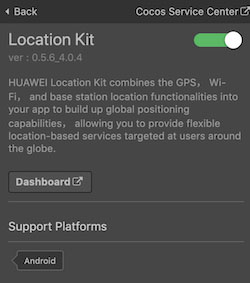
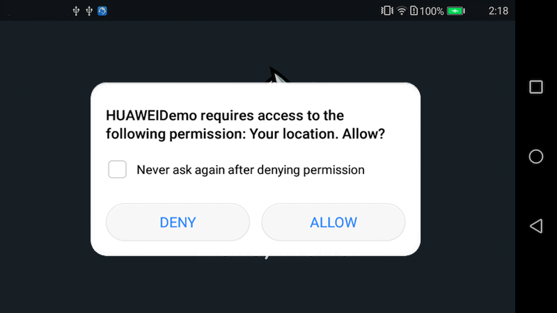

> **Note**: this version of the documentation has been archived and is no longer maintained. Please move to the [latest version](https://service.cocos.com/document/en/hms-location.html).

# Location Kit (HMS Core) Quick Start

[HUAWEI Location Kit](https://developer.huawei.com/consumer/en/hms/huawei-locationkit) combines the GPS, Wi-Fi, and base station location functionalities into your app to build up global positioning capabilities, allowing you to provide flexible location-based services targeted at users around the globe. Currently, it provides three main capabilities: fused location, activity identification, and geofence. You can call one or more of these capabilities as needed.

- Fused location: Provides a set of simple and easy-to-use APIs for your app to quickly obtain the device location based on the GPS, Wi-Fi, and base station location data.

- Activity identification: Identifies user motion status through the acceleration sensor, cellular network information, and magnetometer, helping you adapt your app to user behavior.

- Geofence: Allows you to set an interested area through an API so that your app can receive a notification when a specified action (such as leaving, entering, or staying in the area) occurs.

### Version Update Description

- Latest Version: 0.5.8_5.0.2

    - Update the SDK and add some functions.

- v0.5.6_4.0.4

    - Integrated Huawei HMS Location Kit.

### Use Cases

#### Fused location

If your app needs to obtain the device location, you can apply for the location permission for your app, call the [requestLocationUpdates()](#requests-location-updates) API of HMS Core Location Kit, and specify a location mode as needed. To cancel obtaining location information, call the [removeLocationUpdates()](#requests-location-updates) API.

#### Activity Identification

If your app needs to obtain the activity status of a user (for example, walking, running, or bicycling) or detect activity status change of a user, you can apply for the activity identification permission for your app and call the [createActivityIdentificationUpdates()](#registers-activity-identification-updates) API. To cancel activity identification update, call the [deleteActivityIdentificationUpdates()](#removes-activity-identification-updates-associated) API. If you want to detect user activity status change, call the [createActivityConversionUpdates()](#detects-activity-conversions) API to listen for activity status changes of the current device. To cancel listening for activity status changes, call the [deleteActivityConversionUpdates()](#removes-activity-conversion-updates) API.

#### Geofence

You can call the [createGeofenceList()](#adds-geofences) API to create a geofence based on the location that may be of interest to users. Then, Location Kit can sense the distance between the current device location and the geofence. When the device enters the geofence, a notification will be sent to your app. In addition, Location Kit can detect the duration during which the device stays in the geofence, and send a notification to your app if the stay duration reaches your preset limit.

You can also create a geofence by dragging to select an area on the map and setting relevant parameters. For details, please refer to [Server Development](https://developer.huawei.com/consumer/en/doc/HMSCore-Guides-V5/server-dev-0000001050170474-V5).

## Enable Location Kit Service

- Use Cocos Creator to open the project that needs to be connected to Location Kit.

- Click on **Panel -> Service** in the menu bar to open the Service panel, select Location Kit service to go to the service detail page, and then click on the **Enable** button in the top right to enable the service. For details, please refer to the Cocos Service [Operation Guide](./index.md#usage) documentation.

  

- Refer to [HUAWEI Location Kit Development Preparation](https://developer.huawei.com/consumer/en/doc/development/HMS-Guides/location-preparation) document to complete developer registration, app creation, **generation and configuring the Signing Certificate Fingerprint**.

- Location Kit can be used directly, without additional operations in the AppGallery Connect console.

### Configs HUAWEI Config File

Most of HUAWEI Services need the `agconnect-services.json` configuration file. If there are operations such as newly opened services, please update the file in time.

- Sign in to [AppGallery Connect](https://developer.huawei.com/consumer/en/service/josp/agc/index.html) find your project from the project list and select the app on the project card.

- On the **Project Setting** page, click the configuration file **agconnect-services.json** to download it. The `agconnect-services.json` file **must be copied manually** to the `settings` directory of the project directory after downloading or updating.

  

> **Notes**:
>
> 1. Please make sure that you have completed the [generating/configuring the signing certificate Fingerprint](https://developer.huawei.com/consumer/en/doc/development/HMSCore-Guides/config-agc-0000001050166285#EN-US_TOPIC_0000001054452903__section10260203515546) to config the SHA-256 certificate fingerprint.
> 2. If the **Debug Mode** is checked in the **Build** panel, the developer needs to configure the Keystore signature file in the `app/build.gradle` file of Android Studio.
>
>     
>
> 3. For Creator v2.4.3 and above, if you want to publish to the [HUAWEI AppGallery Connect](../publish/publish-huawei-agc.md), you can select the downloaded or updated configuration file directly in the **Build** panel, no need to copy it manually.
>
>     

### Verify whether the service is integrated successfully

- Once the Location Kit is integrated, we can verify the success of the Location Kit integration by adding simple code to the script.

  ```js
  huawei.hms.location.locationService.once(huawei.hms.location.HMS_LOCATION_EVENT_LISTENER_NAME.HMS_LOCATION_PERMISSION, (result) => {
      if (result.code === huawei.hms.location.LocationActivityService.StatusCode.success)
      {
          console.log('requestLocationPermission...', 'success');
      } else {
          console.log('requestLocationPermission...', 'fail:', result.errMsg);
      }
  });

  huawei.hms.location.locationService.requestLocationPermission();
  ```

- You can [publish to the Android platform](../publish/publish-native.md) after the code is added. Please make sure that the **Package Name** on the **Build** panel is consistent with the **Package Name** set in the AppGallery Connect console.

- The first time you run the project on a phone, the dialog box for applying for location permission will pop up (see the figure below), which means the integrate is successful.

  

- If you have already applied for permission, you can view the log in Logcat.

## Sample Project

Developer can get a quick taste of the Location Kit with the sample project.

- Click on the **Sample** button in the Location Kit service panel, clone or download, and open the project in Cocos Creator.

- After enabling the Location Kit service and configuring the HUAWEI configuration file as described above, you can open the **Build** panel to compile the project by clicking **Project -> Build** in the Creator editor menu bar. Cocos Creator v2.4.1 and above, you could [publish to HUAWEI AppGallery Connect](../publish/publish-huawei-agc.md). Below Creator v2.4.1 could [publish to the Android platform](../publish/publish-native.md).

- Need to test on Huawei or Honor brand phones with HMS Core service installed.

- Once the Sample project is running on the phone, click the **Location** button on the homepage for testing.

  

## Developer Guide

All functions of Location Kit within async callback. Call the function with `huawei.hms.location.locationService.once` to get a single callback, or use `huawei.hms.location.locationService.on` lintener to listen for callbacks.

### Location Service

`huawei.hms.location.locationService`

Refer to [Developing the Location Service](https://developer.huawei.com/consumer/en/doc/development/HMSCore-Guides/location-develop-steps-0000001050746143).

#### Checking the Device Location Settings

`checkLocationSettings(): void`

Checks whether relevant location settings are valid.

**Example**:

```js
huawei.hms.location.locationService.once(huawei.hms.location.HMS_LOCATION_EVENT_LISTENER_NAME.HMS_LOCATION_SETTINGS, (result) => {
    if (result.code === huawei.hms.location.LocationActivityService.StatusCode.success) {
        console.log('checkLocationSettings...', 'success');
    } else {
        console.log('checkLocationSettings...', 'fail:', result.errMsg);
    }
});

huawei.hms.location.locationService.checkLocationSettings();
```

#### Request location permission

`requestLocationPermission(): void`

Dynamic application location permission method.

**Example**:

```js
huawei.hms.location.locationService.once(huawei.hms.location.HMS_LOCATION_EVENT_LISTENER_NAME.HMS_LOCATION_PERMISSION, (result) => {
    if (result.code === huawei.hms.location.LocationActivityService.StatusCode.success) 
    {
        console.log('requestLocationPermission...', 'success');
    } else {
        console.log('requestLocationPermission...', 'fail:', result.errMsg);
    }
});
        
huawei.hms.location.locationService.requestLocationPermission();
```

#### Requests location updates

`requestLocationUpdates(): void`

Requests location updates using the callback on the specified looper thread. This method can be called back continuously only when your process exists.

`requestLocationUpdatesEx(): void`

Requests location updates. This is an extended location service API that supports high-precision location and is compatible with common location APIs.

**Example**:

```js
huawei.hms.location.locationService.once(huawei.hms.location.HMS_LOCATION_EVENT_LISTENER_NAME.HMS_REQUEST_LOCATION_UPDATE, (result) => {
    if (result.code === huawei.hms.location.LocationActivityService.StatusCode.success) {
        console.log('requestLocationUpdates...', 'success');
    } else {
        console.log('requestLocationUpdates...', 'fail:', result.errMsg);
    }
});

huawei.hms.location.locationService.requestLocationUpdates();
huawei.hms.location.locationService.requestLocationUpdatesEx(); // For high-precision location
```

`removeLocationUpdates(): void`

Removes location updates.

**Example**:

```js
huawei.hms.location.locationService.once(huawei.hms.location.HMS_LOCATION_EVENT_LISTENER_NAME.HMS_REMOVE_LOCATION_UPDATE, (result) => {
    if (result.code === huawei.hms.location.LocationActivityService.StatusCode.success) {
        console.log('removeLocationUpdates...', 'success');
    } else {
        console.log('removeLocationUpdates...', 'fail:', result.errMsg);
    }
});

huawei.hms.location.locationService.removeLocationUpdates();
```

#### Obtains the available location of the last request

`getLastLocation(): void`

Instead of proactively requesting a location, this method uses the location cached during the last request.

The value **null** may be returned in the following scenarios:

- The location function has never been used.
- The location function is disabled.
- The device is restored to factory settings.

If real-time location is required, you are advised to proactively call `requestLocationUpdates` instead of `getLastLocation`.

**Example**:

```js
huawei.hms.location.locationService.once(huawei.hms.location.HMS_LOCATION_EVENT_LISTENER_NAME.HMS_LAST_LOCATION, (location) => {
    if (location.code === huawei.hms.location.LocationActivityService.StatusCode.success) {
        console.log('getLastLocation...', 'success', lon:' + location.longitude + ",lat:" + location.latitude);
    } else {
        console.log('getLastLocation...', 'fail:', location.errMsg);
    }
});

huawei.hms.location.locationService.getLastLocation();
```

`getLastLocationWithAddress(): void`

Obtains the available location of the last request, including the detailed address information. If a location is unavailable, `null` will be returned.

**Example**:

```js
huawei.hms.location.locationService.once(huawei.hms.location.HMS_LOCATION_EVENT_LISTENER_NAME.HMS_GET_HWLOCATION, (result) => {
    if (result.code === huawei.hms.location.LocationService.StatusCode.success) {
        console.log('getLastLocationWithAddress success, data is ', JSON.stringify(result));
    } else {
        console.log('getLastLocationWithAddress fail, reason ', result.errMsg);
    }
});

huawei.hms.location.locationService.getLastLocationWithAddress();
```

#### Flush location

`flushLocations(): void`

Updates the location under processing.

> **Note**: currently, the `flushLocations()` method is not provided, nor implemented in the HMS SDK.

**Example**:

```js
huawei.hms.location.locationService.once(huawei.hms.location.HMS_LOCATION_EVENT_LISTENER_NAME.HMS_FLUSH_LOCATIONS, (result) => {
    if (result.code === huawei.hms.location.LocationService.StatusCode.success) {
        console.log('flushLocations success,data is ', result.toString());
    } else {
        console.log('flushLocations fail ,reason ', result.errMsg);
    }
});

huawei.hms.location.locationService.flushLocations();
```

#### Using the Mock Location Function

This function is used for a test environment. Open Android Settings menu, go to **System & updates > Developer options > Select mock location app and select the desired app**. If Developer options is unavailable, open Android Settings menu, go to **About phone** and tap **Build number** for seven consecutive times. Then, **Developer options** will be displayed on **System & updates**.

Apply for the mock location permission in the AndroidManifest.xml file.

```
<uses-permission
android:name="android.permission.ACCESS_MOCK_LOCATION"
tools:ignore="MockLocation,ProtectedPermissions" />
```

**Set mock mode**:

`setMockMode(mockMode: boolean): void`

Sets whether to use the location mock mode. If the value **true** is passed, the GPS or network location is not used and the location set through `setMockLocation` is directly returned (see below for the reference of `setMockLocation`).

**Parameter Description**:

| Parameter | Description |  
| :---------- | :------------- |  
| mockMode | If this parameter is set to **true**, the mock mode will be enabled. Can be set to **false** when mock mode is no longer needed. | 

**Example**:

```js
huawei.hms.location.locationService.once(huawei.hms.location.HMS_LOCATION_EVENT_LISTENER_NAME.HMS_MOCK_MODE, (result) => {
    if (location.code === huawei.hms.location.LocationActivityService.StatusCode.success) {
        console.log('setMockMode...', 'success');
    } else {
        console.log('setMockMode...', 'fail:', result.errMsg);
    }
});

huawei.hms.location.locationService.setMockMode(true);
```

**Sets a specific mock location**

`setMockLocation(latitude: string, longitude: string): void`

You must call the `setMockMode (boolean)` method and set it to true before calling this method.

**Parameter Description**:

| Parameter | Description |  
| :---------- | :------------- |  
| latitude | value of latitude | 
| longitude | value of longitude |

**Example**:

```js
huawei.hms.location.locationService.once(huawei.hms.location.HMS_LOCATION_EVENT_LISTENER_NAME.HMS_MOCK_LOCATION, (result) => {
    if (location.code === huawei.hms.location.LocationActivityService.StatusCode.success)
    {
        console.log('setMockLocation...', 'success');
    } else {
        console.log('setMockLocation...', 'fail:', result.errMsg);
    }
});

//set longitude and latitude
huawei.hms.location.locationService.setMockLocation(24.4813889,118.1590724);
```

### Activity Identification Service

`huawei.hms.location.locationActivityService`

Refer to [Developing the Activity Identification Service](https://developer.huawei.com/consumer/en/doc/development/HMSCore-Guides/activity-recognition-develop-steps-0000001050706110).

#### Assigning App Permissions

`requestRecognitionPermission(): void`

[The preceding permissions](https://developer.huawei.com/consumer/en/doc/development/HMSCore-Guides/activity-recognition-develop-steps-0000001050706110) are dangerous permissions and need to be dynamically applied.

**Example**:

```js
huawei.hms.location.locationActivityService.requestRecognitionPermission();
```

#### Registers activity identification updates

`createActivityIdentificationUpdates(intervalMillis: number): void`

[Registers activity identification updates](https://developer.huawei.com/consumer/en/doc/HMSCore-References-V5/activityidentificationservice-0000001050986183-V5#ZH-CN_TOPIC_0000001050986183__section177364246397).

**Parameter Description**:

| Parameter | Description |  
| :---------- | :------------- |  
| intervalMillis | Interval for detecting activity updates, in milliseconds. Larger values will result in fewer activity detections. Smaller values will result in more activity detections. | 

**Example**:

```js
huawei.hms.location.locationActivityService.once(huawei.hms.location.HMS_LOCATION_EVENT_LISTENER_NAME.HMS_CREATE_ACTIVITY_IDENTIFICATION_UPDATES, (result) => {
    if (result.code === huawei.hms.location.LocationActivityService.StatusCode.success) {
        console.log('requestActivityUpdates...', 'success');
    } else {
        console.log('requestActivityUpdates...', 'fail:', result.errMsg);
    }
});

huawei.hms.location.locationActivityService.createActivityIdentificationUpdates(parseInt(time) || 5000);
```

#### Set listener for location activity service update

**Example**:

```js
huawei.hms.location.locationActivityService.on(huawei.hms.location.HMS_LOCATION_EVENT_LISTENER_NAME.HMS_ACTIVITY_UPDATES, (result) => {
    console.log('HMS_ACTIVITY_UPDATES...', JSON.stringify(result));
}, this);

huawei.hms.location.locationActivityService.on(huawei.hms.location.HMS_LOCATION_EVENT_LISTENER_NAME.HMS_CONVERSION_UPDATES, (result) => {
    //todo
    console.log('HMS_CONVERSION_UPDATES...', JSON.stringify(result));
}, this);
```

#### Removes activity identification updates associated

`deleteActivityIdentificationUpdates(): void`

**Example**:

```js
huawei.hms.location.locationActivityService.once(huawei.hms.location.HMS_LOCATION_EVENT_LISTENER_NAME.HMS_REMOVE_ACTIVITY_CONVERSION_UPDATES, (result) => {
    if (result.code === huawei.hms.location.LocationActivityService.StatusCode.success) {
        console.log('deleteActivityUpdates...', 'success');
    } else {
        console.log('deleteActivityUpdates...', 'fail:', result.errMsg);
    }
}); 

huawei.hms.location.locationActivityService.deleteActivityIdentificationUpdates();
```

#### Detects activity conversions

`createActivityConversionUpdates(params: any): void`

Detects activity conversions (entering and exit), for example, detecting user status change from walking to bicycling.

**Example**:

```js
huawei.hms.location.locationActivityService.once(huawei.hms.location.HMS_LOCATION_EVENT_LISTENER_NAME.HMS_CREATE_ACTIVITY_CONVERSION_UPDATES, (result) => {
    if (result.code === huawei.hms.location.LocationActivityService.StatusCode.success) {
        console.log('createActivityConversionUpdates...', 'success');
    } else {
        console.log('createActivityConversionUpdates...', 'fail:', result.errMsg);
    }
});
let cls = huawei.hms.location.ConversionInfo;
let type = huawei.hms.location.ACTIVITY_IDENTIFICATION_ENUM;
let cType = huawei.hms.location.ACTIVITY_CONVERSION_TYPE;
let infoList = [
    new cls(type.STILL, cType.ENTER_ACTIVITY_CONVERSION),
    new cls(type.STILL, cType.EXIT_ACTIVITY_CONVERSION),
];

huawei.hms.location.locationActivityService.createActivityConversionUpdates(infoList);
```

#### Removes activity conversion updates

`deleteActivityConversionUpdates(): void`

**Example**:

```js
huawei.hms.location.locationActivityService.once(huawei.hms.location.HMS_LOCATION_EVENT_LISTENER_NAME.HMS_REMOVE_ACTIVITY_CONVERSION_UPDATES, (result) => {
    if (result.code === huawei.hms.location.LocationActivityService.StatusCode.success) {
        console.log('deleteActivityConversionUpdates...', 'success');
    } else {
        console.log('deleteActivityConversionUpdates...', 'fail:', result.errMsg);
    }
});

huawei.hms.location.locationActivityService.deleteActivityConversionUpdates();
```

### Geofence Service

`huawei.hms.location.locationGeofenceService`

Refer to [Developing the Geofence Service](https://developer.huawei.com/consumer/en/doc/development/HMSCore-Guides/geofence-develop-steps-0000001050986159).

#### Set listener for geofence service

**Example**:

```js
huawei.hms.location.locationGeofenceService.on(huawei.hms.location.HMS_LOCATION_EVENT_LISTENER_NAME.HMS_RECEIVE_GEOFENCE_DATA, (result) => {
    console.log('HMS_RECEIVE_GEOFENCE_DATA...', JSON.stringify(result));
}, this);
```

#### Adds geofences

`createGeofenceList(list: Array<GeofenceData>, type: HMS_LOCATION_GEOFENCEREQUEST)`

**Example**:

```js
huawei.hms.location.locationGeofenceService.once(huawei.hms.location.HMS_LOCATION_EVENT_LISTENER_NAME.HMS_CREATE_GEOFENCE_LIST, (result) => {
    if (result.code === huawei.hms.location.LocationActivityService.StatusCode.success) {
        console.log('createGeofenceList...', 'success');
    } else {
        console.log('createGeofenceList...', 'fail:', result.errMsg);
    }
});
let cls = huawei.hms.location.GeofenceData;
let type = huawei.hms.location.GEOFENCE_TYPE;
let list = [
    new cls(
        this.editBox.string,    //setUniqueId
        type.DWELL_GEOFENCE_CONVERSION | type.ENTER_GEOFENCE_CONVERSION | type.EXIT_GEOFENCE_CONVERSION,  //setConversions
        24.4813889,             //setRoundArea, latitude
        118.1590724,            //setRoundArea, longitude
        2000,                   //setRoundArea, radius
        60 * 60 * 1000,         //setValidContinueTime
        1000                    //setDwellDelayTime
)];
let requestType = huawei.hms.location.HMS_LOCATION_GEOFENCEREQUEST;
let initType = requestType.EXIT_INIT_CONVERSION | requestType.ENTER_INIT_CONVERSION | requestType.DWELL_INIT_CONVERSION;
console.log('createGeofenceList...', 'params=', JSON.stringify(list), 'init type=', initType);

huawei.hms.location.locationGeofenceService.createGeofenceList(list, initType);
```

#### remove a geofence through PendingIntent

`removeWithIntent(): void`

**Example**:

```js
huawei.hms.location.locationGeofenceService.once(huawei.hms.location.HMS_LOCATION_EVENT_LISTENER_NAME.HMS_REMOVE_GEOFENCE_WITH_INTENT, (result) => {
    if (result.code === huawei.hms.location.LocationActivityService.StatusCode.success) {
        console.log('removeWithIntent...', 'success');
    } else {
        console.log('removeWithIntent...', 'fail:', result.errMsg);
    }
});

huawei.hms.location.locationGeofenceService.removeWithIntent();
```

#### Remove a geofence by geofence ID

`removeWithID(removeID: string): void`

**Example**:

```js
huawei.hms.location.locationGeofenceService.once(huawei.hms.location.HMS_LOCATION_EVENT_LISTENER_NAME.HMS_REMOVE_GEOFENCE_WITH_ID, (result) => {
    if (result.code === huawei.hms.location.LocationActivityService.StatusCode.success) {
        console.log('removeWithID...', 'success');
    } else {
        console.log('removeWithID...', 'fail:', result.errMsg);
    }
});

var removeID = "ID1";
huawei.hms.location.locationGeofenceService.removeWithID(removeID);
```

## API Reference

Please refer to the [Location Kit - API Reference](https://service.cocos.com/document/api/modules/huawei.hms.location.html).
