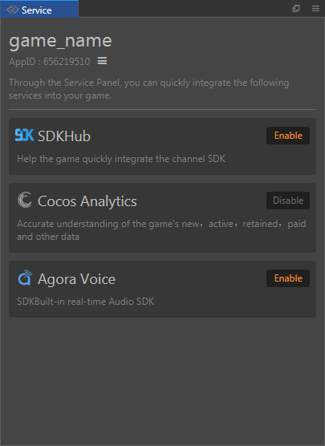
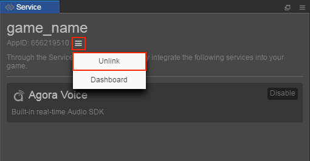

> **Note**: this version of the documentation has been archived and is no longer maintained. Please move to the [latest version](https://service.cocos.com/document/en/).

# Access to Third Party Services

Cocos Creator provides a **Service** panel in the **Menu bar -> Panel**, and developers can quickly integrate services through the **Service** panel for the game.

The **Service** Panel currently supports the integration of third-party services including the following:

  - [Cocos SDKHub](sdkhub.md)

  - [Location Kit (HMS Core)](hms-location.md)

  - [Analytics Kit (HMS Core)](hms-analytics.md)

  - [APM (AppGallery Connect)](agc-apm.md)

  - [Auth Service (AppGallery Connect)](agc-auth.md)

  - [Crash (AppGallery Connect)](agc-crash.md)

  - [Remote Configuration (AppGallery Connect)](agc-remote.md)

  - [App Messaging (AppGallery Connect)](agc-appmessaging.md)

  - [App Linking (AppGallery Connect)](agc-applinking.md)

  - [Cloud DB (AppGallery Connect)](agc-clouddb.md)

  - [Cloud Storage (AppGallery Connect)](agc-cloudstorage.md)

  - [Cloud Functions (AppGallery Connect)](agc-cloudfunc.md)

## Usage

- Open the Cocos Creator, choose **Menu bar -> Panel -> Service** to open the **Service** panel. Click the  button above the **Service** panel. Select **Dashboard** and go to the [Cocos Account Center](https://auth.cocos.com/#/) to register your user account.

  

  Create Personal/Company games as needed after account registration is complete:

  

- After the game is created, return to the Cocos Creator **Service** panel and click the  button. After selecting **Set Cocos AppID**, jump to the **Set Cocos AppID** panel. Then select the game and click the **Association** button.

  

  You can create a game by clicking the **Cocos AppID is not found. Click here to create** button to jump to the Cocos Account Center.

- When the AppID setup is complete, it automatically jumps to the **Service** panel, where you can see that the game name and AppID are already displayed at the top left of the panel.

  

  If you need to switch games, you can click the  button again to select **Unlink**. Then go to the **Set Cocos AppID** panel again and re-select the game.

  
