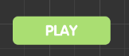
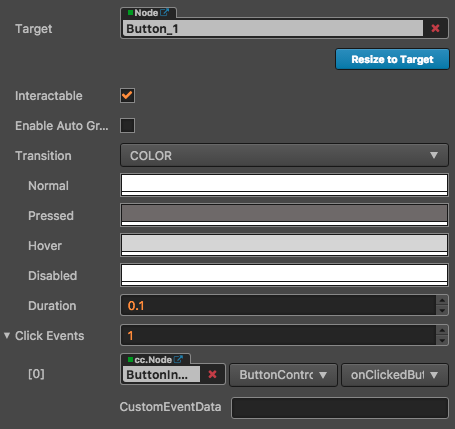

# Button Component Reference

The button component responds to a click from the user. When the user clicks a Button, its status will change. In addition, users can assign a custom behavior to buttons' click event.





Click the **Add Component** button at the bottom of the **Properties** panel and select **Button** from **UI Component**. Then you can add the Button component to the node.

## Button Properties

| Property |   Function explanation |
| :-------------- | :----------- |
| Interactable            | Boolean type, if set to false then the Button component enters the forbidden state. |
| Enable Auto Gray Effect | Boolean type, if set to true, the Button's target sprite will turn gray when interactable is false. |
| Transition              | Enumeration type, including NONE, COLOR, SPRITE and SCALE. Each type corresponds to a different Transition setting. Please see the **Button Transition** section below for details. |
| Click Event             | Default list type is null. Each event added by the user is composed of the node reference, component name and a response function. Please see the **Button Click Event** section below for details. |

> **Note**: when `Transition` is `SPRITE` and the `disabledSprite` property has a `spriteFrame` associated with it, the `Enable Auto Gray Effect` property is ignored at this time.

## Button Transition

Button Transition is used to indicate the status of the Button when clicked by the user. Currently the types available are NONE, COLOR, SPRITE and SCALE.


### Color Transition


| Property |   Function Explanation |
| :-------------- | :----------- |
|Normal| Color of Button under Normal status. |
|Pressed| Color of Button under Pressed status. |
|Hover| Color of Button under Hover status. |
|Disabled| Color of Button under Disabled status. |
|Duration| Time interval needed for Button status switching. |

### Sprite Transition


| Property |   Function Explanation |
| :-------------- | :----------- |
|Normal| SpriteFrame of Button under Normal status. |
|Pressed| SpriteFrame of Button under Pressed status. |
|Hover| SpriteFrame of Button under Hover status. |
|Disabled| SpriteFrame of Button under Disabled status. |

### Scale Transition


| Property |   Function Explanation |
| :-------------- | :----------- |
|Duration| Time interval needed for Button status switching. |
|ZoomScale| When user press the button, the button will zoom to a scale. The final scale of the button equals button original `scale * zoomScale`, zoomScale could be negative value. |

## Button Click Event

The Button can additionally add a Click event to respond to the player's click action. There are two ways to do this.

### Add a callback using the Properties


| No. | Property | Function Explanation              |
| :--- | :-------- | :----------                       |
|  1  | Target   | Node with the script component.   |
|  2  | Component | Script component name.           |
|  3  | Handler  | Assign a callback function which will be triggered when the user clicks the Button. |
|  4  | customEventData | A user-defined string value passed as the last event argument of the event callback.  |

### Add a callback using the script

There are two ways to add a callback through the script.

1. The event callback added by this method is the same as the event callback added by the editor, all added by code. First you need to construct a `cc.Component.EventHandler` object, and then set the corresponding `target`, `component`, `handler` and `customEventData` parameters.

    ```js
    // here is your component file, file name = MyComponent.js 
    cc.Class({
        extends: cc.Component,
        properties: {},

        onLoad: function () {
            var clickEventHandler = new cc.Component.EventHandler();
            clickEventHandler.target = this.node; // This node is the node to which your event handler code component belongs
            clickEventHandler.component = "MyComponent";// This is the code file name
            clickEventHandler.handler = "callback";
            clickEventHandler.customEventData = "foobar";

            var button = this.node.getComponent(cc.Button);
            button.clickEvents.push(clickEventHandler);
        },

        callback: function (event, customEventData) {
            // here event is a Event object, you can get events sent to the event node node
            var node = event.target;
            var button = node.getComponent(cc.Button);
            // here the customEventData parameter is equal to you set before the "foobar"
        }
    });
    ```

2. By `button.node.on ('click', ...)` way to add, this is a very simple way, but the way there are some limitations in the event callback which can not gets the screen coordinate point of the current click button.

    ```js
    // Suppose we add an event handler callback to the onLoad method of a component and handle the event in the callback function:

    cc.Class({
        extends: cc.Component,

        properties: {    
            button: cc.Button
        },

        onLoad: function () {
            this.button.node.on('click', this.callback, this);
        },

        callback: function (button) {
            // do whatever you want with button
            // In addition, attention to this way registered events, can not pass customEventData
        }
    });
    ```
