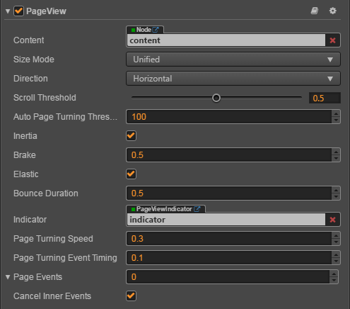

# PageView component reference

PageView component is derived from ScrollView, the difference is that when scrolls it automatically snaps to next page of content.



Click the **Add Component** button at the bottom of the **Properties** panel and select **PageView** from **UI Component**. This will add PageView component to the current node.

Please refer to the script interface of the [PageView API](%__APIDOC__%/en/classes/PageView.html)

## PageView properties

| Property                    | Function description |
| --------------------------- | --------------------------- |
| Content                     | It is a node reference that is used to contain the contents of the PageView |
| Size Mode                   | Specify the size type of each page in PageView, currently has Unified type and Free type. Please refer to [SizeMode API](%__APIDOC__%/en/enums/PageView.SizeMode.html) for details.|
| Direction                   | The page view direction |
| Scroll Threshold            | This value will be multiplied with the distance between two pages, to get the threshold distance. If user scroll distance is larger than this threshold distance, the page will turn immediately |
| Auto Page Turning Threshold | Auto page turning velocity threshold. When users swipe the PageView quickly, it will calculate a velocity based on the scroll distance and time, if the calculated velocity is larger than the threshold, then it will trigger page turning. |
| Inertia                     | When inertia is set, the content will continue to move when touch ended |
| Brake                       | It determines how quickly the content stop moving. A value of 1 will stop the movement immediately. A value of 0 will never stop the movement until it reaches to the boundary of scrollview. |
| Elastic                     | When elastic is set, the content will be bounce back when move out of boundary |
| Bounce Duration             | The elapse time of bouncing back. A value of 0 will bounce back immediately |
| Indicator                   | The Page View Indicator, please refer to **CCPageViewIndicator Set Up** below for details. |
| Page Turning Speed          | The time required to turn over a page. |
| Page Turning Event Timing   | Change the PageTurning event timing of PageView |
| Page Events                 | PageView events callback |
| Cancel Inner Events         | If cancelInnerEvents is set to true, the scroll behavior will cancel touch events on inner content nodes. It's set to true by default.|

### CCPageViewIndicator Set Up

CCPageViewIndicator is optional, the component is used to display the number of pages and mark the current page. Please refer to [PageviewIndicator Component](./pageviewindicator.md) for details.

The association can be done by dragging a node with a PageViewIndicator component into the **Indicator** property of the PageView component in the **Node Tree**.

### PageView event


| Property        | Function description |
| --------------  | -----------                                                  |
| Target          | Node with script component |
| Component       | Script component name |
| Handler         | Specifies a callback function that will be called when the PageView event occurs |
| CustomEventData | The user specifies an arbitrary string as the last argument of the event callback |

PageView event callback has two parameters, the first parameter is the PageView itself, the second parameter is the event type of the PageView.

## Detailed explanation

The PageView component must have the specified content node to work, Each child node in content is a separate page. The size of each page is the size of the PageView node, The operation effect is divided into two kinds: 

- Slow sliding, by dragging the page in the view to reach the specified ScrollThreshold value (the value is the percentage of page size), after the release will automatically slide to the next page.
- Fast sliding, fast to a direction to drag, automatically slide the next page, each slide up to only one page.

Usually a PageView node tree as shown below:


## Add callback via script code

### Method one

The event callback added by this method is the same as the event callback added by the editor, all added by code. First you need to construct a `cc.Component.EventHandler` object, and then set the corresponding `target`, `component`, `handler` and `customEventData` parameters.

```js
var pageViewEventHandler = new cc.Component.EventHandler();
pageViewEventHandler.target = this.node; // Is the node of your event handling code component
pageViewEventHandler.component = "cc.MyComponent"
pageViewEventHandler.handler = "callback";
pageViewEventHandler.customEventData = "foobar";

pageView.pageEvents.push(pageViewEventHandler);

// here is your component file
cc.Class({
    name: 'cc.MyComponent'

    extends: cc.Component,

    properties: {
    },

    // Note: that the order and type of parameters are fixed
    callback: function(pageView, eventType, customEventData) {
        // Where pageView is a cc.PageView object
        // Where eventType === cc.PageView.EventType.PAGE_TURNING
        // Where the customEventData parameter is equal to the "foobar"
    }
});
```

### Method two

By `pageView.node.on('page-turning', ...)` way to add

```js
// Suppose we add event handling callbacks to the onLoad method of a component and perform event handling in the callback function:

cc.Class({
    extends: cc.Component,

    properties: {
       pageView: cc.PageView
    },

    onLoad: function () {
       this.pageView.node.on('page-turning', this.callback, this);
    },

    callback: function (pageView) {
       // The parameter of the callback is the pageView component.
       // do whatever you want with pageView
    }
});
```
