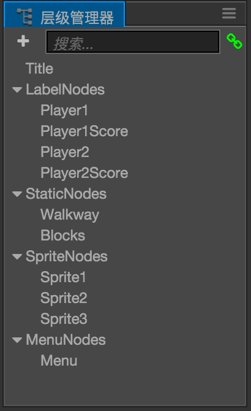

# Node Tree and render order

We've learnt that by combining Node and Components we can create all kinds of image, text and interactive elements in the scene. We can use **Node Tree** panel to arrange their render order and hierarchy to make things organized.

## Introduce to Node Tree Panel

When creating and positioning nodes in **Scene** panel you get the convenience of WYSIWYG style editing. While **Node Tree** provides an organized tree view where you can easily select and arrange nodes no matter if they are big, small or invisible. Please read [Node Tree](../getting-started/basics/editor-panels/node-tree.md) to learn the basic instruction of the interface.

## Node Tree (Scene Graph)

**Node tree** is a data structure that arranges the hierarchy of nodes in scene, it's also called **Scene Graph** in cocos2d-x term.

You can read the [Basic concepts chapter of the Cocos2d-x programmer guide](https://docs.cocos.com/cocos2d-x/manual/en/basic_concepts/), it describes the node tree very well with some pictures below.

Here's a simple game scene with background image, 3 actors, some text and a start game button:

Every visual element is a node, when it comes down to game development we usually don't put all nodes flat in scene, but arrange them according to their category and render order.

Each two nodes connected with an arrow have parent-child relationship. We call the one above 'parent' and the one below 'child'. This graph looks like this in **Node Tree** panel:

We use parent nodes to hold similar nodes together. In real projects we have many more options that can fit specific needs. Let's go over the details of parent-child relationship and how can we utilize them in real project.

### Local Coordinate System for Node

In previous section [Local Coordinate System](transform.md#-world-coordinate-local-coordinate-) we understand that one of the key feature of parent child relationship is to transform child node within Local Coordinate System.

The World Coordinate System's origin is at the bottom left of screen. If there's no parent child relationship and all nodes are using World Coordinates, when we want two nodes to be at the center of the background node we will have coordinates like this:

Since there's no relationship between the center nodes and the background node, their position values are all under world coordinate system and hard to relate to each other. If we want to move the actors within the background range we need to calculate the limit manually.

Now let's get help from local coordinate system, drag our two actor nodes under the `Parent` node, now their **Position** property will be like:

Since the anchor point of `Parent` node is at `(0.5, 0.5)` (its center), the local coordinate system use the center as origin. The two actor nodes' position become `(-100, 0)` and `(100, 0)`. It's very easy to get the relative position between these two nodes and the background node. Make it more friendly to designer. It's also easier to get the background edge position, for example the right most x position of the parent node would be `(parentNode.width/2, 0)`.

If we want multiple nodes to move/scale/rotate as a whole, the parent child relationship allow us to only care about parent node's transform. The image below shows applying scale and rotation transform on parent node, and the children will follow.

In real game project we will have a lot of actors made of combined nodes. Let's see how can we manage our node tree based on logic.

### Manage nodes by logical category

Below it's a typical hero actor that made of multiple nodes:

We have `Sprite` and `Animation` component on `body` node, to control the main visual appearance of the actor. A shadow sprite need to be rendered under other actors so we seprate that as `shadow` node. At last the in game hit point UI has its own node group, the parent node is called `HPBar`.

This is a typical case of organizing node tree based on logic. We can control `body` to play animation and flip as we want; we can update `HPBar` based on current hit point; their mutual parent `player` used to control character's movement, and can be inserted as a group into other layer or scene.

### Managing Render Order

In the above example let's pay attention to `body` and `shadow` node's order in **Node Tree** panel, and their actual render order in **Scene** panel. The engine will render all nodes according to the order in **Node Tree**, from top to bottom. So that the node on bottom will be drawn over the node on top.

In a parent child relationship, the parent node is always on top, so child node will be rendered last. That's why we make a separate `body` node in the example, so that we can specify the exact order of `shadow` and `body`.

## Node Count Optimization

Please note, although it's convenient to use parent node as container to group up other nodes, but the total node count in a scene will have impact on the node tree initialization time. We should avoid adding unnecessary nodes just for the cause of 'keep things organized'. Try to combine functions of multiple nodes as much as you can.
