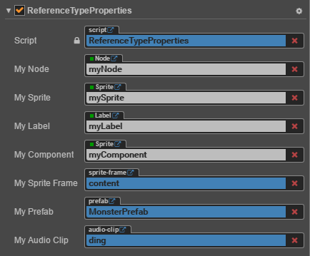

# Properties

**Properties** panel is the working area where we check and edit the current selected nodes, components and assets. Select a node in **Scene**, **Node Tree** panel or select an asset in **Assets** panel, their properties of this node, properties of all the components of this node and properties of assets will display in **Properties** panel for your inquiry and editing.

## node name and activating switch

The check box on the top left corner indicates the activating state of node. When the used node is not activated, all the components related to image rendering on the node will be shut down. The whole node including child nodes will be hidden efficiently.

What displays at the right side of the node activating switch is node name, which is in accordance with the node name showed in **Node Tree**.

## Node Properties

Next, **Properties** panel will show properties of node, which are listed under the headline `Node`. By clicking `Node`, one can fold or unfold the properties of node. There is a node setting button on the right side of the `Node` header, which can reset node properties or reset node properties and all component properties, or paste copied components.

Other than the transforming properties like Position, Rotation, Scale and Size, node properties also include Anchor, Color, Opacity, etc. Generally, modifications of node properties will immediately reflect in the changes in the appearance or position of node in **Scene** panel. 
If you need to edit several nodes at once, you can press Shift in the **Node Tree** panel to select them, and make modifications in **Properties** panel. 
The batch setting of node properties is similar to the assets. For details, please refer to Editing Several Assets at Once section at the bottom of this document.

For more details on node properties, please read [Transform](../../../content-workflow/transform.md) section.

## Component Properties

All the components mounted to a node and their properties will be listed under node property. Just like node property, you can switch the fold/unfold status of a component property by clicking its name. When there are many components mounted to a node, you can get larger working area by folding the component properties that are not frequently modified.

There are two buttons for help documentation and component settings to the right of the component name. The help document button can jump to the relevant document introduction page of this component. The component settings button can perform component delete, reset, move up, move down, copy and paste functions.

Users create a component by script, the property of which is declared by the script. Different types of properties have different widget appearances and editing methods in **Properties** panel. The defining method of property will be introduced in detail in [Scripting Properties](../../../scripting/reference/attributes.md).

## Editing Properties

**Property** is a public variable that declared in the component script and can be serialized and stored in the scene and animation data. We can quickly modify the property settings by **Properties** panel to realize the goal of adjusting game data and playing method with out programming.

Normally we can divide properties into **value type** and **reference type** according to the different memory location used by variables.

### Value type properties

**Value type** includes numbers, strings, enumerations and other simple variable types that occupy small RAM space:

- Number: Can be input directly by keyboard. Users can also press the upward/downward arrows near the input field to gradually increase/decrease attribute value.
- Vec2: the widget of Vec2 is the combination of two input values. And the input field will mark the corresponding child property name of each value with `x` and `y`.
- String: Directly use keyboard to input string into textbox. The input widget of string can be divided into two types: single line and multiple lines. Users can press Enter button to wrap in Multiple lines textbox.
- Boolean: It can be edited in the form of check box. The selected state indicates the property value is `true`; and the non-selected state indicates the property value is `false`.
- Enum: It can be edited in the form of drop-down menu. Click enum menu and choose one option from the pop up menu list, then the modification of enum can be finished.
- Color: Click color property preview box and **color picker** window will popped out. You can click to choose the color you need in this window, or directly enter specified color in the RGBA color input box below. Click any position outside the **color picker** window will close the window and the color selected in the end will be took as the property color.

  

### Reference type properties

**Reference type** includes much more complicated objects, such as node, component or asset. Different from the various editing methods of value type, reference type normally has only one editing method--drag the node or the asset into the attribute column.

The property of reference type will show `None` after the initialization. Because users can't use script to set up initialized value for property of reference type, they can drag corresponding nodes or assets according to the type of property to finish the assignment for reference type.

The property column that needs to be assigned value by dragging nodes will show white label. There might display `Node` on the label, which means any node can be dragged into it. Also, the label may display component names like `Sprite`,`Animation`, etc., then users need to drag the nodes to which corresponding components are mounted.

The property column that needs to be assigned value by dragging assets will show blue labels. There might display the asset type on the label, such as `sprite-frame`, `prefab`, `font`, etc.. The assignment can be finished as long as you drag the assets of corresponding type from **Assets**.

> **Note**: the script file is also a type of asset. Therefore the script asset reference property used by components shown on the top of the above picture is also represented by a blue label.

## Editing several assets at once

Selecting an asset in the **Assets** panel displays the properties of the asset in the **Properties** panel for query and editing. Asset settings related, see documentation on [Asset workflow](../../../asset-workflow/index.md#common-asset-workflow) for details.

When you need to edit several assets properties of the **same type** at once, you can press Shift in the **Assets** panel to select several assets, and then the **Properties** panel will display the number of selected assets and editable asset properties. After that, click the **Apply** button on the top right.

If a property in **Properties** panel shows the following statuses, it means the property values of the assets are inconsistent. You can choose whether to continue to modify the properties in batches as required.

- Check box is **gray**
- Input box is **-**
- Select box is **blank**

> **Notes**:
>
> 1. Currently, this feature does not support Material properties and Texture Compression properties.
> 2. Several assets with **different types** can be selected at once, but it is not supported to modify properties at the same time. Only the number of currently selected assets will be displayed in the **Properties** panel.
>
>     
