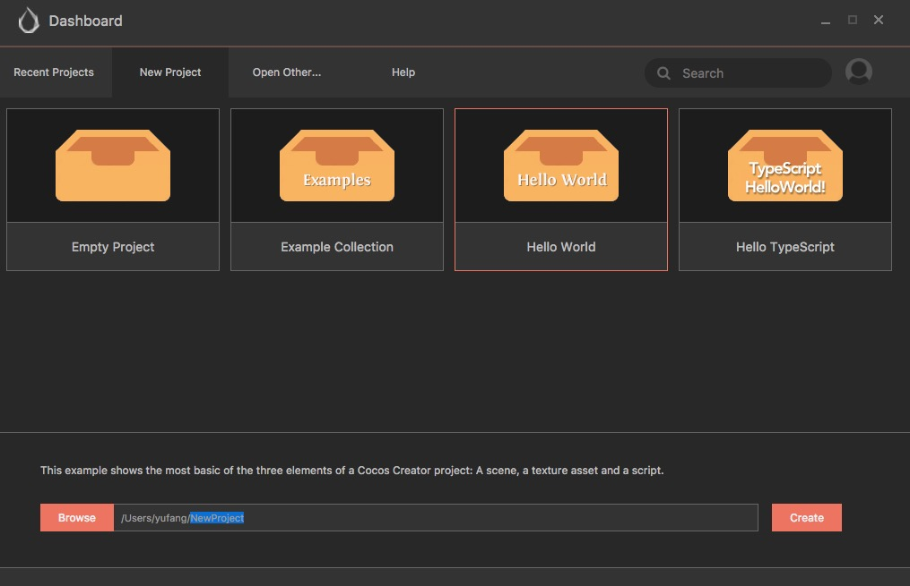

# Hello World

Now that we understand how to use the [Dashboard](./dashboard.md), let's see how to create and open a Hello World project.

## Create a New Project

In the Dashboard, open the **Create a New Project** tab and choose the `Hello World` project template.

Then assign the path of the new project in the project path bar below. The last section of the path is the project folder.

After finish inputting the path, click the **Create a New Project** button at the bottom right corner, the project will be automatically created from the Hello World project template and will be opened.

## Open a Scene to Get Started

The core of Cocos Creator is data-driven workflows. When opening a project for the first time, no scene will open by default. To view the content of the Hello World template, we need to first open a scene asset file.

Double click the `Hello World` scene asset file indicated by the arrow, in **Assets** panel. All the scene assets in Cocos Creator use  as their icon.

## Preview Scene

To see a preview of the game scene, please click the **Preview** button at the top of the editor window.

Cocos Creator will use your default browser to run the current game scene. The effect is as illustrated below:

Click the drop down menu in the top left corner of the preview window and from here you can choose the preview effects for different device screens.

## Customize the Welcome Message

Let's show you what's data-driven workflow with a simple example. Let's say we need to change the welcome message of Hello Word, we don't need to edit the script code anymore, but can directly modify properties of the words that are saved in the scene.

Firstly click the `Canvas` node in the **Node Tree**, to which our `Hello World` component script is attached.

Next, find the `Hello World` component properties at the bottom of the **Properties**, and change the text in the `Text` property into `你好，世界!`:

When running the preview again, we will see that the welcome message has been updated:

## Summary

The content of this section lets us know how to get started with scenes in Cocos Creator. And by customizing the welcome message, it gives a brief introduction to the way data-driven works. Next, we will guide you through building a complete leisure game step by step. You will have a more comprehensive understanding on Cocos Creator's workflows after that.
