# Quick Start: Make your first game

This document is a systematic introductions of the editor panel and the functions and workflows of Cocos Creator. Completing this chapter will help you quickly learn the general flow and methods for developing games with Cocos Creator. After finishing this tutorial you have enough information to get started creating basic games. It is strongly recommended you continue reading this guide to understand the details of each functional block and the complete workflows. Now, let's begin!

Following the tutorial, we will create a game that is named **Pick Up the Stars**. Players of this game need to manipulate an **obtuse** monster that never stops jumping to touch the continuously appearing stars. The dazzling acceleration will bring great challenges to players. Play with your friends and see who can obtain the most stars!

The completed form of this game can be played here:

<http://fbdemos.leanapp.cn/star-catcher/>

## Prepare project and resources

We have prepared for you all the resources needed for creating this game. Download **Original Project** and decompress it to the location you want. Then we can start:

[Download the original project -- **start_project**](https://github.com/cocos-creator/tutorial-first-game/tree/v2.4)

You can also download the completed project. If there is any confusion when following the tutorial to create the game, you can open the completed project for reference:

[Download the completed project -- **complete_project**](https://github.com/cocos-creator/tutorial-first-game/tree/v2.4)

## Open the original project

If you still don't know how to obtain and start Cocos Creator, please read the [Install](install.md) section.

1. First, start Cocos Creator, and choose **Open Other Projects**.
2. In the pop up input field for selecting folder, choose `start_project` that has just been downloaded and decompressed, and click the **Select Folder** button.
3. The main window of Cocos Creator editor will be opened, and you will see the project status as follows:

    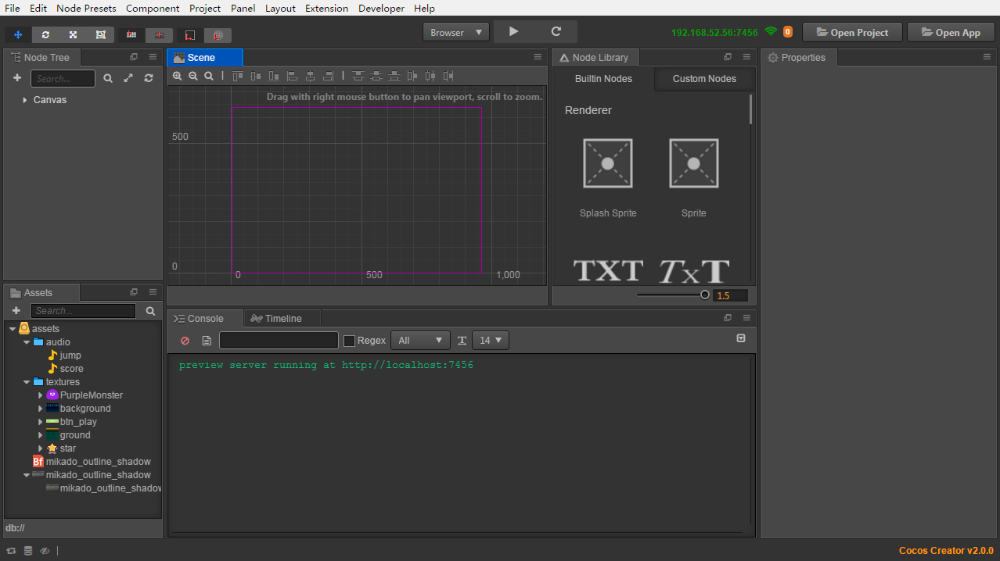

## Check game resources

Our original project has included all the game resources needed, therefore you don't need to import any other resources. For details on importing resources, please read content related to [Asset Workflow](../asset-workflow/index.md).

Next, let's get to know the resources of the project. Please pay attention to the **Assets** panel, on which all the resource allocation graphs of the project are shown.

We can see that the root directory of the project resources is named as **assets**, which is in accordance with the `assets` directory in the decompressed original project. Only resources under this directory can be displayed in the **Assets** panel of the Creator Editor.

The **Assets** panel can display the directory structure of any hierarchy. An icon like  represents a folder. Clicking the triangle icon on the left side of the folder, you can unfold the contents of the folder. After completely unfolding the folder, the **Assets** panel will present itself as illustrated below.


Every resource is a file, and after importing the project, the editor will recognize the different resource types according to their extensions, and their icons will also be different. Next, let's take a look at the respective types and usages of the resources in the project:

-  Audio file, which is an **mp3** file generally. In this tutorial, we will play audio files named as `jump` and `score` respectively when the character jumps and scores.
-  Bitmap font, which is formed by an **fnt** file and a **png** file of the same name. Bitmap font is a commonly used font resource in game development, see [Font](../asset-workflow/font.md) documentation for more information.
- There are various kinds of abbreviated icons, all of which are image resources, normally a **png** or **jpg** file. After being imported into the project, the image file will be crudely processed into the resource of **texture** type. Then these resources can be dragged into scenes or component properties for use.

## Creating a game scene

In Cocos Creator, the game scene is the core of organizing the game contents when developing games, which is also the carrier for all the game contents presented to players. The game scene will normally include the following contents:

- Scene images and words (Sprite, Label)
- Characters
- Game logic scripts attached to scene nodes in the form of components

When players run the game, the game scene will be loaded. After that, the game scripts of included components will automatically run to realize various kinds of logic functions set up by developers. Therefore, apart from resources, the game scene is the foundation of all content creation. Now let's create a new scene.

1. Click the `assets` folder in the **Assets** panel, making sure the scene will be created under this folder.

2. Click the plus sign on the top left corner of the **Assets** panel, and choose **Scene** in the pop up menu.

    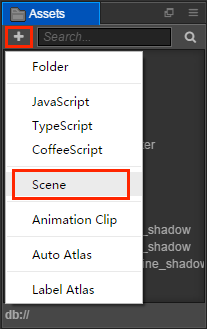

3. We created a scene file named as `New Scene`. Right click it and choose **Rename** to rename it as `game`.

4. Double click `game` and the scene will be opened in the **Scene**, and the scene's nodes will be displayed in the **Node Tree**.

### To understand Canvas

After opening the scene, all the nodes (and their hierarchical relations) of the current scene will be shown in the the **Node Tree**. The newly created scene has a node called `Canvas`. `Canvas` can be called the canvas node or rendering root node. Click `Canvas`, its properties will display in the **Properties** panel.

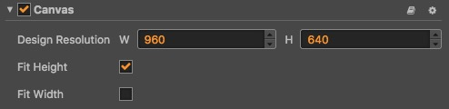

The `Design Resolution` property here stipulates the design resolution of the game. `Fit Height` and `Fit Width` properties stipulate how we should zoom `Canvas` to adjust to different resolutions when running on screens of different sizes.

Being provided with the function of adjusting to different resolutions, we will normally put all the nodes in charge of image display in the scene under `Canvas`. In this way, when the `scale` property of `Canvas` changes, all the images, as its child nodes, will zoom together to adjust to the sizes of different screens.

For more detailed information, please read [Canvas](../components/canvas.md) document. Currently, we only need to know that the scene images added next will all be put under the `Canvas` node.

## Setting up a scene image

### Adding a background

First, find the background image resource according to the path of `assets/textures/background` in the **Assets** panel. Click and drag this resource to the `Canvas` node in **Node Tree** panel. Don't release the mouse until the `Canvas` node is highlighted orange, which means the resource will be added as a child node of `Canvas`.

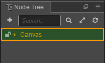

Now you can release the mouse button, and you will see a node named `background` has been added under `Canvas`. When we use the way of dragging a resource to add a node, the node will be automatically named as the name of the texture resource.

When we edit and modify the scene, we can promptly save our modifications by main menu **File -> Save Scene**. Or we can save by shortcut keys: <kbd>Ctrl + S</kbd> (Windows) or <kbd>Cmd + S</kbd> (Mac).

#### Modify background size

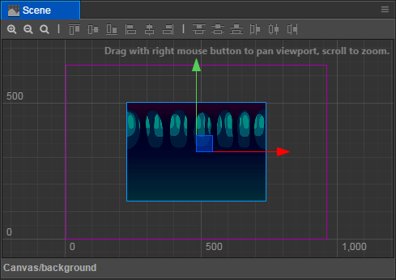

In **Scene**, the newly added background images can be seen. Next we will modify the size of the background image to make it cover the whole screen.

1. Click the `background` node, and click the fourth [Rect Transform Tool](./basics/editor-panels/scene.md#rect-transform-tool) at the top left corner of the main window:

    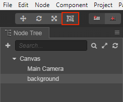

2. By using this tool we can conveniently modify the size of the image node. Move the mouse to rest on the left side of `background` in **Scene**, click and drag it to the left until the left side of `background` exceeds the frame that represents the design resolution. Then we can drag the right side of `background` to the right using the same method.

    

3. Then we need to drag the upper and lower sides to make the size of the background image fully cover the frame of the designing resolution.

    

When using **Rect Transform Tool** to modify the size of the background image, we can see the `Size` property of **Node** in the **Properties** panel is changing accordingly. After completion, the size of the background image is approximately `(1360, 760)`. You can also directly input a numeric value into the input field of the `Size` property, which will achieve the same effect as that of using **Rect Transform Tool**. A background image of this size can cover the whole screen of all the phones on the market, with no exceptions.

### Adding a ground

Our main character needs a ground that it can jump on. By the same method of adding a background, dragging and dropping the `assets/textures/ground` resource from the **Assets** panel to the `Canvas` node of the **Node Tree** panel.<br>
We can also select the order of the newly added `ground` node and the `background` node while dragging. Move the mouse pointer below the `background` node while dragging the resource until an orange highlight box appears on the `Canvas` and a green line indicating the insertion position appears under the `background` node at the same time, and then release the mouse. The `ground` node is then placed under the `background` node in the node hierarchy, and is also a child node under the `Canvas` node.

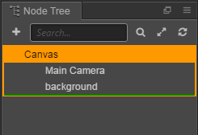

In the **Node Tree**, the rendering order of the nodes shown below is at the back of the upper node, which means that the node below is drawn after the upper node. We can see the `ground` node at the bottom of the **Node Tree**, which appears at the front of the hierarchy in the **Scene**. In addition, the child nodes in the scene will always be displayed on top of the parent node, and we can adjust the hierarchical order and relationship of the nodes at any time to control their display order.

#### Modify ground size and location

We can use the **Rect Transform Tool** to set a suitable size for the `ground` node in the same way as we modified the `background` node.<br>
Then use the first [Move Transform Tool](./basics/editor-panels/scene.md#move-transform-tool) in the upper left toolbar of the main window to change the position of the node:


Try to hold down the arrow of **Move Transform Tool** shown on the node and drag it, then we can change the position of the node on a single coordinate axis at one time.

The following figure is the ground node state we set up:


When setting up the position and size of the `background` and `ground`, we don't need precise numeric values and can drag them by guessing. If you prefer whole numbers, you can directly input numeric values of `position` and `size` according to the screenshot.

### Adding a main character

Next our main character the little monster will make its debut. Drag `assets/texture/PurpleMonster` from the **Assets** panel and put it under `Canvas` in the **Node Tree**, and make sure its position is below `ground`, in this way our main character will be shown at the very front.

To highlight the aura of the main character in the scene nodes, we right click the newly added `PurpleMonster` node, choose **Rename** and rename it as `Player`.

Next we will set up the properties of the main character. First, we change the position of **Anchor**. The anchor point of any node will be at the center of itself by default, which means the position of the center of the node is the position of the node. We hope to manipulate the position of the base of the main character to simulate the effect of jumping on the ground; therefore, we need to set up the anchor point of the main character under its foot now. Find `Anchor` property in the **Properties** panel and set up the value of `y` as `0`. We will see that in **Scene**, the arrow of the **Move Tool** that represents the position of the main character appears under the foot of the main character.

Next, drag `Player` from **Scene** and put it on the ground. The effect is as illustrated below:


In this way our scene's basic artistic content is set up. In the next section we will write code to vivify the contents of the game.

## Writing the main character's script

One of the core ideas of developing games by Cocos Creator is to let the content creation and function development undergo parallel cooperation smoothly. In the last section we focused on artistic content. Next we will write script to develop the flow of functions, and we will see that the finished program script can be used by content creators easily.

Even if you have never written a program before, there's no need to worry. We will provide all the necessary codes in the tutorial. You only need to copy and paste them to the correct position. Then in this part you can ask your programmer partners for help. Next let's start creating script that drives the main character to act.

### Create script

1. First, right click the `assets` folder in the **Assets** panel and choose **Create -> Folder**

    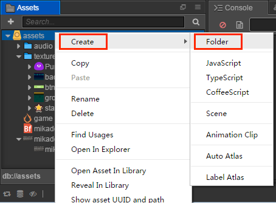

2. Right click `New Folder`, choose **Rename** and rename it as `scripts`. And then all of our scripts will be stored here.

3. Right click the `scripts` folder, choose **Create -> JavaScript** and create a **JavaScript** script.

4. Rename the newly created script as `Player`, double click this script and open the [Script editor](./basics/editor-panels/preferences.html#data-editor).

    > The name of the script in Cocos Creator is the name of the component, which is case-sensitive! If the component name is not capitalized correctly, the component will not be used correctly by name!

### Writing component property

There are already some preset blocks of code in the opened `Player` script, as follows:

```js
cc.Class({
    extends: cc.Component,

    properties: {
        // foo: {
        //     // ATTRIBUTES:
        //     default: null,        // The default value will be used only when the component attaching
        //                           // to a node for the first time
        //     type: cc.SpriteFrame, // optional, default is typeof default
        //     serializable: true,   // optional, default is true
        // },
        // bar: {
        //     get () {
        //         return this._bar;
        //     },
        //     set (value) {
        //         this._bar = value;
        //     }
        // },
    },

    // LIFE-CYCLE CALLBACKS:

    // onLoad () {},

    start () {

    },

    // update (dt) {},
});
```

Let's take a look at the role of these codes. First we can see a global `cc.Class()` method, what is `cc`? `cc` is the abbreviation for Cocos, the main namespace of the Cocos engine. And all the classes, functions, properties, and constants in the engine code are defined in this namespace. And `Class()` is a method under the `cc` module, which is used to declare classes in the Cocos Creator. To make it easier to differentiate, we call the class declared with `cc.Class` called `CCClass`. The parameter of the `Class()` method is a prototype object, the required class can be created by setting the desired type parameter in the form of a key-value pair in the prototype object.

**Example**:

```js
var Sprite = cc.Class({
    name: "sprite"
});
```

The above code creates a type with the `cc.Class()` method and assigns it to the `Sprite` variable. The class name is also set to `sprite`. Class names are used for serialization, which can generally be omitted.

For `cc.Class` detailed learning can refer to [Declare class with `cc.Class`](../scripting/class.md).

Now we go back to the code editor and look back at the code, which is the structure needed to write a component script. Scripts with such a structure are the **Components** in Cocos Creator, which can be mounted on nodes in the scene and control various functions of the node. Let's start by setting some properties and then see how we can adjust them in the scene.

Find the `properties` section in the `Player` script, change it to the following and save:

```js
// Player.js
    //...
    properties: {
        // Main character's jump height
        jumpHeight: 0,
        // Main character's jump duration
        jumpDuration: 0,
        // Maximal movement speed
        maxMoveSpeed: 0,
        // Acceleration
        accel: 0,
    },
    //...
```

Cocos Creator specifies that a node has properties that are written in the `properties` code block, which will specify how the main character moves, and we don't need to care what the values of these properties are in the code, because we'll set them directly in the **Properties** panel. Later, during game development, we can put all the properties that need to be adjusted at any time in the `properties` block.

Now we can add the `Player` component to the node of the main character. Choose the `Player` node in the **Node Tree**, click the **Add Component** button in the bottom of the **Properties** panel and choose **Custom Component -> Player** to add the `Player` component to the node of the main character.


Now we can see the newly added `Player` component in the **Properties** panel of the `Player` node (The `Player` node needs to be selected in the **Node Tree** first). Set up properties related to the jumping and movement of the main character according to the image below:

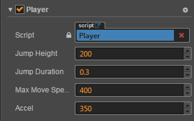

Only the value of the `jumpDuration` property is in seconds, and the other properties are in pixels. According to the current setting of the `Player` component, our main character will have a jump height of 200 pixels, the time needed for jumping to the highest point is 0.3 seconds, its maximum horizontal movement speed is 400 pixels per second, its horizontal acceleration is 350 pixels per second.

All these numeric values are suggestions. Later when the game is running, you can modify these numeric values in the **Properties** panel at anytime according to your preference, no need to change any codes.

### Writing code for jumping and movement

Next we add a method called `runJumpAction` under the `properties: {...},` code block to make the main character jump.

```js
// Player.js
    properties: {
        //...
    },

    runJumpAction () {
        // Jump up
        var jumpUp = cc.tween().by(this.jumpDuration, {y: this.jumpHeight}, {easing: 'sineOut'});
        // Jump down
        var jumpDown = cc.tween().by(this.jumpDuration, {y: -this.jumpHeight}, {easing: 'sineIn'});

        // Create a easing and perform actions in the order of "jumpUp", "jumpDown"
        var tween = cc.tween().sequence(jumpUp, jumpDown);
        // Repeat
        return cc.tween().repeatForever(tween);
    },
```

Here you need to know about the `cc.tween` system. In Cocos Creator, `cc.tween` provides a chain-created method that can manipulate any object, and easing any of the object's properties.

For example, in the code above, the `by()` method is used to calculate the relative value of the property, which is the changing value. See the [cc.tween](../scripting/tween.md) documentation and the API documentation [Tween class](%__APIDOC__%/en/classes/Tween.html) for more details.

Next, call the `runJumpAction` method you just added in the `onLoad` method, and then call `start` to start the action:

```js
// Player.js
    onLoad: function () {
        // Initialize the jump action
        var jumpAction = this.runJumpAction();
        cc.tween(this.node).then(jumpAction).start()
    },
```

The `onLoad` method will be executed immediately after the scene is loaded, so the operations and logic related to initialization should be placed in the `onLoad` method. We first pass the loop-jumping action to the `jumpAction` variable, then insert it into the queue where `cc.tween` eases the node (main character), and finally we call `start` to start executing `cc.tween`, thus making the main character keep jumping.

Once the script modifications are done, remember to save it, then return to the Creator editor, and we're ready to run the game for the first time!<br>
Click the **Preview** button at the top of the editor, which looks like a "play" button:


Creator will automatically open your default browser and run the game in it. Now we should see the main character --- a purple monster jumping lively and continuously in the scene.

### Manipulation of movement

A main character that can only jump foolishly up and down on the same spot is not very promising. Let us add keyboard input for the main character, using <kbd>A</kbd> and <kbd>D</kbd> to manipulate its jump direction. Add the Keyboard event response function  `onKeyUp` and `onKeyDown` below the `runJumpAction` method:

```js
// Player.js
    runJumpAction: function () {
        //...
    },

    onKeyDown (event) {
        // Set a flag when key pressed
        switch(event.keyCode) {
            case cc.macro.KEY.a:
                this.accLeft = true;
                break;
            case cc.macro.KEY.d:
                this.accRight = true;
                break;
        }
    },

    onKeyUp (event) {
        // Unset a flag when key released
        switch(event.keyCode) {
            case cc.macro.KEY.a:
                this.accLeft = false;
                break;
            case cc.macro.KEY.d:
                this.accRight = false;
                break;
        }
    },
```

Then modify the `onLoad` method, into which we add the switch of accelerating to the left/right and the current horizontal speed of the main character. Finally, call `cc.systemEvent` and start listening for keyboard input after the scene has been loaded:

```js
// Player.js
    onLoad: function () {
        // Initialize jump action
        var jumpAction = this.runJumpAction();
        cc.tween(this.node).then(jumpAction).start()

        // Acceleration direction switch
        this.accLeft = false;
        this.accRight = false;
        // The main character's current horizontal velocity
        this.xSpeed = 0;

        // Initialize the keyboard input listening
        cc.systemEvent.on(cc.SystemEvent.EventType.KEY_DOWN, this.onKeyDown, this);
        cc.systemEvent.on(cc.SystemEvent.EventType.KEY_UP, this.onKeyUp, this);
    },

    onDestroy () {
        // Cancel keyboard input monitoring
        cc.systemEvent.off(cc.SystemEvent.EventType.KEY_DOWN, this.onKeyDown, this);
        cc.systemEvent.off(cc.SystemEvent.EventType.KEY_UP, this.onKeyUp, this);
    },
```

Here we register the keyboard response functions (`onKeyDown`, `onKeyUp`) in the `systemEvent`, in which we use `switch` to determine whether the <kbd>A</kbd> or <kbd>D</kbd> key on the keyboard is pressed or not, and if it is pressed, perform the corresponding operation.<br>
With Android development experience, it's better to understand that the listener here is essentially the same as the `OnClickListener` in Android, Creator listens for [system Global events](../scripting/player-controls.md) via `systemEvent`. For details on the listening and dispatching of mouse, touch and custom events, please refer to the [Listen to and launch events](../scripting/events.md).

Finally, modify the `update` method to add settings for acceleration, velocity, and the current position of the main character:

```js
// Player.js
    update: function (dt) {
        // Update speed of each frame according to the current acceleration direction
        if (this.accLeft) {
            this.xSpeed -= this.accel * dt;
        } else if (this.accRight) {
            this.xSpeed += this.accel * dt;
        }
        // Restrict the movement speed of the main character to the maximum movement speed
        if ( Math.abs(this.xSpeed) > this.maxMoveSpeed ) {
            // If speed reach limit, use max speed with current direction
            this.xSpeed = this.maxMoveSpeed * this.xSpeed / Math.abs(this.xSpeed);
        }

        // Update the position of the main character according to the current speed
        this.node.x += this.xSpeed * dt;
    },
```

`update` will be invoked once per frame after the scene is loaded, and we generally put the logical content in `update` that needs to be calculated frequently or updated in time. In our game, after getting the acceleration direction from the keyboard input, we need to calculate the speed and position of the main character in `update` every frame.

After saving the script, go back to the editor and click the **Preview** button at the top to check the latest outcome. After opening the preview in your browser, **click the game scene with the mouse (due to the restrictions of browsers, keyboard input can only be accepted after clicking the game scene)**, then you can press the <kbd>A</kbd> and <kbd>D</kbd> buttons to manipulate the main character to move to the left/right!

Is the movement a little bit too slow? Does the main character not jump high enough? Hope to extend jump duration? No problem! All these can be adjusted at anytime. Just set up different property values for the `Player` component, then you can adjust the game at your will. Here is a set of settings for reference:

```js
Jump Height: 150
Jump Duration: 0.3
Max Move Speed: 400
Accel: 1000
```

This set of properties will make the main character become more flexible, as to how to choose, it depends on what style of game you want to do.

## Making stars

The main character can jump freely now so we need to set up a goal for players. The stars will appear continuously in the scene and players need to manipulate the monster to touch the stars to collect points. The star touched by the main character will disappear and a new one will be immediately re-created at a random position.

### Create Prefab

As for the nodes that need to be created repeatedly, we can save it as a **Prefab** resource, which can be a template for the dynamic generation of nodes. For more information about **Prefab**, please read [Prefab](../asset-workflow/prefab.md).

Firstly, drag and drop the `assets/textures/star` texture from the **Assets** panel into the **Scene** panel anywhere you like. We only need the **Scene** to be our workbench for creating the Star Prefab. After creation we will delete this node from the **Scene**.

We don't need to modify the position or render properties of the Star, but to make the Star disappear when touched by the main character, we need to add a special script component for the Star as well. By the same method of adding the `Player` script, add a JavaScript script named `Star` to `assets/scripts`.


Next, double click this script to start editing. Only one property is needed for the star component to stipulate the distance for collecting points by the main character. Modify `properties` and add the following content:

```js
// Star.js
    properties: {
        // When the distance between the star and main character is less than this value, collection of the point will be completed
        pickRadius: 0,
    },
```

After saving the script, add this script to the newly created `star` node. Select the `star` node in the **Node Tree** and click on the **Add component** button in the **Properties** and select **Custom Component -> Star**, which is added to the newly created star node. Then set the value of `Pick Radius` property to `60` and save the scene.


The settings needed by Star Prefab are now finished. Now drag the `star` node from the **Node Tree** and drop it into the `assets` folder in the **Assets**. This should generate a Prefab resource named `star`, as shown below.

At this point the settings required for the Star Prefab are complete, and the Prefab resource named `star` will be generated by dragging the `star` node from the **Node Tree** into the `assets` folder in **Assets**, as shown below:

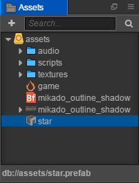

Now the `star` node can be deleted from the scene. We can double click the `star` Prefab resource directly to edit.

Next, we can dynamically use the Prefab resource of stars in the script to generate stars.

### Adding game control script

The generation of stars is part of the game's main logic, so we need to add a JavaScript script called `Game` as a game master logic script. The script will then add logic for scoring, game failure, and restarting.

Add a new `Game` script inside the `assets/scripts` folder, and double click to open the script. First, add the properties needed for generating stars:

```js
// Game.js
    properties: {
        // This property quotes the PreFab resource of stars
        starPrefab: {
            default: null,
            type: cc.Prefab
        },

        // The random scale of disappearing time for stars
        maxStarDuration: 0,
        minStarDuration: 0,

        // Ground node for confirming the height of the generated star's position
        ground: {
            default: null,
            type: cc.Node
        },

        // Player node for obtaining the jump height of the main character and controlling the movement switch of the main character
        player: {
            default: null,
            type: cc.Node
        }
    },
```

Beginners here may wonder why an property like `starPrefab` is enclosed in `{}` with the new "property" in parentheses? In fact, this is a complete declaration of an property, previously our property declarations were incomplete, and in some cases we need to add parameters to the attribute declaration that control how the property is displayed in the **Properties** panel, and the behaviour of the property during the scene serialization process. For example:

```js
properties: {
    score: {
        default: 0,
        displayName: "Score (player)",
        tooltip: "The score of player",
    }
}
```

The above code sets three parameters to the `score` attribute.

The above code sets three parameters for the `score` property:
- `default` -- Specifies that the default value of `score` is 0.
- `displayName` -- Specifies that the property name will be displayed as `Score (player)` in the **Properties** panel.
- `tooltip` --  When the mouse moves over the property in the **Properties** panel, displays the corresponding tooltip.

Here are the common parameters:

`default`: Sets the default value for the property, which is only used when the component is first added to the node<br>
`type`: To qualify the data type of a property, see [CCClass Advanced Reference: type attribute](../scripting/reference/class.md#type-attribute) for details.<br>
`visible`: Set to `false` to not display the property in the **Properties** panel<br>
`serializable`: Set to `false` to not serialize (save) the property<br>
`displayName`: Displays the specified property name in the **Properties** panel<br>
`tooltip`: Add a tooltip for the property in the **Properties** panel

So the code above is easy to understand:

```js
starPrefab: {
    default: null,
    type: cc.Prefab
},
```

First, the `starPrefab` property is declared under the Game component, the default value is `null`, and the type that can be passed in must be a Prefab resource type. After that, the `ground` and `player` properties can also be understood.

After saving the script, add the `Game` component to the `Canvas` node in the **Node Tree** (after choosing the `Canvas` node, drag the script to the **Properties** or click the **Add Component** button in the **Properties** and choose `Game` in **Custom Component**).

then, drag the `star` Prefab resource from the **Assets** into the `Star Prefab` property of the newly created `Game` component. This is the first time we've set a reference to a property, and you can drag a resource or a node onto that property (such as the `cc.Prefab` type written here) only if it is specified as a reference type when the property is declared.

Next, drag and drop the `ground` and `Player` nodes from the **Node Tree** onto the correspondingly named properties in the `Game` component of the `Canvas` node to complete the node reference.

Finally, set the values of the `Min Star Duration` and `Max Star Duration` properties as **3** and **5**. Later when generating stars, we will choose a random value between these two values, for the duration of each star.

### Generate stars at a random position

Next we continue to modify the `Game` script and add the logic to generate the stars **after** the `onLoad` method:

```js
// Game.js
    onLoad: function () {
        // Obtain the anchor point of ground level on the y axis
        this.groundY = this.ground.y + this.ground.height/2; // "this.ground.top" may also work
        // Generate a new star
        this.spawnNewStar();
    },

    spawnNewStar: function() {
        // Generate a new node in the scene with a preset template
        var newStar = cc.instantiate(this.starPrefab);
        // Put the newly added node under the Canvas node
        this.node.addChild(newStar);
        // Set up a random position for the star
        newStar.setPosition(this.getNewStarPosition());
    },

    getNewStarPosition: function () {
        var randX = 0;
        // According to the position of the ground level and the main character's jump height, randomly obtain an anchor point of the star on the y axis
        var randY = this.groundY + Math.random() * this.player.getComponent('Player').jumpHeight + 50;
        // According to the width of the screen, randomly obtain an anchor point of star on the x axis
        var maxX = this.node.width/2;
        randX = (Math.random() - 0.5) * 2 * maxX;
        // Return to the anchor point of the star
        return cc.v2(randX, randY);
    },
```

Here are a few things to watch out for.

1. The `y` property under the node corresponds to the `y` coordinate of the anchor point, because the anchor point defaults to the center of the node, so the `y` coordinate of the ground needs to add half of the ground height.
2. `instantiate()` is used to clone the specified object of any type, or to instantiate a new node from Prefab. The return value is Node or Object.
3. The effect of the `addChild` method under the node is to build a new node at the next level of the node, so the new node is displayed above the node
4. The `setPosition()` method under the node is to set the position of the node in the parent node's coordinate system, and you can set the coordinate points in two ways:
    - The first is to pass in two values `x` and `y`.
    - The second is Pass in `cc.v2(x, y)` or `cc.v3(x, y, z)` (An object of type `cc.Vec2` or `cc.Vec3`)
5. The effect of the `getComponent` method under the node is to get the component references that are mounted on the node

After saving the script, go back to the editor and click the **Preview** button. Then in the browser you will see that a star is dynamically generated after the game is started! By the same method, you can dynamically generate any preset node with a `Prefab` template in the game.

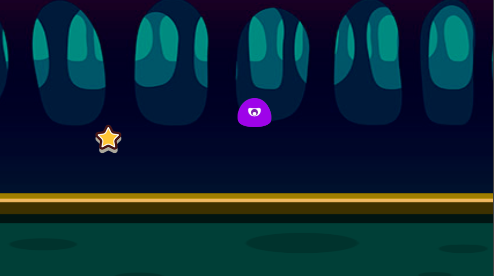

### Adding the action of the main character's touching and collecting of stars

Now we will add the logic of the main character's behavior of collecting stars. The essential here is that the stars need to obtain the position of the main character's node at any time to determine if the distance between them is shorter than the collectable distance. How do we obtain the reference of the main character's node? Don't forget that we have done two things before:

1. There is a property named `player` in the `Game` component, which saved the reference of the main character's node.
2. Each star is dynamically generated in the `Game` script.

Therefore, we just need to pass the instance into the `Star` script component and save it when the `Game` script generates the `Star` node instance, and then we can access the main character node through `game.player` at any time.

Let's open the `Game` script and add a `newStar.getComponent('Star').game = this;` at the end of the `spawnNewStar` method, as follows:

```js
// Game.js
    spawnNewStar: function() {
        // ...

        // Save a reference of the Game object on the Star script component
        newStar.getComponent('Star').game = this;
    },
```

Open the `Star` script after saving, and now we can use the `Player` node referenced in the `Game` component to determine the distance. Add methods named `getPlayerDistance` and `onPicked` after the `onLoad` method.

```js
// Star.js
    getPlayerDistance: function () {
        // Determine the distance according to the position of the Player node
        var playerPos = this.game.player.getPosition();

        // Calculate the distance between two nodes according to their positions
        var dist = this.node.position.sub(playerPos).mag();
        return dist;
    },

    onPicked: function() {
        // When the stars are being collected, invoke the interface in the Game script to generate a new star
        this.game.spawnNewStar();

        // Then destroy the current star's node
        this.node.destroy();
    },
```

The `getPosition()` method in Node returns the position `(x, y)` of the node in the parent node's coordinate system, that is a `Vec2` type object. And then calling the `destroy()` method in Node can destroy the node.

Then add the judge distance per frame in the `update` method. If the distance is less than the collection distance specified by the `pickRadius` property, the collection behavior is performed:

```js
// Star.js
    update: function (dt) {
        // Determine if the distance between the Star and main character is less than the collecting distance for each frame
        if (this.getPlayerDistance() < this.pickRadius) {
            // Invoke collecting behavior
            this.onPicked();
            return;
        }
    },
```

Save the script, by pressing <kbd>A</kbd> and <kbd>D</kbd> key to control the main character to move around, you can see that when the main character gets close to the Star, the Star will disappear and a new one will be generated at a random position!

## Adding score

The little Monster works so hard to collect the Stars, how can he not be rewarded? Now, let's add the logic and display of scoring rewards when collecting Stars.

### Adding a score label (Label)

The score will start from 0 when the game is started, and 1 point will be added for each Star the Monster collects. To display the score, we should first create a `Label` node. Choose the `Canvas` node in the **Node Tree**, right click and choose **Create -> Create Renderer Nodes -> Node With Label** option in the menu, a new Label node will be created under the `Canvas` node, with the hierarchy order at the bottom. Next we configure this Label node by following the steps below:

1. Change the node's name to `score`.
2. Select the `score` node in the **Node Tree**, and set the X, Y of the `position` property to `(0, 180)`.
3. Edit the `String` property of the **Label** component and input `Score: 0`.<br>
    > **Note**: the `String` property of the Label component will not recognize a Chinese colon when a bitmap font is added.
4. Set the `Font Size` property of the **Label** component to `50`.
5. Drag the `assets/mikado_outline_shadow` bitmap font resource from the **Assets** (Note that the icon is ) into the `Font` property of the **Label** component, replace the font of the text with the bitmap font in our project resource

The effect of the completed configuration is shown in the following figure:

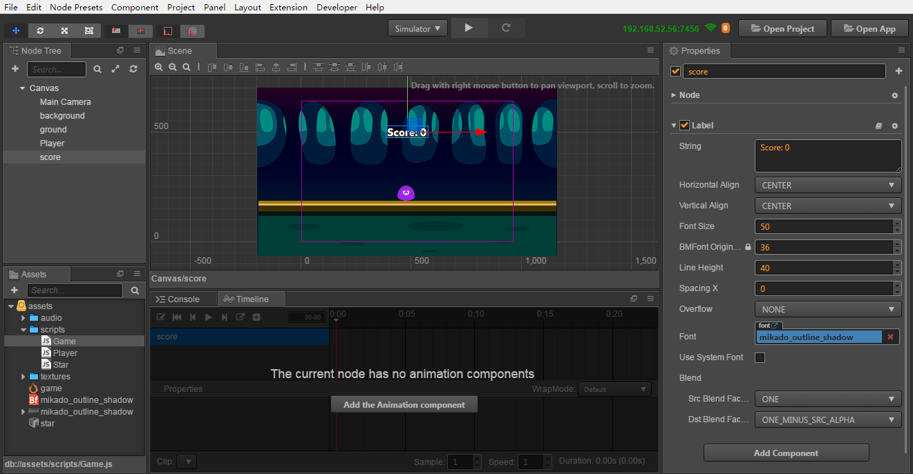

### Adding scoring logic to Game script

We will put the logic of scoring and updating the score display in the `Game` script.<br>
Open the `Game` script to start editing. First, add a reference property of the score display Label to the **end** of the `properties` block:

```js
// Game.js
    properties: {
        // ...

        // Reference of score label
        scoreDisplay: {
            default: null,
            type: cc.Label
        }
    },
```

Next, add the initialization of the variable used for scoring to the end of the `onLoad` method:

```js
// Game.js
    onLoad: function () {
        // ...
        // Initialize scoring
        this.score = 0;
    },
```

Then add a new method named `gainScore` after the `update` method:

```js
// Game.js
    gainScore: function () {
        this.score += 1;
        // Update the words of the scoreDisplay Label
        this.scoreDisplay.string = 'Score: ' + this.score;
    },
```

After saving the `Game` script, go back to the editor, select the `Canvas` node in the **Node Tree**, then drag the `score` node which add before to the `Score Display` property of the `Game` component in the **Properties**.

### Invoke the scoring logic

Next we need to call the scoring logic of the `Game` script in the `Star` script. Open the `Star` script and add the invoking of `gainScore` to the `onPicked` method.

```js
// Star.js
    onPicked: function() {
        // When the stars are being collected, invoke the interface in the Game script to generate a new star
        this.game.spawnNewStar();

        // Invoke the scoring method of the Game script
        this.game.gainScore();

        // Then destroy the current star's node
        this.node.destroy();
    },
```

After saving the script you must go back to the editor for the script changes to take effect. Then click on the **Preview** and you can see that the score displayed right above the screen now increases when collecting stars!


## Failure judgment and restart

Now our game has begun to taken shape. But no matter how many scores one may get, a game without the possibility of failure won't give players any fulfillment. Now let's add the action of the star's regular disappearance. And if all the stars disappear, the game will be viewed as failed. In other words, players need to finish collecting the star before the star disappears and repeat this procedure unceasingly to finish the loop of the play method.

### Adding the logic of disappearing in a limited time to the star

Open the `Game` script, and add the variable declaration needed for counting time before invoking `spawnNewStar` of the `onLoad` method:

```js
// Game.js
    onLoad: function () {
        // ...

        // Initialize timer
        this.timer = 0;
        this.starDuration = 0;

        // Generate a new star
        this.spawnNewStar();

        // Initialize scoring
        this.score = 0;
    },
```

Then add the logic of resetting the timer to the end of the `spawnNewStar` method, in which `this.minStarDuration` and `this.maxStarDuration` are properties of the `Game` component that was declared at the beginning, to specify a random range of time for the stars to disappear.

```js
// Game.js
    spawnNewStar: function() {
        // ...

        // Reset timer, randomly choose a value according the scale of star duration
        this.starDuration = this.minStarDuration + Math.random() * (this.maxStarDuration - this.minStarDuration);
        this.timer = 0;
    },
```

Add logic to the `update` method for updating the timer and determining if it has timed out.

```js
// Game.js
    update: function (dt) {
        // Update timer for each frame, when a new star is not generated after exceeding duration

        // Invoke the logic of game failure
        if (this.timer > this.starDuration) {
            this.gameOver();
            return;
        }
        this.timer += dt;
    },
```

Finally, add a `gainScore` method after the `gameOver` method to reload the scene if the game fails.

```js
// Game.js
    gameOver: function () {
        // Stop the jumping action of the Player node
        this.player.stopAllActions(); 
        // reload the "game" scene
        cc.director.loadScene('game');
    }
```

The beginner needs to know that `cc.director` is a single object that manages the logical process of your game. Since `cc.director` is a single instant, you don't need to call any constructor or create functions, the standard way to use it is by calling `cc.director.methodName()`. For example, the `cc.director.loadScene('game')` here is to reload the game scene `game`, which means that the game starts again. And the `stopAllActions` method under the node will invalidate all the `Action` on the node.

Above, the modifications to the `Game` script are complete. Save the `Game` script, and then open the `Star` script, we need to add a simple visual prompt for the disappearing stars, adding the following code to the end of the `update` method.

```js
// Star.js
    update: function() {
        // ...

        // Update the transparency of the star according to the timer in the Game script
        var opacityRatio = 1 - this.game.timer/this.game.starDuration;
        var minOpacity = 50;
        this.node.opacity = minOpacity + Math.floor(opacityRatio * (255 - minOpacity));
    }
```

Save the `Star` script, and the logic of our game's play method is all done! Now go back to the editor and click the **Preview** button, we will see a qualified game with a core play method, incentive mechanism and failure mechanism in the browser.

## Adding sound effects

Although lots of people will ignore sound when playing mobile games, for the completeness of the workflow presented in this tutorial, we still have to supplement the task of adding sound effects.

### Jumping sound effect

Firstly, add the jump sound effect. Open the `Player` script and add a `jumpAudio` property to the `properties` to reference the sound file resource:

```js
// Player.js
    properties: {
        // ...

        // Jumping sound effect resource
        jumpAudio: {
            default: null,
            type: cc.AudioClip
        },
    },
```

Then rewrite the `runJumpAction` method, insert the callback of playing the sound effect, and play the sound by adding a `playJumpSound` method:

```js
// Player.js
    runJumpAction: function () {
        // Jump up
        var jumpUp = cc.tween().by(this.jumpDuration, {y: this.jumpHeight}, {easing: 'sineOut'});

        // Jump down
        var jumpDown = cc.tween().by(this.jumpDuration, {y: -this.jumpHeight}, {easing: 'sineIn'});

        // Create a easing
        var tween = cc.tween()
                        // perform actions in the order of "jumpUp", "jumpDown"
                        .sequence(jumpUp, jumpDown)
                        // Add a callback function to invoke the "playJumpSound()" method we define after the action is finished
                        .call(this.playJumpSound, this);

        // Repeat unceasingly
        return cc.tween().repeatForever(tween);
    },

    playJumpSound: function () {
        // Invoke sound engine to play the sound
        cc.audioEngine.playEffect(this.jumpAudio, false);
    },
```

### Scoring sound effect

After saving the `Player` script, open the `Game` script to add the scoring sound effect. Firstly, we still add a `scoreAudio` property in the `properties` to reference the sound file resource:

```js
// Game.js
    properties: {
        // ...

        // Scoring sound effect resource
        scoreAudio: {
            default: null,
            type: cc.AudioClip
        }
    },
```

Then add the code of playing the sound to the end of the `gainScore` method:

```js
// Game.js
    gainScore: function () {
        this.score += 1;
        // Update the words of the scoreDisplay Label
        this.scoreDisplay.string = 'Score: ' + this.score.toString();
        // Play the scoring sound effect
        cc.audioEngine.playEffect(this.scoreAudio, false);
    },
```

Save the `Game` script and go back to the **Node Tree** of the editor. Choose the `Player` node, and drag the `assets/audio/jump` resource from the **Assets** to the `Jump Audio` property of the `Player` component.<br>
And then choose the `Canvas` node, drag the `assets/audio/score` resource to the `Score Audio` property of the `Game` component.

Then we're done! The node hierarchy and the properties of each key component in the completed state are as follows:

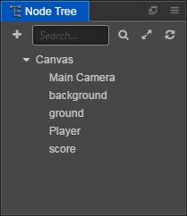

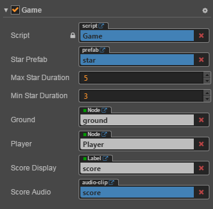


Now we can fully enjoy the newly finished game, how many scores can you get? Don't forget that you can change game parameters such as movement control and star dwell time in the `Player` and `Game` components at any time, to quickly adjust the difficulty of the game. You need to save the scene after modifying the component properties so that the modified values will be recorded.

## Summary

Congratulations! You have finished the first game created by Cocos Creator. We hope this quick start tutorial for beginners can help you understand the basic concepts and workflows in the game development process of Cocos Creator. If you are not interested in writing and learning script programming, you can directly copy and paste the completed script from the completed project.

Next, you can continue to refine all aspects of the game, and here are some recommended directions for improvement:

- Add a simple start menu, display a start button when the game starts running. Only after clicking the button will the game start
- Add a simple menu interface for the failure of the game. Only after clicking the button will the game restart after failure
- Restrict the movement of the main character to the window's boundaries
- Add more exquisite animation performance to the jumping action of the main character
- Add a countdown progress bar to the state when a star disappears
- Add more gorgeous effects when collecting stars
- Add input controls for touch screen devices

For editions that have been improved in all the above aspects, you can download [Evolution Edition Project -- **polished_project**](https://github.com/cocos-creator/tutorial-first-game/tree/v2.4) for reference and learning, which will not be discussed in detail here.

Moreover, if you want to release the completed game on a server to share with your friends, you can read the content of the [Build and Preview](basics/preview-build.md) section.

Today's tutorial ends here. You can immediately start creating your second Cocos Creator game or continue reading this guide. For any questions on this quick start tutorial, you can send feedback on [Warehouse of this tutorial on Github](https://github.com/cocos-creator/tutorial-first-game) or directly by clicking the **Have Feedback?** button in the bottom right corner of the document.
