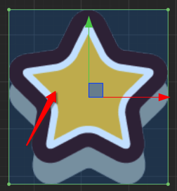

# Edit Collider Component

You can click **editing** checkbox of a collider component to edit collider shape freely.

## Polygon Collider

For editing **Polygon Collider** all points of the collider can be moved freely by dragging. All changes to the points can be seen in **Points** property of Polygon Collider.

If you move the mouse over the line between two points, the mouse pointer changes to **Add** style. Then clicking the mouse to add a new point to the Polygon Collider.

If you move the mouse over a point while hoding **Ctrl** or **Command** key, you'll find the point and two lines connecting to it become red. Click the mouse to remove the point from this Polygon Collider.

In CocosCreator v1.5, **Regenerate Points** has been added to the Polygon Collider component. It can automatically generates the points of the corresponding outline based on the texture pixels of the Sprite component on the node which the component is attached.

**Threshold** indicates the minimum distance between the points of the generated texture outline. The larger the value, the fewer points are generated, which can be adjusted according to the requirements.

## Circle Collider

Enable editing for a **Circle Collider** will show the circle editing area like below:

Move the mouse over the circle edge and drag will modify the radius of Circle Collider.

## Box Collider

Enable editing for a **Box Collider** will show the box editing area like below:

When the mouse is hovering over the points of the box collider, clicking the left mouse button and drag to modify the length and width of the box collider component. 
When the mouse is hovering over the edge line of the box collider, clicking the left mouse button will modify one of the length or width of the box collider component.

Drag while holding **Shift** to keep the aspect ratio of the box. 
Drag while holding **Alt** to keep the center of the box unchanged.

## Change the Collider Offset

In the editing mode of all kinds of Colliders you can drag the center of the collider to move it off the center of the node. The **Offset** property of the collider will change as well.

