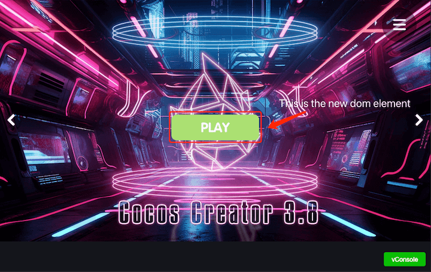

# Facebook Instant Games

Facebook Instant Games are a bit different compared to WeChat Mini Games, as Facebook Instant Games runs in a pure HTML5 environment. This means that your games can be run not only on your phone but also in a desktop browser, making development and debugging more convenient.

**Cocos Creator includes:**

- Integrated Facebook Instant Games SDK, and automatic initialization, users can directly call the relevant API
- Provides a one-click packaging process in the Cocos Creator Build Panel that can be packaged directly into a Facebook Instant Games that meets all technical specifications

**What the user needs to do:**

- Call the Facebook Instant Games SDK to access platform-related features
- Upload your Cocos Creator packaged version to Facebook according to the Facebook Release process

## Publish Process

- Build your game using Cocos Creator
- Upload your game to Facebook background
- Test your game
- Share your game on Facebook

### First, use Cocos Creator to build the game

1. Using Creator open the project that needs to be published. Open the **Build** panel from the **Menu bar -> Project**, select the **Facebook Instant Game** in the **Platform** dropdown of the **Build** panel:

    

    The specific filling rules for the relevant parameter configuration are as follows:

    - **Main Bundle Compression Type**

      Set the compression type of the main package, please refer to the [built-in Asset Bundle — `main`](../asset-manager/bundle.md#the-built-in-asset-bundle) documentation for details.

2. After the build is complete, a `fb-instant-games` folder will be created in the release package directory `build`.

    

### Second, upload to Facebook

Create a new application in the background of Facebook, add an **Instant Games** in **Add a Product**, set the game category, and save the changes. (For details, please refer to the [setting application](https://developers.facebook.com/docs/games/instant-games/getting-started/quickstart?locale=en_US#app-setup))

Click the **Instant Games -> Web Hosting** tab on the left side of the Applications panel, click **Upload Version**, and upload the `.zip` file in the `fb-instant-games` directory to the Facebook hosting service.


When the version status changes to Standby, click the "★" button to push the build version to the production environment.


### Third, test the game

#### Enable the https-enabled Web server locally

- First open the command line window, enter the build `fb-instant-games` directory. Install http-server package via npm

  ```bash
  $ cd fb-instant-games
  $ npm install -g http-server
  ```

- Then create the private key and certificate through openssl.

  ```bash
  $ openssl genrsa 2048 > key.pem
  $ openssl req -x509 -days 1000 -new -key key.pem -out cert.pem
  ```

- Once the private key and certificate are ready, the Web service can be started locally via SSL.

  ```bash
  $ http-server --ssl -c-1 -p 8080 -a 127.0.0.1
  ```

- Use the browser to open <https://localhost:8080> and skip the security warning displayed by the browser. This step is only to allow the browser to whitelist the above private key and certificate. If you subsequently regenerate the private key and certificate, you will need to turn on the confirmation again. It is not yet possible to preview the game directly at this step, because the preview game needs to initialize the Facebook Instant Games SDK. You need to use the following method.

#### Preview the game on Facebook

If you want to use all the features of the Facebook Instant Games SDK, you need to open <https://www.facebook.com/embed/instantgames/YOUR_GAME_ID/player?game_url=https://localhost:8080> in your browser. Pay attention to the `YOUR_GAME_ID` in the link. Replace the application number you created in Facebook.

Then you can see the game running successfully:


### Fourth, Share your game on Facebook

Click on the **Instant Games** tab in the Applications panel, select **Details**, in the details page to the bottom of the page you can see the following picture, select **share the game**, you can directly share the game to the Facebook news.


For details, refer to [Testing, Publishing, and Sharing an Instant Game](https://developers.facebook.com/docs/games/instant-games/test-publish-share?locale=EN).

> **Note**: there are many limitations to Facebook hosting, the most important of which are:
>
> 1. Does not support server-side logic (e.g. php)
> 2. A maximum of 500 files uploaded per application

## Custom Instant Games

Developers can [create the `build-templates/fb-instant-games` directory](custom-project-build-template.md) in the Creator project folder according to their needs, and then copy the published files to this directory and customize them:


 - `fbapp-config.json`: This is the configuration of the entire package, go to the [official introduction](https://developers.facebook.com/docs/games/instant-games/bundle-config).
 - `index.html`: This will change the version of the Instant Games SDK introduced.
 - `main.js`: Here you can modify the SDK initialization and progress bar.

## Customizing Instant Games

Developers can create the [build-templates/fb-instant-games](custom-project-build-template.md) directory under the Creator project folder to customize them according to their needs, and then copy the published files into that directory to customize them: ##


- `fbapp-config.json`: this is the configuration for the whole package, go to [official introduction](https://developers.facebook.com/docs/games/instant-games/bundle-config)
- `index.html`: Here you can modify the introduced Facebook Instant Games SDK version
- `index.js`: Here you can modify the SDK initialization and progress bar

## Creating DOM Elements in the Game
Please refer to the example code below to create Dom elements in a Facebook Instant Game and display them on the game screen.

```javascript
var buttonDiv = document.createElement("div");
var button = document.createElement("button");

const frameSize = cc.view.getFrameSize();
const imageWidth = 195, imageHeight = 57;

button.style.position = "absolute";
button.style.left = `${frameSize.width / 2 - imageWidth / 2}px`;
button.style.top = `${frameSize.height / 2 - imageHeight / 2}px`;

//load image from resources bundle
cc.resources.load("btn_play", cc.Texture2D, (error, res)=>{
  if (!error) {
    button.style.backgroundImage = `url(${res.nativeUrl})`;
    button.style.backgroundRepeat = "no-repeat";
    button.style.backgroundPosition = "center";
    button.style.width = res.width + "px";
    button.style.height = res.height + "px";
    button.style.backgroundColor = "transparent";
    button.style.borderColor = "transparent";
    button.onclick = (()=>{
          //DO SOMETHING
    });
    buttonDiv.appendChild(button);
    var body = document.body;
    body.insertBefore(buttonDiv, body.lastChild);
  }
});
```

Result when running:



## SDK Instructions

Cocos Creator has integrated the Facebook **Instant Games SDK** and it automatically initializes (`initializeAsync` and `startGameAsync`) when the game is loaded. The user can access directly through the `FBInstant` namespace. See the [Instant Games SDK](https://developers.facebook.com/docs/games/instant-games/sdk) for details.

In addition, Facebook also provides the **Facebook SDK for JavaScript**, which can be used to access Facebook's social features according to your needs. It needs to be accessed through the `FB` namespace. However, it is not integrated into Cocos Creator and needs to be manually introduced by the user. See the [official documentation](https://developers.facebook.com/docs/javascript) for details.

## Reference link

- The [Instant Games sample project](https://github.com/cocos-creator/demo-instant-games) provided by Cocos Creator contains an Instant Games SDK usage example.
- [Facebook background](https://developers.facebook.com/)
- [Facebook Instant Games document](https://developers.facebook.com/docs/games/instant-games?locale=en_US)
